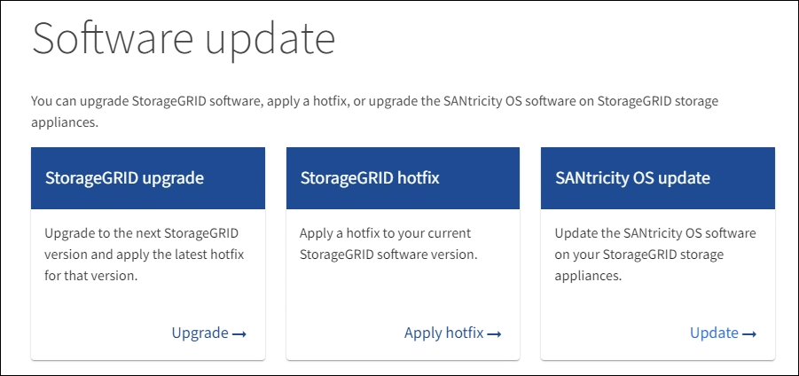

= 
:allow-uri-read: 

.Ce dont vous avez besoin
* Vous avez consulté la matrice d'interopérabilité (IMT) de NetApp afin de vérifier que la version de SANtricity OS que vous utilisez pour la mise à niveau est compatible avec votre appliance.
* Vous disposez de l'autorisation Maintenance ou accès racine.
* Vous êtes connecté au Grid Manager à l'aide d'un xref:../admin/web-browser-requirements.adoc[navigateur web pris en charge].
* Vous avez la phrase secrète pour le provisionnement.
* Vous avez accès à la page de téléchargements NetApp pour SANtricity OS.

.Description de la tâche
Vous ne pouvez pas effectuer d'autres mises à jour logicielles (mise à niveau du logiciel StorageGRID ou correctif) tant que vous n'avez pas terminé le processus de mise à niveau de SANtricity OS. Si vous tentez de lancer un correctif ou une mise à niveau du logiciel StorageGRID avant la fin du processus de mise à niveau de SANtricity OS, vous êtes redirigé vers la page de mise à niveau de SANtricity OS.

La procédure ne sera terminée qu'une fois la mise à niveau de SANtricity OS appliquée avec succès à tous les nœuds applicables sélectionnés pour la mise à niveau. Cela peut prendre plus de 30 minutes pour charger le système d'exploitation SANtricity sur chaque nœud (de façon séquentielle) et jusqu'à 90 minutes pour redémarrer chaque appliance de stockage StorageGRID.

CAUTION: Les étapes suivantes s'appliquent uniquement lorsque vous utilisez le gestionnaire de grille pour effectuer la mise à niveau. Les contrôleurs de stockage de l'appliance ne peuvent pas être mis à niveau avec Grid Manager lorsque ceux-ci utilisent un système d'exploitation SANtricity antérieur à 08.42.20.00 (11.42).

NOTE: Cette procédure met automatiquement à niveau la NVSRAM vers la version la plus récente associée à la mise à niveau du système d'exploitation SANtricity. Vous n'avez pas besoin d'appliquer un fichier de mise à niveau NVSRAM distinct.

.Étapes
. [[Download_santricity_os]] Télécharger le nouveau fichier logiciel SANtricity OS depuis le site de support NetApp.
+
Veillez à choisir la version de système d'exploitation SANtricity pour vos contrôleurs de stockage.

+
https://["Téléchargement NetApp : appliance StorageGRID"^]

. Sélectionnez *MAINTENANCE* *système* *mise à jour du logiciel*.
+

. Dans la section mise à jour de SANtricity OS, sélectionnez *mise à jour*.
+
La page de mise à niveau de SANtricity OS s'affiche.

+
image::../media/santricity_os_upgrade_first.png[Capture d'écran affichant la première page de SANtricity OS de StorageGRID]

. Sélectionnez le fichier de mise à niveau de système d'exploitation SANtricity que vous avez téléchargé depuis le site du support NetApp.
+
.. Sélectionnez *Parcourir*.
.. Localisez et sélectionnez le fichier.
.. Sélectionnez *Ouvrir*.
+
Le fichier est téléchargé et validé. Une fois le processus de validation terminé, le nom du fichier s'affiche en regard du bouton *Parcourir*.

+

NOTE: Ne modifiez pas le nom du fichier car il fait partie du processus de vérification.

. Saisissez la phrase secrète pour le provisionnement.
+
Le bouton *Démarrer* est activé.

+
image::../media/santricity_start_button.png[Capture d'écran affichant la première page de SANtricity OS de StorageGRID]

. Sélectionnez *Démarrer*.
+
Un message d'avertissement s'affiche indiquant que la connexion de votre navigateur peut être perdue temporairement car les services sur les nœuds mis à niveau sont redémarrés.

+
image::../media/santricity_upgrade_warning.png[la capture d'écran montrant la connexion sera temporairement perdue]

. Sélectionnez *OK* pour faire passer le fichier de mise à niveau du système d'exploitation SANtricity au nœud d'administration principal.
+
Lorsque la mise à niveau de SANtricity OS démarre :

+
.. Le contrôle de l'état est exécuté. Ce processus vérifie qu'aucun nœud ne présente l'état nécessite une intervention.
+

NOTE: Si des erreurs sont signalées, résolvez-les et sélectionnez à nouveau *Démarrer*.

.. Le tableau de progression de la mise à niveau de SANtricity OS s'affiche. Ce tableau affiche tous les nœuds de stockage de votre grille ainsi que l'étape actuelle de la mise à niveau de chaque nœud.
+

NOTE: Le tableau indique tous les nœuds de stockage de l'appliance. Les nœuds de stockage logiciels ne s'affichent pas. Sélectionnez *Approve* pour tous les nœuds nécessitant la mise à niveau.

+
image::../media/santricity_upgrade_progress_table.png[Capture d'écran affichant la partie progression de la mise à niveau de SANtricity OS de la page mise à niveau de SANtricity OS]

. Vous pouvez aussi trier la liste des nœuds par ordre croissant ou décroissant en fonction de *site*, *Nom*, *progression*, *étape*, *Détails*, Ou *version actuelle du micrologiciel du contrôleur*. Vous pouvez également saisir un terme dans la zone *Rechercher* pour rechercher des nœuds spécifiques.
+
Vous pouvez faire défiler la liste des nœuds à l'aide des flèches gauche et droite dans le coin inférieur droit de la section.

. Approuver les nœuds de grille que vous êtes prêt à ajouter à la file d'attente de mise à niveau. Les nœuds approuvés du même type sont mis à niveau un par un.
+

IMPORTANT: N'approuvez pas la mise à niveau du système d'exploitation SANtricity pour un nœud de stockage de l'appliance sauf si vous êtes sûr que le nœud est prêt à être arrêté et redémarré. Lorsque la mise à niveau de SANtricity OS est approuvée sur un nœud, les services qui y sont arrêtés et le processus de mise à niveau commence. Plus tard, lorsque la mise à niveau du nœud est terminée, le nœud d'appliance est redémarré. Ces opérations peuvent entraîner des interruptions de service pour les clients qui communiquent avec le nœud.

+
** Sélectionnez l'un des boutons *approuver tout* pour ajouter tous les nœuds de stockage à la file d'attente de mise à niveau de SANtricity OS.
+

NOTE: Si l'ordre dans lequel les nœuds sont mis à niveau est important, approuvez les nœuds ou les groupes de nœuds un par un et attendez que la mise à niveau soit terminée sur chaque nœud avant d'approuver le ou les nœuds suivants.

** Sélectionnez un ou plusieurs boutons *Approve* pour ajouter un ou plusieurs nœuds à la file d'attente de mise à niveau de SANtricity OS.
+
Après avoir sélectionné *Approve*, le processus de mise à niveau détermine si le noeud peut être mis à niveau. Si un nœud peut être mis à niveau, il est ajouté à la file d'attente de mise à niveau.

+
Pour certains noeuds, le fichier de mise à niveau sélectionné n'est pas appliqué intentionnellement et vous pouvez terminer le processus de mise à niveau sans mettre à niveau ces noeuds spécifiques. Les nœuds volontairement non mis à niveau affichent une étape terminée (tentative de mise à niveau) et indiquent la raison pour laquelle le nœud n'a pas été mis à niveau dans la colonne Détails.

. Si vous devez supprimer un nœud ou tous les nœuds de la file d'attente de mise à niveau de SANtricity OS, sélectionnez *Supprimer* ou *tout supprimer*.
+
Lorsque l'étape dépasse la mise en file d'attente, le bouton *Supprimer* est masqué et vous ne pouvez plus supprimer le nœud du processus de mise à niveau de SANtricity OS.

. Attendez que la mise à niveau de SANtricity OS soit appliquée à chaque nœud de grid approuvé.
+
** Si un nœud affiche l'étape d'erreur lors de l'application de la mise à niveau du système d'exploitation SANtricity, la mise à niveau a échoué pour le nœud. Avec l'aide du support technique, vous devrez peut-être placer l'appliance en mode maintenance pour la restaurer.
** Si le micrologiciel du nœud est trop ancien pour être mis à niveau avec Grid Manager, le nœud affiche une étape d'erreur avec les détails suivants : « vous devez utiliser le mode de maintenance pour mettre à niveau SANtricity OS sur ce nœud. Consultez les instructions d'installation et de maintenance de votre appareil. Après la mise à niveau, vous pouvez utiliser cet utilitaire pour les mises à niveau futures.» Pour résoudre l'erreur, procédez comme suit :
+
... Utilisez le mode de maintenance pour mettre à niveau SANtricity OS sur le nœud qui affiche une étape d'erreur.
... Utilisez Grid Manager pour redémarrer et terminer la mise à niveau de SANtricity OS.

+
Une fois la mise à niveau de SANtricity OS terminée sur tous les nœuds approuvés, le tableau des progrès de la mise à niveau de SANtricity OS se ferme et une bannière verte indique la date et l'heure de la mise à niveau de SANtricity OS.

image::../media/santricity_upgrade_finish_banner.png[Capture d'écran de la page de mise à niveau de SANtricity OS une fois la mise à niveau terminée]

. Si un nœud ne peut pas être mis à niveau, notez la raison indiquée dans la colonne Détails et effectuez l'action appropriée :
+
** "Noeud de stockage déjà mis à niveau." Aucune autre action n'est requise.
** « La mise à niveau de SANtricity OS n'est pas applicable à ce nœud. » Le nœud ne dispose d'aucun contrôleur de stockage qui peut être géré par le système StorageGRID. Terminez le processus de mise à niveau sans mettre à niveau le nœud affichant ce message.
** « Le fichier SANtricity OS n'est pas compatible avec ce nœud. » Le nœud requiert un fichier SANtricity OS différent de celui que vous avez sélectionné. Une fois la mise à niveau actuelle terminée, téléchargez le fichier SANtricity OS approprié pour le nœud et répétez le processus de mise à niveau.

IMPORTANT: La mise à niveau de SANtricity OS n'est terminée qu'une fois la mise à niveau de SANtricity OS approuvée sur tous les nœuds de stockage répertoriés.

. Si vous souhaitez mettre fin à l'approbation des nœuds et revenir à la page SANtricity OS pour permettre le téléchargement d'un nouveau fichier SANtricity OS, procédez comme suit :
+
.. Sélectionnez *Ignorer les nœuds et Terminer*.
+
Un message d'avertissement s'affiche vous demandant si vous êtes sûr de vouloir terminer le processus de mise à niveau sans mettre à niveau tous les nœuds.

.. Sélectionnez *OK* pour revenir à la page *SANtricity OS*.
.. Lorsque vous êtes prêt à continuer l'approbation des nœuds, accédez à <<download_santricity_os,Téléchargez SANtricity OS>> pour redémarrer le processus de mise à niveau.

+

NOTE: Les nœuds déjà approuvés et mis à niveau sans erreur restent mis à niveau.

. Répétez cette procédure de mise à niveau pour tous les nœuds dont la procédure de fin nécessite un fichier de mise à niveau SANtricity OS différent.
+

NOTE: Pour les nœuds avec un état de nécessite une intervention, utilisez le mode maintenance pour effectuer la mise à niveau.

+

NOTE: Lorsque vous répétez la procédure de mise à niveau, vous devez approuver les nœuds mis à niveau précédemment.

