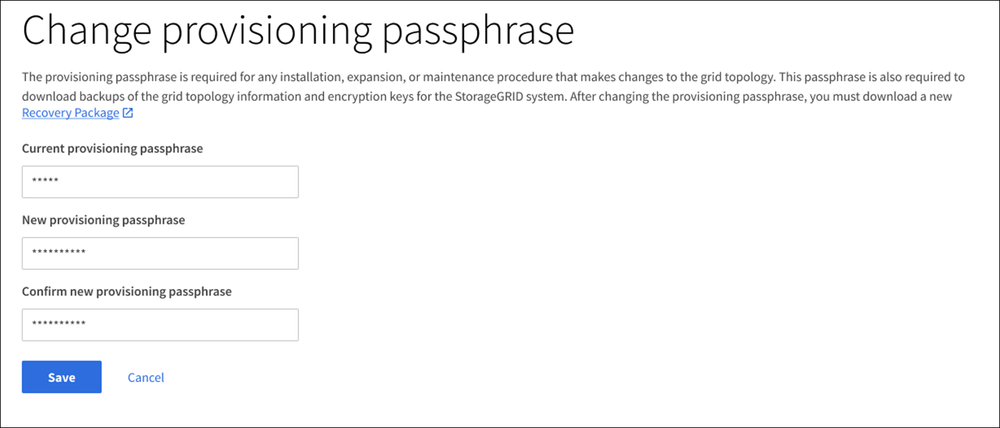

= Modifiez la phrase secrète de provisionnement
:allow-uri-read: 
:icons: font
:imagesdir: ../media/

[role="lead"]
Utilisez cette procédure pour modifier la phrase secrète du provisionnement StorageGRID. La phrase de passe est requise pour les procédures de restauration, d'extension et de maintenance. La phrase de passe est également requise pour télécharger les sauvegardes du pack de récupération qui incluent les informations de topologie de la grille, les mots de passe de la console des nœuds grid et les clés de chiffrement pour le système StorageGRID.

.Ce dont vous avez besoin, 8217;ll
* Vous êtes connecté au Grid Manager à l'aide d'un xref:../admin/web-browser-requirements.adoc[navigateur web pris en charge].
* Vous disposez d'autorisations d'accès à la racine ou à la maintenance.
* Vous disposez de la phrase secrète pour le provisionnement.

La phrase secrète de provisionnement est requise pour la plupart des procédures d'installation et de maintenance, et pour xref:../maintain/downloading-recovery-package.adoc[Téléchargement du progiciel de restauration]. La phrase de passe de provisionnement n'est pas répertoriée dans le `Passwords.txt` fichier. Veillez à documenter la phrase de passe de provisionnement et à la conserver dans un emplacement sûr et sécurisé.

.Étapes
. Sélectionnez *CONFIGURATION* *contrôle d'accès* *mots de passe de grille*.
+
image::../media/grid_password_change_provisioning_firstpage.png[Mots de passe de grille]

. Sélectionnez *faire une modification* sous *Modifier la phrase de passe de provisionnement*.
+

. Saisissez votre phrase secrète pour le provisionnement.
. Saisissez la nouvelle phrase de passe. La phrase de passe doit contenir au moins 8 caractères et pas plus de 32 caractères. Les phrases passe sont sensibles à la casse.
. Stocker la nouvelle phrase secrète pour le provisionnement dans un emplacement sécurisé Elle est requise pour les procédures d'installation, d'extension et de maintenance.
. Saisissez à nouveau la nouvelle phrase de passe et sélectionnez *Enregistrer*.
+
Le système affiche une bannière verte de réussite lorsque la modification de la phrase de passe de provisionnement est terminée.

+
image::../media/change_provisioning_passphrase_success.png[la modification de la phrase secrète du provisionnement a réussi]

. Sélectionnez *progiciel de récupération*.
. Entrez la nouvelle phrase de passe de provisionnement pour télécharger le nouveau progiciel de restauration.
+

CAUTION: Après avoir modifié la phrase de passe de provisionnement, vous devez télécharger immédiatement un nouveau progiciel de restauration. Le fichier du progiciel de récupération vous permet de restaurer le système en cas de défaillance.

