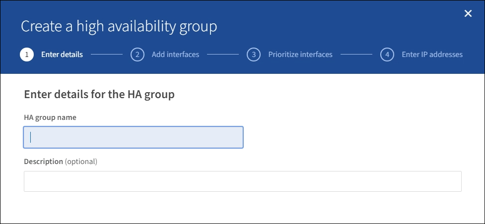
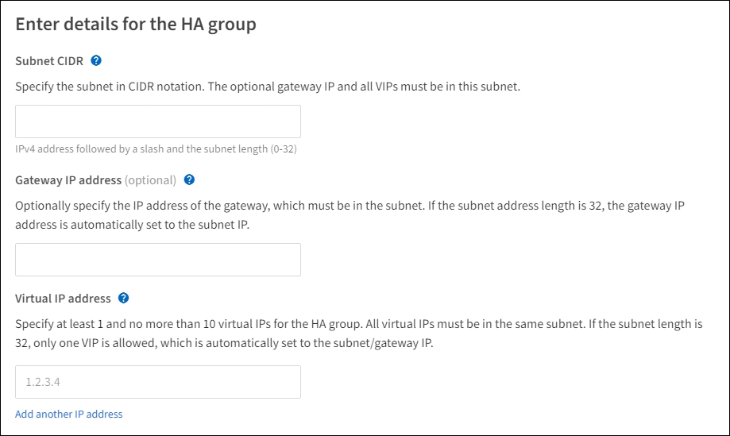

= Configurez les groupes haute disponibilité
:allow-uri-read: 
:icons: font
:imagesdir: ../media/

[role="lead"]
Vous pouvez configurer des groupes haute disponibilité pour fournir un accès haute disponibilité aux services sur des nœuds d'administration ou de passerelle.

.Ce dont vous avez besoin, 8217;ll
* Vous êtes connecté au Grid Manager à l'aide d'un xref:../admin/web-browser-requirements.adoc[navigateur web pris en charge].
* Vous disposez de l'autorisation d'accès racine.
* Si vous prévoyez d'utiliser une interface VLAN dans un groupe haute disponibilité, vous avez créé cette interface. Voir xref:../admin/configure-vlan-interfaces.adoc[Configurez les interfaces VLAN].
* Si vous prévoyez d'utiliser une interface d'accès pour un nœud d'un groupe haute disponibilité, vous avez créé l'interface :
+
** *Red Hat Enterprise Linux ou CentOS (avant d'installer le nœud)* : xref:../rhel/creating-node-configuration-files.adoc[Créez des fichiers de configuration de nœud]
** *Ubuntu ou Debian (avant d'installer le nœud)* : xref:../ubuntu/creating-node-configuration-files.adoc[Créez des fichiers de configuration de nœud]
** *Linux (après l'installation du nœud)* : xref:../maintain/linux-adding-trunk-or-access-interfaces-to-node.adoc[Linux : ajoutez une jonction ou des interfaces d'accès à un nœud]
** *VMware (après l'installation du noeud)* : xref:../maintain/vmware-adding-trunk-or-access-interfaces-to-node.adoc[VMware : ajoutez du jonction ou des interfaces d'accès à un nœud]

== Créez un groupe haute disponibilité

Lorsque vous créez un groupe haute disponibilité, vous sélectionnez une ou plusieurs interfaces et organisez-les par ordre de priorité. Vous affectez ensuite une ou plusieurs adresses VIP au groupe.

Pour qu'un nœud de passerelle ou un nœud d'administration soit inclus dans un groupe haute disponibilité, une interface doit être configurée pour inclure un nœud de passerelle. Un groupe haute disponibilité ne peut utiliser qu'une interface pour un nœud donné. Toutefois, les autres interfaces du même nœud peuvent être utilisées dans d'autres groupes haute disponibilité.

=== Accéder à l'assistant

. Sélectionnez *CONFIGURATION* *réseau* *groupes haute disponibilité*.
. Sélectionnez *Créer*.

=== Entrez les détails du groupe haute disponibilité

. Indiquez un nom unique pour le groupe HA.
+

. Si vous le souhaitez, entrez une description pour le groupe HA.
. Sélectionnez *Continuer*.

=== Ajouter des interfaces au groupe haute disponibilité

. Sélectionnez une ou plusieurs interfaces à ajouter à ce groupe haute disponibilité.
+
Utilisez les en-têtes de colonne pour trier les lignes ou entrez un terme de recherche pour localiser les interfaces plus rapidement.

+
image::../media/ha_group_add_interfaces.png[Les groupes HAUTE DISPONIBILITÉ ajoutent des interfaces]

+

NOTE: Après avoir créé une interface VLAN, attendez jusqu'à 5 minutes que la nouvelle interface apparaisse dans le tableau.

+
.Consignes de sélection des interfaces
** Vous devez sélectionner au moins une interface.
** Vous ne pouvez sélectionner qu'une interface pour un nœud.
** Si le groupe HA est destiné à la protection haute disponibilité des services des nœuds d'administration, qui incluent le Grid Manager et le tenant Manager, sélectionnez les interfaces sur les nœuds d'administration uniquement.
** Si le groupe HA est destiné à la protection HA du trafic client S3 ou Swift, sélectionnez les interfaces dans les nœuds d'administration, les nœuds de passerelle ou les deux.
** Si le groupe haute disponibilité est destiné à la protection haute disponibilité du service CLB obsolète, sélectionnez uniquement les interfaces sur les nœuds de passerelle.
** Si vous sélectionnez des interfaces sur différents types de nœuds, une note d'information s'affiche. Il est rappelé que en cas de basculement, les services fournis par le nœud actif précédemment risquent de ne pas être disponibles sur le nouveau nœud actif. Par exemple, un nœud de passerelle de sauvegarde ne peut pas assurer la protection HA des services du nœud d'administration. De même, un nœud d'administration de sauvegarde ne peut pas effectuer toutes les procédures de maintenance que le nœud d'administration principal peut fournir.
** Si vous ne pouvez pas sélectionner une interface, sa case à cocher est désactivée. L'info-bulle fournit plus d'informations.
+
image::../media/vlan_parent_interface_tooltip.png[Info-bulle de l'interface VLAN]

** Vous ne pouvez pas sélectionner une interface si sa valeur de sous-réseau ou sa passerelle entre en conflit avec une autre interface sélectionnée.
** Vous ne pouvez pas sélectionner une interface configurée si elle ne possède pas d'adresse IP statique.

. Sélectionnez *Continuer*.

=== Déterminez l'ordre de priorité

. Déterminez l'interface principale et toutes les interfaces de sauvegarde (basculement) pour ce groupe haute disponibilité.
+
Faites glisser et déposez des lignes pour modifier les valeurs dans la colonne *ordre de priorité*.

+
image::../media/ha_group_determine_failover.png[Les groupes HAUTE DISPONIBILITÉ déterminent l'ordre de priorité]

+

IMPORTANT: Si le groupe HA donne accès à Grid Manager, vous devez sélectionner une interface sur le nœud d'administration principal pour qu'il soit l'interface principale. Certaines procédures de maintenance peuvent uniquement être effectuées depuis le nœud d'administration principal.

+
La première interface de la liste est l'interface principale. L'interface principale est l'interface active, sauf en cas de défaillance.

+
Si le groupe haute disponibilité comprend plusieurs interfaces et que l'interface principale échoue, les adresses VIP passent à l'interface à la priorité la plus élevée qui est disponible. En cas d'échec de cette interface, les adresses VIP passent à l'interface de priorité supérieure suivante disponible, etc.

. Sélectionnez *Continuer*.

=== Saisissez les adresses IP

. Dans le champ *Subnet CIDR*, spécifiez le sous-réseau VIP en notation CIDR--une adresse IPv4 suivie d'une barre oblique et de la longueur du sous-réseau (0-32).
+
Aucun bit d'hôte ne doit être défini pour l'adresse réseau. Par exemple : `192.16.0.0/22`.

+

NOTE: Si vous utilisez un préfixe 32 bits, l'adresse réseau VIP sert également d'adresse de passerelle et d'adresse VIP.

+

. Si des clients S3, Swift, d'administration ou de locataires accèdent à ces adresses VIP à partir d'un sous-réseau différent, saisissez l'adresse IP *Gateway*. L'adresse de la passerelle doit se trouver dans le sous-réseau VIP.
+
Les utilisateurs client et admin utiliseront cette passerelle pour accéder aux adresses IP virtuelles.

. Entrez une ou plusieurs *adresses IP virtuelles* pour le groupe HA. Vous pouvez ajouter jusqu'à 10 adresses IP. Tous les VIP doivent être inclus dans le sous-réseau VIP.
+
Vous devez fournir au moins une adresse IPv4. Vous pouvez éventuellement spécifier des adresses IPv4 et IPv6 supplémentaires.

. Sélectionnez *Créer groupe HA* et *Terminer*.
+
Le groupe haute disponibilité est créé et vous pouvez maintenant utiliser les adresses IP virtuelles configurées.

NOTE: Attendez 15 minutes que les modifications d'un groupe haute disponibilité soient appliquées à tous les nœuds.

=== Étapes suivantes

Si vous utilisez ce groupe haute disponibilité pour équilibrer la charge, créez un terminal d'équilibreur de charge afin de déterminer le port et le protocole réseau, et de connecter tous les certificats requis. Voir xref:configuring-load-balancer-endpoints.adoc[Configurer les terminaux de l'équilibreur de charge].

== Modifiez un groupe haute disponibilité

Vous pouvez modifier un groupe haute disponibilité (HA) pour modifier son nom et sa description, ajouter ou supprimer des interfaces, modifier l'ordre de priorité ou ajouter ou mettre à jour des adresses IP virtuelles.

Par exemple, vous devrez peut-être modifier un groupe haute disponibilité si vous souhaitez supprimer le nœud associé à une interface sélectionnée dans la procédure de mise hors service d'un site ou d'un nœud.

.Étapes
. Sélectionnez *CONFIGURATION* *réseau* *groupes haute disponibilité*.
+
La page groupes haute disponibilité affiche tous les groupes haute disponibilité existants.

+
image::../media/ha_groups_page_with_groups.png[Page groupes HAUTE DISPONIBILITÉ avec groupes]

. Cochez la case du groupe HA que vous souhaitez modifier.
. Effectuez l'une des opérations suivantes, en fonction de ce que vous souhaitez mettre à jour :
+
** Sélectionnez *actions* *Modifier l'adresse IP virtuelle* pour ajouter ou supprimer des adresses VIP.
** Sélectionnez *actions* *Modifier le groupe HA* pour mettre à jour le nom ou la description du groupe, ajouter ou supprimer des interfaces, modifier l'ordre de priorité ou ajouter ou supprimer des adresses VIP.

. Si vous avez sélectionné *Modifier l'adresse IP virtuelle* :
+
.. Mettre à jour les adresses IP virtuelles du groupe haute disponibilité.
.. Sélectionnez *Enregistrer*.
.. Sélectionnez *Terminer*.

. Si vous avez sélectionné *Modifier le groupe HA* :
+
.. Vous pouvez également mettre à jour le nom ou la description du groupe.
.. Sélectionner ou désélectionner les cases à cocher pour ajouter ou supprimer des interfaces.
+

NOTE: Si le groupe HA donne accès à Grid Manager, vous devez sélectionner une interface sur le nœud d'administration principal pour qu'il soit l'interface principale. Certaines procédures de maintenance peuvent uniquement être effectuées depuis le nœud d'administration principal

.. Vous pouvez également faire glisser et déposer des lignes pour modifier l'ordre de priorité de l'interface principale et des interfaces de sauvegarde pour ce groupe haute disponibilité.
.. Si vous le souhaitez, mettez à jour les adresses IP virtuelles.
.. Sélectionnez *Enregistrer*, puis *Terminer*.

NOTE: Attendez 15 minutes que les modifications d'un groupe haute disponibilité soient appliquées à tous les nœuds.

== Supprimer un groupe haute disponibilité

Vous pouvez supprimer un ou plusieurs groupes haute disponibilité (HA) à la fois. Toutefois, vous ne pouvez pas supprimer un groupe HA s'il est lié à un ou plusieurs terminaux d'équilibrage de la charge.

Pour éviter les interruptions de vos clients, mettez à jour les applications clients S3 ou Swift affectées avant de supprimer un groupe haute disponibilité. Mettre à jour chaque client pour se connecter à l'aide d'une autre adresse IP, par exemple l'adresse IP virtuelle d'un autre groupe haute disponibilité ou l'adresse IP configurée pour une interface lors de l'installation.

.Étapes
. Sélectionnez *CONFIGURATION* *réseau* *groupes haute disponibilité*.
. Cochez la case correspondant à chaque groupe haute disponibilité à supprimer. Sélectionnez ensuite *actions* *Supprimer le groupe HA*.
. Vérifiez le message et sélectionnez *Supprimer le groupe HA* pour confirmer votre sélection.
+
Tous les groupes HA sélectionnés sont supprimés. Une bannière de réussite verte apparaît sur la page groupes de haute disponibilité.

