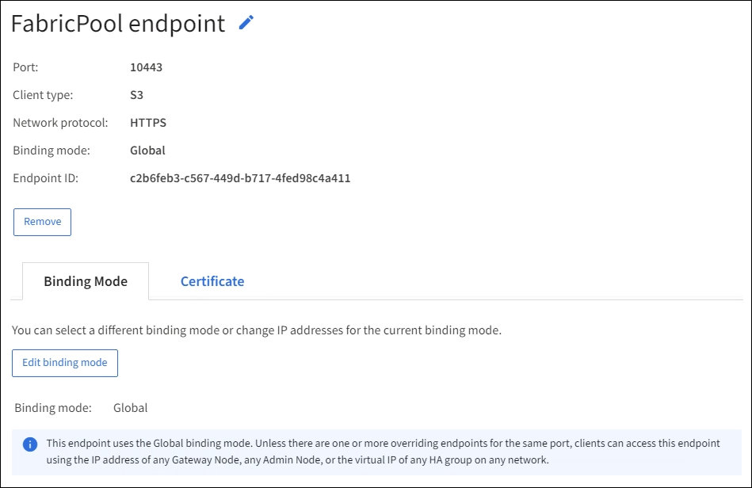

= Configurer les terminaux de l'équilibreur de charge
:allow-uri-read: 
:icons: font
:imagesdir: ../media/

[role="lead"]
Les terminaux d'équilibrage de la charge déterminent les ports et les protocoles réseau que les clients S3 et Swift peuvent utiliser pour la connexion à l'équilibreur de charge StorageGRID sur les nœuds de passerelle et d'administration.

.Ce dont vous avez besoin, 8217;ll
* Vous êtes connecté au Grid Manager à l'aide d'un xref:../admin/web-browser-requirements.adoc[navigateur web pris en charge].
* Vous disposez de l'autorisation d'accès racine.
* Si vous avez précédemment mappé à nouveau un port que vous souhaitez utiliser pour le noeud final de l'équilibreur de charge, vous avez xref:../maintain/removing-port-remaps.adoc[retirez le schéma de câblage des ports - effectué].
* Vous avez créé tous les groupes à haute disponibilité (HA) que vous prévoyez d'utiliser. Les groupes HAUTE DISPONIBILITÉ sont recommandés, mais pas obligatoires. Voir xref:managing-high-availability-groups.adoc[Gérez les groupes haute disponibilité].
* Si le point final de l'équilibreur de charge est utilisé par xref:../admin/manage-s3-select-for-tenant-accounts.adoc[Locataires S3 pour S3 Select], Il ne doit pas utiliser les adresses IP ou FQDN de tout noeud bare-Metal. Seuls les appliances SG100 ou SG1000 et les nœuds logiciels VMware sont autorisés pour les terminaux d'équilibrage de charge utilisés pour S3 Select.
* Vous avez configuré toutes les interfaces VLAN que vous prévoyez d'utiliser. Voir xref:configure-vlan-interfaces.adoc[Configurez les interfaces VLAN].
* Si vous créez un noeud final HTTPS (recommandé), vous disposez des informations relatives au certificat de serveur.
+

NOTE: Les modifications apportées à un certificat de point final peuvent prendre jusqu'à 15 minutes pour être appliquées à tous les nœuds.

+
** Pour télécharger un certificat, vous avez besoin du certificat de serveur, de la clé privée de certificat et, éventuellement, d'un bundle CA.
** Pour générer un certificat, vous devez disposer de tous les noms de domaine et adresses IP que les clients S3 ou Swift utiliseront pour accéder au terminal. Vous devez également connaître le sujet (Nom unique).
** Si vous souhaitez utiliser le certificat API StorageGRID S3 et Swift (qui peut également être utilisé pour les connexions directement aux nœuds de stockage), vous avez déjà remplacé le certificat par défaut par un certificat personnalisé signé par une autorité de certification externe. Voirxref:../admin/configuring-custom-server-certificate-for-storage-node-or-clb.adoc[Configurez les certificats API S3 et Swift].
+
Le certificat peut utiliser des caractères génériques pour représenter les noms de domaine complets de tous les nœuds d'administration et de passerelle exécutant le service Load Balancer. Par exemple : `*.storagegrid._example_.com` utilise le caractère générique * pour représenter `adm1.storagegrid._example_.com` et `gn1.storagegrid._example_.com`. Voir xref:configuring-s3-api-endpoint-domain-names.adoc[Configurez les noms de domaine de terminaux API S3].

== Créer un noeud final d'équilibreur de charge

Chaque point final de l'équilibreur de charge spécifie un port, un type de client (S3 ou Swift) et un protocole réseau (HTTP ou HTTPS).

=== Accéder à l'assistant

. Sélectionnez *CONFIGURATION* *réseau* *points d'extrémité de l'équilibreur de charge*.
. Sélectionnez *Créer*.

=== Saisissez les détails du point final

. Saisissez les détails du noeud final.
+
image::../media/load_balancer_endpoint_create_http.png[Créer UN point final LB]

+
[cols="1a,3a"]
|===
| Champ | Description 

 a| 
Nom
 a| 
Nom descriptif du noeud final, qui apparaîtra dans le tableau sur la page noeuds finaux de l'équilibreur de charge.

 a| 
Port
 a| 
Les ports clients utilisent pour se connecter au service Load Balancer sur les nœuds d'administration et les nœuds de passerelle.

Acceptez le numéro de port suggéré ou entrez tout port externe qui n'est pas utilisé par un autre service de grille. Entrez une valeur comprise entre 1 et 65535.

Si vous saisissez *80* ou *443*, le noeud final est configuré uniquement sur les noeuds de passerelle. Ces ports sont réservés sur des nœuds d'administration.

Voir la xref:../network/index.adoc[Instructions de mise en réseau] pour plus d'informations sur les ports externes.

 a| 
Type de client
 a| 
Type d'application client qui utilisera ce noeud final, *S3* ou *Swift*.

 a| 
Protocole réseau
 a| 
Protocole réseau utilisé par les clients lors de la connexion à ce noeud final.

** Sélectionnez *HTTPS* pour la communication sécurisée et cryptée TLS (recommandé). Vous devez joindre un certificat de sécurité avant de pouvoir enregistrer le noeud final.
** Sélectionnez *HTTP* pour une communication moins sécurisée et non chiffrée. Utilisez HTTP uniquement pour une grille autre que la production.

|===
. Sélectionnez *Continuer*.

=== Sélectionnez le mode de reliure

. Sélectionnez un mode de liaison pour le noeud final afin de contrôler l'accès au noeud final.
+
[cols="1a,3a"]
|===
| Option | Description 

 a| 
Global (par défaut)
 a| 
Les clients peuvent accéder au noeud final à l'aide d'un nom de domaine complet (FQDN), de l'adresse IP d'un nœud de passerelle ou d'un nœud d'administration, ou de l'adresse IP virtuelle d'un groupe HA sur n'importe quel réseau.

Utilisez le paramètre *Global* (valeur par défaut) sauf si vous devez restreindre l'accessibilité de ce point final.

 a| 
Interfaces de nœuds
 a| 
Les clients doivent utiliser l'adresse IP d'un nœud et d'une interface réseau sélectionnés pour accéder à ce noeud final.

 a| 
Adresses IP virtuelles de groupes haute disponibilité
 a| 
Les clients doivent utiliser une adresse IP virtuelle d'un groupe haute disponibilité pour accéder à ce noeud final.

Les terminaux peuvent tous utiliser le même numéro de port, tant que les groupes haute disponibilité que vous sélectionnez pour les terminaux ne se chevauchent pas.

Les noeuds finaux avec ce mode peuvent tous utiliser le même numéro de port tant que les interfaces sélectionnées pour les noeuds finaux ne se chevauchent pas.

|===
+

NOTE: Si vous utilisez le même port pour plusieurs noeuds finaux, un noeud final utilisant le mode *IP virtuelles de groupes HA* remplace un noeud final en utilisant le mode *interfaces Node*, qui remplace un noeud final en utilisant le mode *Global*.

. Si vous avez sélectionné *Node interfaces*, sélectionnez une ou plusieurs interfaces de nœud pour chaque noeud d'administration ou nœud de passerelle que vous souhaitez associer à ce noeud final.
+
image::../media/load_balancer_endpoint_node_interfaces_binding_mode.png[Mode de liaison des interfaces de nœud de point final]

. Si vous avez sélectionné *IP virtuelles de groupes HA*, sélectionnez un ou plusieurs groupes HA.
+
image::../media/load_balancer_endpoint_ha_group_vips_binding_mode.png[Mode de liaison VIP du groupe HA de terminaux]

. Si vous créez un noeud final *HTTP*, vous n'avez pas besoin d'attacher un certificat. Sélectionnez *Créer* pour ajouter le nouveau noeud final de l'équilibreur de charge. Ensuite, passez à ,Une fois que vous avez terminé. Sinon, sélectionnez *Continuer* pour joindre le certificat.

=== Joindre un certificat

. Si vous créez un noeud final *HTTPS*, sélectionnez le type de certificat de sécurité que vous souhaitez associer au noeud final.
+
Le certificat sécurise les connexions entre les clients S3 et Swift et le service Load Balancer sur les nœuds d'administration ou de passerelle.

+
** *Télécharger le certificat*. Sélectionnez cette option si vous avez des certificats personnalisés à télécharger.
** *Générer un certificat*. Sélectionnez cette option si vous avez les valeurs nécessaires pour générer un certificat personnalisé.
** *Utilisez le certificat StorageGRID S3 et Swift*. Sélectionnez cette option pour utiliser le certificat d'API S3 et Swift global, qui peut également être utilisé pour les connexions directement aux nœuds de stockage.
+
Vous ne pouvez pas sélectionner cette option à moins d'avoir remplacé le certificat API S3 et Swift par défaut, signé par l'autorité de certification de la grille, par un certificat personnalisé signé par une autorité de certification externe. Voirxref:../admin/configuring-custom-server-certificate-for-storage-node-or-clb.adoc[Configurez les certificats API S3 et Swift].

. Si vous n'utilisez pas le certificat StorageGRID S3 et Swift, téléchargez ou générez le certificat.
+
[role="tabbed-block"]
====
.Télécharger le certificat
--
.. Sélectionnez *Télécharger le certificat*.
.. Téléchargez les fichiers de certificat de serveur requis :
+
*** *Certificat de serveur* : fichier de certificat de serveur personnalisé dans le codage PEM.
*** *Clé privée de certificat* : fichier de clé privée de certificat de serveur personnalisé (`.key`).
+

NOTE: Les clés privées EC doivent être de 224 bits ou plus. Les clés privées RSA doivent être de 2048 bits ou plus.

*** *Paquet CA* : un fichier facultatif unique contenant les certificats de chaque autorité de certification intermédiaire (AC). Le fichier doit contenir chacun des fichiers de certificat d'autorité de certification codés au PEM, concaténés dans l'ordre de la chaîne de certificats.

.. Développez *Détails du certificat* pour afficher les métadonnées de chaque certificat que vous avez téléchargé. Si vous avez téléchargé un bundle CA facultatif, chaque certificat s'affiche sur son propre onglet.
+
*** Sélectionnez *Télécharger le certificat* pour enregistrer le fichier de certificat ou sélectionnez *Télécharger le paquet CA* pour enregistrer le lot de certificats.
+
Spécifiez le nom du fichier de certificat et l'emplacement de téléchargement. Enregistrez le fichier avec l'extension `.pem`.

+
Par exemple : `storagegrid_certificate.pem`

*** Sélectionnez *Copy certificate PEM* ou *Copy CA bundle PEM* pour copier le contenu du certificat pour le coller ailleurs.

.. Sélectionnez *Créer*. + le noeud final de l'équilibreur de charge est créé. Le certificat personnalisé est utilisé pour toutes les nouvelles connexions ultérieures entre les clients S3 et Swift et le terminal.

--
.Générez un certificat
--
.. Sélectionnez *générer certificat*.
.. Spécifiez les informations de certificat :
+
*** *Nom de domaine* : un ou plusieurs noms de domaine pleinement qualifiés à inclure dans le certificat. Utilisez un * comme caractère générique pour représenter plusieurs noms de domaine.
*** *IP* : une ou plusieurs adresses IP à inclure dans le certificat.
*** *Sujet*: X.509 sujet ou nom distinctif (DN) du propriétaire du certificat.
*** *Jours valides*: Nombre de jours après la création que le certificat expire.

.. Sélectionnez *generate*.
.. Sélectionnez *Détails du certificat* pour afficher les métadonnées du certificat généré.
+
*** Sélectionnez *Télécharger le certificat* pour enregistrer le fichier de certificat.
+
Spécifiez le nom du fichier de certificat et l'emplacement de téléchargement. Enregistrez le fichier avec l'extension `.pem`.

+
Par exemple : `storagegrid_certificate.pem`

*** Sélectionnez *Copier le certificat PEM* pour copier le contenu du certificat pour le coller ailleurs.

.. Sélectionnez *Créer*.
+
Le noeud final de l'équilibreur de charge est créé. Le certificat personnalisé est utilisé pour toutes les nouvelles connexions ultérieures entre les clients S3 et Swift et ce terminal.

--
====

=== Une fois que vous avez terminé

. Si vous utilisez un système de noms de domaine (DNS), assurez-vous que le DNS inclut un enregistrement pour associer le nom de domaine complet StorageGRID à chaque adresse IP que les clients utiliseront pour établir des connexions.
+
L'adresse IP que vous entrez dans l'enregistrement DNS dépend de l'utilisation ou non d'un groupe HA de nœuds d'équilibrage de la charge :

+
** Si vous avez configuré un groupe haute disponibilité, les clients se connectent aux adresses IP virtuelles de ce groupe haute disponibilité.
** Si vous n'utilisez pas de groupe haute disponibilité, les clients se connectent au service StorageGRID Load Balancer à l'aide de l'adresse IP d'un nœud de passerelle ou d'un nœud d'administration.
+
Vous devez également vous assurer que l'enregistrement DNS référence tous les noms de domaine de point final requis, y compris les noms de caractères génériques.

. Fournissez aux clients S3 et Swift les informations nécessaires pour se connecter au terminal :
+
** Numéro de port
** Nom de domaine ou adresse IP complet
** Tous les détails de certificat requis

== Afficher et modifier les points finaux de l'équilibreur de charge

Vous pouvez afficher les détails des noeuds finaux existants de l'équilibreur de charge, y compris les métadonnées de certificat d'un noeud final sécurisé. Vous pouvez également modifier le nom d'un noeud final ou le mode de liaison et mettre à jour tous les certificats associés.

Vous ne pouvez pas modifier le type de service (S3 ou Swift), le port ou le protocole (HTTP ou HTTPS).

* Pour afficher les informations de base de tous les noeuds finaux de l'équilibreur de charge, consultez le tableau de la page noeuds finaux de l'équilibreur de charge.
+
image::../media/load_balancer_endpoint_table.png[Tableau des points finaux de l'équilibreur de charge]

* Pour afficher tous les détails sur un noeud final spécifique, y compris les métadonnées du certificat, sélectionnez le nom du noeud final dans le tableau.
+

* Pour modifier un noeud final, utilisez le menu *actions* de la page noeuds finaux de l'équilibreur de charge ou la page de détails d'un noeud final spécifique.
+

IMPORTANT: Après avoir modifié un noeud final, vous devrez peut-être attendre jusqu'à 15 minutes que vos modifications soient appliquées à tous les noeuds.

+
[cols="1a, 2a,2a"]
|===
| Tâche | Menu actions | Page de détails 

 a| 
Modifier le nom du point final
 a| 
.. Cochez la case correspondant au point final.
.. Sélectionnez *actions* *Modifier le nom du point final*.
.. Saisissez le nouveau nom.
.. Sélectionnez *Enregistrer*.

 a| 
.. Sélectionnez le nom du noeud final pour afficher les détails.
.. Sélectionnez l'icône de modification image:../media/icon_edit_tm.png["Icône Modifier"].
.. Saisissez le nouveau nom.
.. Sélectionnez *Enregistrer*.

 a| 
Modifier le mode de liaison du point final
 a| 
.. Cochez la case correspondant au point final.
.. Sélectionnez *actions* *Modifier le mode de liaison du point final*.
.. Mettez à jour le mode de liaison si nécessaire.
.. Sélectionnez *Enregistrer les modifications*.

 a| 
.. Sélectionnez le nom du noeud final pour afficher les détails.
.. Sélectionnez *Modifier le mode de liaison*.
.. Mettez à jour le mode de liaison si nécessaire.
.. Sélectionnez *Enregistrer les modifications*.

 a| 
Modifier le certificat de point final
 a| 
.. Cochez la case correspondant au point final.
.. Sélectionnez *actions* *Modifier le certificat de point final*.
.. Chargez ou générez un nouveau certificat personnalisé ou commencez à utiliser le certificat Global S3 et Swift, si nécessaire.
.. Sélectionnez *Enregistrer les modifications*.

 a| 
.. Sélectionnez le nom du noeud final pour afficher les détails.
.. Sélectionnez l'onglet *certificat*.
.. Sélectionnez *Modifier le certificat*.
.. Chargez ou générez un nouveau certificat personnalisé ou commencez à utiliser le certificat Global S3 et Swift, si nécessaire.
.. Sélectionnez *Enregistrer les modifications*.

|===

== Supprimez les points finaux de l'équilibreur de charge

Vous pouvez supprimer un ou plusieurs noeuds finaux à l'aide du menu *actions*, ou vous pouvez supprimer un seul noeud final de la page de détails.

IMPORTANT: Pour éviter toute interruption de vos clients, mettez à jour les applications client S3 ou Swift affectées avant de supprimer un terminal d'équilibrage de charge. Mettez à jour chaque client pour vous connecter à l'aide d'un port attribué à un autre noeud final de l'équilibreur de charge. Assurez-vous également de mettre à jour les informations de certificat requises.

* Pour supprimer un ou plusieurs noeuds finaux :
+
.. Dans la page équilibreur de charge, cochez la case pour chaque noeud final que vous souhaitez supprimer.
.. Sélectionnez *actions* *Supprimer*.
.. Sélectionnez *OK*.

* Pour supprimer un noeud final de la page de détails :
+
.. À partir de la page équilibreur de charge. sélectionnez le nom du noeud final.
.. Sélectionnez *Supprimer* sur la page de détails.
.. Sélectionnez *OK*.

