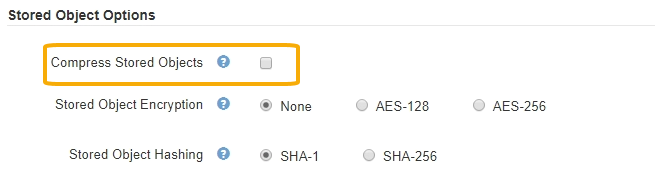

= Configurer la compression des objets stockés
:allow-uri-read: 
:icons: font
:imagesdir: ../media/

[role="lead"]
Vous pouvez utiliser l'option de grille Compress objets stockés pour réduire la taille des objets stockés dans StorageGRID, de sorte que les objets consomment moins de stockage.

.Ce dont vous avez besoin, 8217;ll
* Vous êtes connecté au Grid Manager à l'aide d'un xref:../admin/web-browser-requirements.adoc[navigateur web pris en charge].
* Vous disposez d'autorisations d'accès spécifiques.

Par défaut, l'option de grille de compression des objets stockés est désactivée. Si vous activez cette option, StorageGRID tente de compresser chaque objet lors de son enregistrement, en utilisant la compression sans perte.

NOTE: Si vous modifiez ce paramètre, il faudra environ une minute pour appliquer le nouveau paramètre. La valeur configurée est mise en cache pour les performances et l'évolutivité.

Avant d'activer cette option, tenez compte des points suivants :

* Vous ne devez pas activer la compression, sauf si vous savez que les données stockées sont compressibles.
* Les applications qui enregistrent des objets dans StorageGRID peuvent compresser les objets avant de les enregistrer. Si une application client a déjà compressé un objet avant de l'enregistrer dans StorageGRID, l'activation de la compression des objets stockés ne réduira pas davantage la taille d'un objet.
* N'activez pas la compression si vous utilisez NetApp FabricPool avec StorageGRID.
* Si l'option de grille objets stockés de compression est activée, les applications client S3 et Swift doivent éviter d'exécuter des opérations GET Object qui indiquent une plage d'octets à renvoyer. Ces opérations de « lecture à plage » sont inefficaces, car StorageGRID doit décompresser efficacement les objets pour accéder aux octets demandés. LES opérations GET Object qui demandent une petite plage d'octets provenant d'un objet très volumineux sont particulièrement inefficaces. Par exemple, il est inefficace de lire une plage de 10 Mo sur un objet compressé de 50 Go.
+
Si les plages sont lues à partir d'objets compressés, les demandes client peuvent être en attente.

+

NOTE: Si vous devez compresser des objets et que votre application client doit utiliser des lectures de plage, augmentez le délai de lecture de l'application.

.Étapes
. Sélectionnez *CONFIGURATION* *système* *Options de grille*.
. Dans la section Options des objets stockés, cochez la case *Compresser objets enregistrés*.
+

. Sélectionnez *Enregistrer*.

