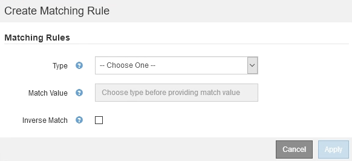
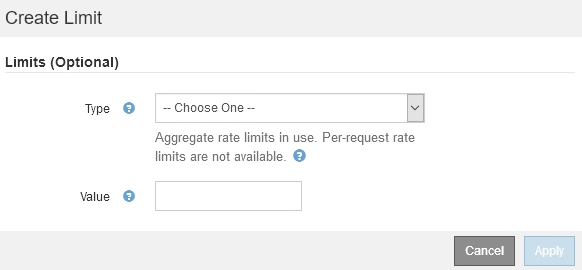

= Créer des stratégies de classification du trafic
:allow-uri-read: 
:icons: font
:imagesdir: ../media/

[role="lead"]
Vous créez des règles de classification du trafic pour surveiller et limiter, éventuellement, le trafic réseau par compartiment, locataire, sous-réseau IP ou point de terminaison d'équilibrage de la charge. Vous pouvez également définir des limites pour une stratégie en fonction de la bande passante, du nombre de demandes simultanées ou du taux de demande.

.Ce dont vous avez besoin, 8217;ll
* Vous êtes connecté au Grid Manager à l'aide d'un xref:../admin/web-browser-requirements.adoc[navigateur web pris en charge].
* Vous disposez de l'autorisation d'accès racine.
* Vous avez créé tous les noeuds finaux de l'équilibreur de charge que vous souhaitez associer.
* Vous avez créé les locataires que vous souhaitez associer.

.Étapes
. Sélectionnez *CONFIGURATION* *réseau* *classification du trafic*.
+
La page règles de classification du trafic s'affiche.

+
image::../media/traffic_classification_policies_main_screen.png[Règles de classification de la circulation - écran principal]

. Sélectionnez *Créer*.
+
La boîte de dialogue Créer une stratégie de classification de trafic s'affiche.

+
image::../media/traffic_classification_policy_create.png[Politique de classification du trafic - Créer]

. Dans le champ *Nom*, entrez un nom pour la stratégie.
+
Entrez un nom descriptif pour reconnaître la stratégie.

. Vous pouvez également ajouter une description de la stratégie dans le champ *Description*.
+
Par exemple, décrivez à quoi s'applique cette politique de classification de trafic et à quoi elle limite.

. Créer une ou plusieurs règles de correspondance pour la règle.
+
Les règles de correspondance contrôlent les entités qui seront affectées par cette politique de classification du trafic. Par exemple, sélectionnez tenant si vous souhaitez que cette stratégie s'applique au trafic réseau d'un locataire spécifique. Ou sélectionnez point final si vous souhaitez que cette stratégie s'applique au trafic réseau sur un point final d'équilibreur de charge spécifique.

+
.. Sélectionnez *Créer* dans la section *règles de correspondance*.
+
La boîte de dialogue Créer une règle de correspondance s'affiche.

+

.. Dans la liste déroulante *Type*, sélectionnez le type d'entité à inclure dans la règle correspondante.
.. Dans le champ *valeur de correspondance*, entrez une valeur de correspondance basée sur le type d'entité que vous avez choisi.
+
*** Compartiment : entrez un nom de compartiment.
*** Regex du compartiment : saisissez une expression régulière qui sera utilisée pour correspondre à un ensemble de noms de compartiment.
+
L'expression régulière n'est pas ancrée. Utilisez l'ancre {caret} pour faire correspondre au début du nom du compartiment, et utilisez l'ancre $ pour correspondre à la fin du nom.

*** CIDR : saisissez un sous-réseau IPv4, en notation CIDR, qui correspond au sous-réseau souhaité.
*** Noeud final : sélectionnez un noeud final dans la liste des noeuds finaux existants. Il s'agit des noeuds finaux de l'équilibreur de charge que vous avez définis sur la page noeuds finaux de l'équilibreur de charge. Voir xref:configuring-load-balancer-endpoints.adoc[Configurer les terminaux de l'équilibreur de charge].
*** Locataire : sélectionnez un locataire dans la liste des locataires existants. La correspondance établie entre les locataires dépend de la propriété du compartiment utilisé. L'accès anonyme à un compartiment correspond au locataire qui détient le compartiment.

.. Si vous souhaitez faire correspondre tout le trafic réseau _exception_ trafic correspondant au type et à la valeur de correspondance que vous venez de définir, cochez la case *inverse*. Sinon, ne cochez pas la case.
+
Par exemple, si vous souhaitez que cette stratégie s'applique à tous les noeuds finaux de l'équilibreur de charge sauf un, spécifiez le noeud final de l'équilibreur de charge à exclure et sélectionnez *inverse*.

+

IMPORTANT: Dans le cas d'une règle contenant plusieurs matcheurs où au moins un est un matcher inverse, veillez à ne pas créer une règle qui correspond à toutes les demandes.

.. Sélectionnez *appliquer*.
+
La règle est créée et répertoriée dans le tableau règles de correspondance.

+
image::../media/traffic_classification_policy_rules.png[Règles de correspondance de la politique routière]

.. Répétez ces étapes pour chaque règle que vous souhaitez créer pour la règle.
+

NOTE: Le trafic correspondant à n'importe quelle règle est géré par la règle.

. Vous avez la possibilité de créer des limites pour la règle.
+

NOTE: Même si vous ne créez pas de limites, StorageGRID collecte des mesures pour vous permettre de surveiller le trafic réseau qui correspond à la stratégie.

+
.. Sélectionnez *Créer* dans la section *limites*.
+
La boîte de dialogue Créer limite s'affiche.

+

.. Dans la liste déroulante *Type*, sélectionnez le type de limite que vous souhaitez appliquer à la stratégie.
+
Dans la liste suivante, *in* désigne le trafic des clients S3 ou Swift vers l'équilibreur de charge StorageGRID et *OUT* désigne le trafic de l'équilibreur de charge vers les clients S3 ou Swift.

+
*** Bande passante agrégée dans
*** Bande passante de l'agrégat sortie
*** Demandes de lecture simultanée
*** Demandes d'écriture simultanées
*** Bande passante par demande dans
*** Bande passante à la demande
*** Taux de demande de lecture
*** Taux de demandes d'écriture
+
[NOTE]
====
Vous pouvez créer des règles pour limiter la bande passante agrégée ou limiter la bande passante par requête. Cependant, StorageGRID ne peut pas limiter simultanément les deux types de bande passante. Les limites de bande passante globales peuvent imposer un impact mineur supplémentaire sur les performances du trafic non limité.

====
+
Pour les limites de bande passante, StorageGRID applique la règle qui correspond le mieux au type de limite défini. Par exemple, si vous avez une stratégie qui limite le trafic dans une seule direction, alors le trafic dans la direction opposée sera illimité, même s'il y a un trafic qui correspond à des stratégies supplémentaires qui ont des limites de bande passante. StorageGRID met en œuvre des correspondances « meilleures » pour les limites de bande passante dans l'ordre suivant :

+
**** Adresse IP exacte (/32 masque)
**** Nom exact du compartiment
**** Seau regex
**** Locataire
**** Point final
**** Correspondances CIDR non exactes (pas /32)
**** Correspondances inverses

.. Dans le champ *valeur*, entrez une valeur numérique pour le type de limite que vous avez choisi.
+
Les unités attendues s'affichent lorsque vous sélectionnez une limite.

.. Sélectionnez *appliquer*.
+
La limite est créée et est répertoriée dans le tableau limites.

+
image::../media/traffic_classification_policy_limits.png[Limites de la politique de trafic]

.. Répétez ces étapes pour chaque limite que vous souhaitez ajouter à la stratégie.
+
Par exemple, si vous souhaitez créer une limite de bande passante de 40 Gbits/s pour un niveau de contrat de niveau de service, créez une limite de bande passante agrégée et une limite de bande passante agrégée OUT et définissez chacune sur 40 Gbits/s.

+

NOTE: Pour convertir les mégaoctets par seconde en gigabits par seconde, multipliez par huit. Par exemple, 125 Mo/s équivaut à 1,000 Mbit/s ou 1 Gbit/s.

. Lorsque vous avez terminé de créer des règles et des limites, sélectionnez *Enregistrer*.
+
La police est enregistrée et est répertoriée dans le tableau règles de classification du trafic.

+
image::../media/traffic_classification_policies_main_screen_w_examples.png[Exemple de politique de trafic]

+
Le trafic client S3 et Swift est désormais géré conformément aux règles de classification du trafic. Vous pouvez afficher les diagrammes de trafic et vérifier que les stratégies appliquent les limites de trafic auxquelles vous vous attendez. Voir xref:viewing-network-traffic-metrics.adoc[Afficher les données de trafic réseau].

