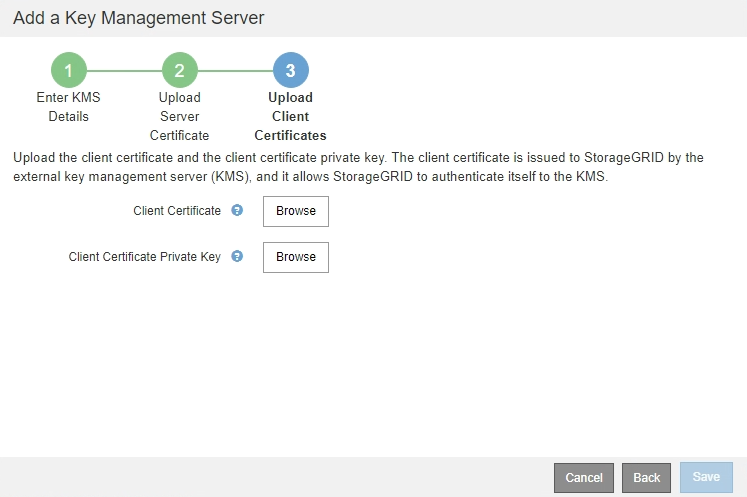
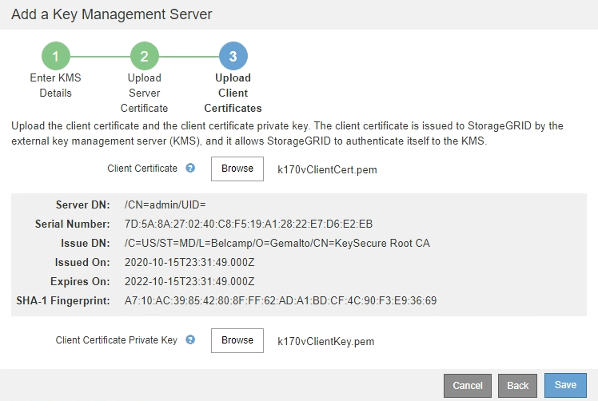
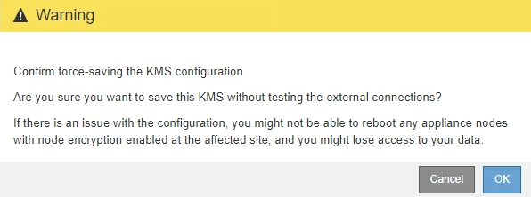

= Ajout d'un serveur de gestion des clés (KMS)
:allow-uri-read: 
:icons: font
:imagesdir: ../media/

[role="lead"]
L'assistant de serveur de gestion des clés StorageGRID vous permet d'ajouter chaque cluster KMS ou KMS.

.Ce dont vous avez besoin, 8217;ll
* Vous avez passé en revue le xref:kms-considerations-and-requirements.adoc[considérations et conditions requises pour l'utilisation d'un serveur de gestion des clés].
* Vous avez xref:kms-configuring-storagegrid-as-client.adoc[Configuration de StorageGRID en tant que client dans le KMS], Et vous disposez des informations requises pour chaque cluster KMS ou KMS.
* Vous êtes connecté au Grid Manager à l'aide d'un xref:../admin/web-browser-requirements.adoc[navigateur web pris en charge].
* Vous disposez de l'autorisation d'accès racine.

Si possible, configurez tous les serveurs de gestion de clés spécifiques au site avant de configurer un KMS par défaut qui s'applique à tous les sites non gérés par un autre KMS. Si vous créez d'abord le KMS par défaut, toutes les appliances chiffrées par nœud dans le grid seront chiffrées par le KMS par défaut. Si vous souhaitez créer ultérieurement un KMS spécifique au site, vous devez d'abord copier la version actuelle de la clé de chiffrement à partir du KMS par défaut vers le nouveau KMS. Voir xref:kms-considerations-for-changing-for-site.adoc[Considérations relatives à la modification du KMS pour un site] pour plus d'informations.

== Étape 1 : saisissez les détails du KMS

À l'étape 1 (entrer les détails KMS) de l'assistant Ajout d'un serveur de gestion des clés, vous fournissez des détails sur le cluster KMS ou KMS.

.Étapes
. Sélectionnez *CONFIGURATION* *sécurité* *serveur de gestion des clés*.
+
La page Key Management Server s'affiche avec l'onglet Configuration Details (Détails de la configuration) sélectionné.

+
image::../media/kms_configuration_details_no_kms.png[Détails de configuration DES KMS pas de KMS]

. Sélectionnez *Créer*.
+
L'étape 1 (entrer les détails KMS) de l'assistant Ajout d'un serveur de gestion de clés s'affiche.

+
image::../media/kms_step_1_enter_kms_details.png[KMS étape 1 Entrez Détails KMS]

. Entrez les informations suivantes pour le KMS et le client StorageGRID que vous avez configuré dans ce KMS.
+
[cols="1a,1a"]
|===
| Champ | Description 

 a| 
Nom d'affichage DES KMS
 a| 
Un nom descriptif pour vous aider à identifier ce KMS. Doit comporter entre 1 et 64 caractères.

 a| 
Nom de clé
 a| 
Alias de clé exact pour le client StorageGRID dans le KMS. Doit comporter entre 1 et 255 caractères.

 a| 
Gère les clés pour
 a| 
Le site StorageGRID qui sera associé à ce KMS. Si possible, vous devez configurer des serveurs de gestion de clés spécifiques au site avant de configurer un KMS par défaut qui s'applique à tous les sites non gérés par un autre KMS.

** Sélectionnez un site si ce KMS gère les clés de chiffrement pour les nœuds d'appliance sur un site spécifique.
** Sélectionnez *sites non gérés par un autre KMS (KMS par défaut)* pour configurer un KMS par défaut qui s'appliquera à tous les sites qui ne disposent pas d'un KMS dédié et à tous les sites que vous ajoutez dans les extensions suivantes.
+
*Remarque :* Une erreur de validation se produit lorsque vous enregistrez la configuration KMS si vous sélectionnez un site qui a été précédemment crypté par le KMS par défaut, mais que vous n'avez pas fourni la version actuelle de la clé de cryptage d'origine au nouveau KMS.

 a| 
Port
 a| 
Le port utilisé par le serveur KMS pour les communications KMIP (Key Management Interoperability Protocol). La valeur par défaut est 5696, qui est le port standard KMIP.

 a| 
Nom d'hôte
 a| 
Le nom de domaine complet ou l'adresse IP du KMS.

*Remarque :* le champ SAN du certificat de serveur doit inclure le FQDN ou l'adresse IP que vous saisissez ici. Dans le cas contraire, StorageGRID ne pourra pas se connecter au KMS ou à tous les serveurs d'un cluster KMS.

|===
. Si vous utilisez un cluster KMS, sélectionnez le signe plus image:../media/icon_plus_sign_black_on_white_old.png["Icône plus signe"] pour ajouter un nom d'hôte pour chaque serveur du cluster.
. Sélectionnez *Suivant*.

== Étape 2 : télécharger le certificat du serveur

À l'étape 2 (Télécharger le certificat de serveur) de l'assistant Ajout d'un serveur de gestion de clés, vous téléchargez le certificat de serveur (ou le paquet de certificats) pour le KMS. Le certificat du serveur permet au KMS externe de s'authentifier auprès de StorageGRID.

.Étapes
. À partir de *Etape 2 (Télécharger le certificat du serveur)*, accédez à l'emplacement du certificat du serveur enregistré ou du groupe de certificats.
+
image::../media/kms_step_2_upload_server_certificate.png[KMS étape 2 Télécharger le certificat du serveur]

. Téléchargez le fichier de certificat.
+
Les métadonnées du certificat de serveur s'affichent.

+
image::../media/kms_step_2_server_certificate_metadata.png[métadonnées de certificat de serveur de l'étape 2 kms]

+

NOTE: Si vous avez téléchargé un ensemble de certificats, les métadonnées de chaque certificat s'affichent sur son propre onglet.

. Sélectionnez *Suivant*.

== Étape 3 : télécharger des certificats client

À l'étape 3 (Téléchargement de certificats client) de l'assistant Ajout d'un serveur de gestion des clés, vous téléchargez le certificat client et la clé privée du certificat client. Le certificat client permet à StorageGRID de s'authentifier auprès du KMS.

.Étapes
. À partir de *Etape 3 (Téléchargement de certificats client)*, accédez à l'emplacement du certificat client.
+

. Téléchargez le fichier de certificat client.
+
Les métadonnées du certificat client s'affichent.

. Accédez à l'emplacement de la clé privée pour le certificat client.
. Téléchargez le fichier de clé privée.
+
Les métadonnées du certificat client et de la clé privée du certificat client s'affichent.

+

. Sélectionnez *Enregistrer*.
+
Les connexions entre le serveur de gestion des clés et les nœuds de dispositif sont testées. Si toutes les connexions sont valides et que la clé correcte est trouvée sur le KMS, le nouveau serveur de gestion des clés est ajouté à la table de la page serveur de gestion des clés.

+

NOTE: Immédiatement après l'ajout d'un KMS, l'état du certificat sur la page Key Management Server apparaît comme inconnu. Le statut réel de chaque certificat peut prendre jusqu'à 30 minutes pour StorageGRID. Vous devez actualiser votre navigateur Web pour voir l'état actuel.

. Si un message d'erreur apparaît lorsque vous sélectionnez *Enregistrer*, vérifiez les détails du message, puis sélectionnez *OK*.
+
Par exemple, vous pourriez recevoir une erreur 422 : entité impossible à traiter si un test de connexion a échoué.

. Si vous devez enregistrer la configuration actuelle sans tester la connexion externe, sélectionnez *forcer l'enregistrement*.
+
image::../media/kms_force_save.png[ENREGISTREMENT de la force DES KMS]

+

IMPORTANT: Si vous sélectionnez *forcer l'enregistrement*, la configuration KMS est enregistrée, mais il ne teste pas la connexion externe de chaque appliance vers ce KMS. En cas de problème avec la configuration, vous ne pouvez pas redémarrer les nœuds d'appliance pour lesquels le chiffrement de nœud est activé sur le site affecté. L'accès à vos données risque d'être perdu jusqu'à la résolution des problèmes.

. Vérifiez l'avertissement de confirmation et sélectionnez *OK* si vous êtes sûr de vouloir forcer l'enregistrement de la configuration.
+

+
La configuration KMS est enregistrée mais la connexion au KMS n'est pas testée.

