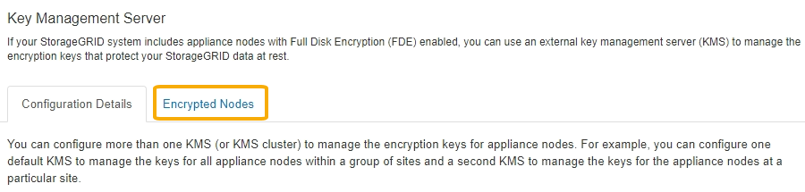

= Afficher les nœuds chiffrés
:allow-uri-read: 
:icons: font
:imagesdir: ../media/

[role="lead"]
Vous pouvez afficher des informations sur les nœuds d'appliance de votre système StorageGRID sur lesquels le paramètre *Node Encryption* est activé.

.Étapes
. Sélectionnez *CONFIGURATION* *sécurité* *serveur de gestion des clés*.
+
La page Key Management Server s'affiche. L'onglet Détails de la configuration affiche tous les serveurs de gestion des clés qui ont été configurés.

+
image::../media/kms_configuration_details_table.png[Tableau KMS des détails de configuration DES KMS]

. En haut de la page, sélectionnez l'onglet *Nodes cryptés*.
+

+
L'onglet nœuds cryptés répertorie les nœuds d'appliance de votre système StorageGRID dont le paramètre *Node Encryption* est activé.

+
image::../media/kms_encrypted_nodes_table.png[Tableau des nœuds cryptés KMS]

. Vérifiez les informations du tableau pour chaque nœud d'appliance.
+
[cols="1a,2a"]
|===
| Colonne | Description 

 a| 
Nom du nœud
 a| 
Nom du nœud d'appliance.

 a| 
Type de nœud
 a| 
Le type de nœud : stockage, Administrateur ou passerelle.

 a| 
Le site
 a| 
Nom du site StorageGRID sur lequel le nœud est installé.

 a| 
Nom d'affichage DES KMS
 a| 
Nom descriptif du KMS utilisé pour le nœud.

Si aucun KMS n'est répertorié, sélectionnez l'onglet Détails de la configuration pour ajouter un KMS.

xref:kms-adding.adoc[Ajout d'un serveur de gestion des clés (KMS)]

 a| 
UID de clé
 a| 
ID unique de la clé de cryptage utilisée pour crypter et décrypter les données sur le nœud de l'appliance. Pour afficher l'intégralité d'un UID de clé, placez le curseur sur la cellule.

Un tiret (--) indique que l'UID de clé est inconnu, peut-être en raison d'un problème de connexion entre le nœud de l'appliance et le KMS.

 a| 
État
 a| 
L'état de la connexion entre le KMS et le nœud de l'appliance. Si le nœud est connecté, l'horodatage est mis à jour toutes les 30 minutes. La mise à jour de l'état de connexion peut prendre plusieurs minutes après la modification de la configuration KMS.

*Remarque :* vous devez actualiser votre navigateur Web pour voir les nouvelles valeurs.

|===
. Si la colonne État indique un problème KMS, répondez immédiatement au problème.
+
Pendant les opérations KMS normales, l'état sera *connecté à KMS*. Si un nœud est déconnecté de la grille, l'état de connexion du nœud est affiché (administrativement arrêté ou inconnu).

+
Les autres messages d'état correspondent aux alertes StorageGRID portant le même nom :

+
** Echec du chargement de la configuration DES KMS
** Erreur de connectivité KMS
** Nom de la clé de cryptage KMS introuvable
** Echec de la rotation de la clé de chiffrement KMS
** La clé KMS n'a pas réussi à décrypter un volume d'appliance
** LES KMS ne sont pas configurés

+
Reportez-vous aux actions recommandées pour ces alertes dans les instructions pour xref:../monitor/index.adoc[Contrôle et dépannage de StorageGRID].

IMPORTANT: Vous devez immédiatement résoudre tout problème pour assurer la protection intégrale de vos données.
