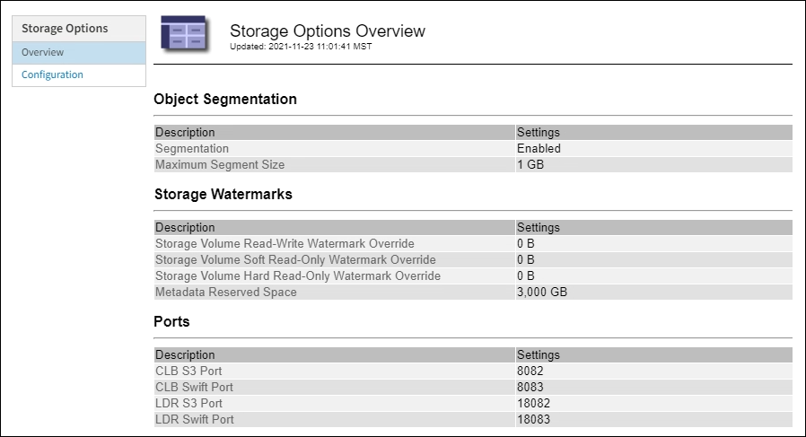

= Gérer les options de stockage
:allow-uri-read: 
:icons: font
:imagesdir: ../media/

[role="lead"]
Les options de stockage incluent les paramètres de segmentation des objets, les valeurs actuelles pour les filigranes du volume de stockage et le paramètre Metadata Reserved Space. Vous pouvez également afficher les ports S3 et Swift utilisés par le service CLB obsolète sur les nœuds de passerelle et par le service LDR sur les nœuds de stockage.

Pour plus d'informations sur les affectations de ports, reportez-vous à la section xref:summary-ip-addresses-and-ports-for-client-connections.adoc[Résumé : adresses IP et ports pour les connexions client].

