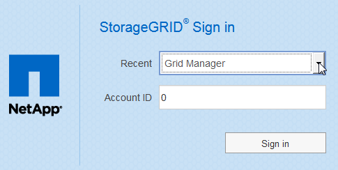

= Connectez-vous au Grid Manager
:allow-uri-read: 
:icons: font
:imagesdir: ../media/

[role="lead"]
Vous accédez à la page de connexion de Grid Manager en entrant le nom de domaine complet (FQDN) ou l'adresse IP d'un noeud d'administration dans la barre d'adresse d'un navigateur Web pris en charge.

.Ce dont vous avez besoin
* Vous disposez de vos identifiants de connexion.
* Vous avez l'URL pour Grid Manager.
* Vous utilisez un xref:../admin/web-browser-requirements.adoc[navigateur web pris en charge].
* Les cookies sont activés dans votre navigateur Web.
* Vous disposez d'autorisations d'accès spécifiques.

.Description de la tâche
Chaque système StorageGRID comprend un nœud d'administration principal et un nombre quelconque de nœuds d'administration non primaires. Vous pouvez vous connecter au Gestionnaire de grille sur n'importe quel noeud d'administration pour gérer le système StorageGRID. Cependant, les nœuds d'administration ne sont pas exactement les mêmes :

* Les accusés de réception d'alarme (système hérité) effectués sur un noeud d'administration ne sont pas copiés sur d'autres noeuds d'administration. Pour cette raison, les informations affichées pour les alarmes peuvent ne pas être identiques sur chaque nœud d'administration.
* Certaines procédures de maintenance peuvent uniquement être effectuées depuis le nœud d'administration principal.

Si des nœuds admin sont inclus dans un groupe haute disponibilité (HA), vous vous connectez à l'aide de l'adresse IP virtuelle du groupe haute disponibilité ou d'un nom de domaine complet mappé sur l'adresse IP virtuelle. Le nœud d'administration principal doit être sélectionné comme interface principale du groupe, de sorte que lorsque vous accédez à Grid Manager, vous y accédez sur le nœud d'administration principal, sauf si le nœud d'administration principal n'est pas disponible.

.Étapes
. Lancez un navigateur Web pris en charge.
. Dans la barre d'adresse du navigateur, entrez l'URL du Grid Manager :
+
`https://_FQDN_or_Admin_Node_IP_/`

+
où `_FQDN_or_Admin_Node_IP_` Est un nom de domaine complet ou l'adresse IP d'un nœud d'administration ou l'adresse IP virtuelle d'un groupe de nœuds d'administration haute disponibilité.

+
Si vous devez accéder à Grid Manager sur un port autre que le port standard pour HTTPS (443), entrez les informations suivantes, où `_FQDN_or_Admin_Node_IP_` Est un nom de domaine complet ou une adresse IP et le port est le numéro de port :

+
`https://_FQDN_or_Admin_Node_IP:port_/`

. Si vous êtes invité à recevoir une alerte de sécurité, installez le certificat à l'aide de l'assistant d'installation du navigateur (voir xref:using-storagegrid-security-certificates.adoc[À propos des certificats de sécurité]).
. Connectez-vous au Grid Manager :
+
** Si l'authentification unique (SSO) n'est pas utilisée pour votre système StorageGRID :
+
... Saisissez votre nom d'utilisateur et votre mot de passe pour le Grid Manager.
... Sélectionnez *connexion*.
+
image::../media/sign_in_grid_manager_no_sso.gif[Page de connexion]

** Si l'authentification SSO est activée pour votre système StorageGRID et qu'il s'agit de la première fois que vous avez accédé à l'URL sur ce navigateur :
+
... Sélectionnez *connexion*. Vous pouvez laisser le champ ID compte vide.
+
image::../media/sso_sign_in_first_time.gif[Connectez-vous à l'écran si SSO est activé et qu'aucun cookie n'est activé]

... Saisissez vos identifiants SSO standard sur la page de connexion SSO de votre entreprise. Par exemple :
+
image::../media/sso_organization_page.gif[Exemple de page de connexion de l'organisation pour SSO]

** Si l'authentification SSO est activée pour votre système StorageGRID et que vous avez déjà accédé au Grid Manager ou à un compte de locataire :
+
... Effectuez l'une des opérations suivantes :
+
**** Saisissez *0* (l'ID de compte pour le gestionnaire de grille) et sélectionnez *connexion*.
**** Sélectionnez *Grid Manager* s'il apparaît dans la liste des comptes récents et sélectionnez *connexion*.
+

... Connectez-vous à l'aide de vos identifiants SSO standard sur la page de connexion SSO de votre entreprise. Lorsque vous êtes connecté, la page d'accueil de Grid Manager s'affiche, qui inclut le tableau de bord. Pour connaître les informations fournies, reportez-vous à la section xref:../monitor/viewing-dashboard.adoc[Afficher le tableau de bord].

+
image::../media/grid_manager_dashboard.png[Tableau de bord]

. Pour vous connecter à un autre nœud d'administration :
+
[cols="1a,2a"]
|===
| Option | Étapes 

 a| 
SSO non activé
 a| 
.. Dans la barre d'adresse du navigateur, entrez le nom de domaine complet ou l'adresse IP de l'autre noeud d'administration. Indiquez le numéro de port requis.
.. Saisissez votre nom d'utilisateur et votre mot de passe pour le Grid Manager.
.. Sélectionnez *connexion*.

 a| 
SSO activé
 a| 
Dans la barre d'adresse du navigateur, entrez le nom de domaine complet ou l'adresse IP de l'autre noeud d'administration.

Si vous vous êtes connecté à un nœud d'administration, vous pouvez accéder aux autres nœuds d'administration sans avoir à vous reconnecter. Toutefois, si votre session SSO expire, vous êtes invité à saisir à nouveau vos informations d'identification.

*Remarque :* SSO n'est pas disponible sur le port restreint Grid Manager. Vous devez utiliser le port HTTPS par défaut (443) si vous souhaitez que les utilisateurs s'authentifient avec une connexion unique.

|===

.Informations associées
* xref:controlling-access-through-firewalls.adoc[Contrôle de l'accès par le biais de pare-feu]
* xref:configuring-sso.adoc[Configurer l'authentification unique]
* xref:managing-admin-groups.adoc[Gérez les groupes d'administration]
* xref:managing-high-availability-groups.adoc[Gérez les groupes haute disponibilité]
* xref:../tenant/index.adoc[Utilisez un compte de locataire]
* xref:../monitor/index.adoc[Surveiller et résoudre les problèmes]

