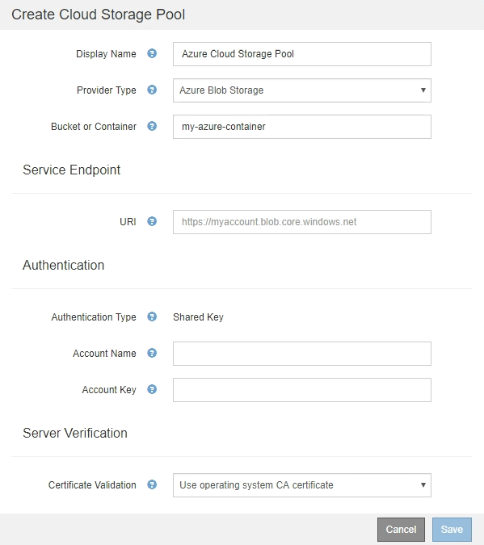

= Azure : spécifiez les détails d'authentification pour un pool de stockage cloud
:allow-uri-read: 
:icons: font
:imagesdir: ../media/

[role="lead"]
Lorsque vous créez un pool de stockage cloud pour le stockage Azure Blob, vous devez spécifier un nom de compte et une clé de compte pour le conteneur externe que StorageGRID utilisera pour stocker des objets.

.Ce dont vous avez besoin, 8217;ll
* Vous avez saisi les informations de base pour le pool de stockage cloud et spécifié *Azure Blob Storage* comme type de fournisseur. *Clé partagée* apparaît dans le champ *Type d'authentification*.
+

* L'URI (Uniform Resource identifier) utilisé pour accéder au conteneur de stockage Blob utilisé pour le pool de stockage cloud.
* Vous connaissez le nom du compte de stockage et la clé secrète. Utilisez le portail Azure pour trouver ces valeurs.

.Étapes
. Dans la section *Service Endpoint*, entrez l'URI (Uniform Resource identifier) utilisé pour accéder au conteneur de stockage Blob utilisé pour le pool de stockage cloud.
+
Spécifiez l'URI dans l'un des formats suivants :

+
** `+https://host:port+`
** `+http://host:port+`

+
Si vous ne spécifiez pas de port, le port 443 est utilisé par défaut pour les URI HTTPS et le port 80 est utilisé pour les URI HTTP. + + *exemple d'URI pour conteneur de stockage Azure Blob* : +
`https://_myaccount_.blob.core.windows.net`

. Dans la section *authentification*, fournissez les informations suivantes :
+
.. Pour *Nom de compte*, entrez le nom du compte de stockage Blob qui possède le conteneur de services externes.
.. Pour *clé de compte*, saisissez la clé secrète du compte de stockage Blob.

+

NOTE: Pour les terminaux Azure, vous devez utiliser l'authentification Shared Key.

. Dans la section *Vérification du serveur*, sélectionnez la méthode à utiliser pour valider le certificat pour les connexions TLS au pool de stockage cloud :
+
[cols="1a,2a"]
|===
| Option | Description 

 a| 
Utiliser le certificat CA du système d'exploitation
 a| 
Utilisez les certificats CA de la grille installés sur le système d'exploitation pour sécuriser les connexions.

 a| 
Utiliser un certificat d'autorité de certification personnalisé
 a| 
Utilisez un certificat d'autorité de certification personnalisé. Sélectionnez *Sélectionner nouveau* et téléchargez le certificat codé PEM.

 a| 
Ne vérifiez pas le certificat
 a| 
Le certificat utilisé pour la connexion TLS n'est pas vérifié.

|===
. Sélectionnez *Enregistrer*.

Lorsque vous enregistrez un pool de stockage cloud, StorageGRID effectue les opérations suivantes :

* Valide que le conteneur et l'URI existent et qu'ils peuvent être atteints à l'aide des informations d'identification que vous avez spécifiées.
* Écrit un fichier de marqueur vers le conteneur pour l'identifier comme pool de stockage cloud. Ne supprimez jamais ce fichier nommé `x-ntap-sgws-cloud-pool-uuid`.

Si la validation du pool de stockage cloud échoue, un message d'erreur s'affiche indiquant pourquoi la validation a échoué. Par exemple, une erreur peut être signalée s'il y a une erreur de certificat ou si le conteneur spécifié n'existe pas déjà.

Reportez-vous aux instructions pour xref:troubleshooting-cloud-storage-pools.adoc[Résolution des problèmes avec les pools de stockage cloud], Résolvez le problème, puis réessayez d'enregistrer le pool de stockage cloud.
