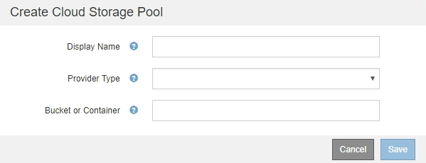

= Création d'un pool de stockage cloud
:allow-uri-read: 
:icons: font
:imagesdir: ../media/

[role="lead"]
Lorsque vous créez un pool de stockage cloud, vous indiquez le nom et l'emplacement du compartiment ou du conteneur externe utilisé par StorageGRID pour stocker des objets, le type de fournisseur cloud (Amazon S3 ou Azure Blob Storage) et le StorageGRID service d'information doit accéder au compartiment ou au conteneur externe.

.Ce dont vous avez besoin
* Vous êtes connecté au Grid Manager à l'aide d'un xref:../admin/web-browser-requirements.adoc[navigateur web pris en charge].
* Vous disposez d'autorisations d'accès spécifiques.
* Vous avez lu les instructions de configuration des pools de stockage cloud.
* Le compartiment ou conteneur externe référencé par le pool de stockage cloud existe déjà.
* Vous disposez de toutes les informations d'authentification requises pour accéder au compartiment ou au conteneur.

.Description de la tâche
Un pool de stockage cloud spécifie un compartiment S3 externe unique ou un conteneur de stockage Azure Blob. StorageGRID valide le pool de stockage cloud dès que vous le sauvegardez. Vous devez donc vous assurer que le compartiment ou le conteneur spécifié dans le pool de stockage cloud est accessible et qu'il existe.

.Étapes
. Sélectionnez *ILM* *Storage pools*.
+
La page Storage pools s'affiche. Cette page contient deux sections : les pools de stockage et les pools de stockage cloud.

+
image::../media/storage_pools_page_cloud_storage_pool.png[Page pools de stockage cloud]

. Dans la section Cloud Storage pools de la page, sélectionnez *Create*.
+
La boîte de dialogue Créer un pool de stockage cloud s'affiche.

+

. Saisissez les informations suivantes :
+
[cols="1a,2a"]
|===
| Champ | Description 

 a| 
Afficher le nom
 a| 
Un nom qui décrit brièvement le pool de stockage cloud et son objectif. Nom facile à identifier lors de la configuration des règles ILM.

 a| 
Type de fournisseur
 a| 
Quel fournisseur de cloud utiliser pour ce pool de stockage cloud :

** *Amazon S3* : sélectionnez cette option pour un terminal S3, C2S S3 ou Google Cloud Platform (GCP).
** *Stockage Azure Blob*

*Remarque :* lorsque vous sélectionnez un type de fournisseur, les sections point de terminaison de service, authentification et vérification du serveur s'affichent en bas de la page.

 a| 
Godet ou conteneur
 a| 
Nom du compartiment S3 externe ou du conteneur Azure créé pour le pool de stockage cloud. Le nom que vous indiquez ici doit correspondre exactement au nom du compartiment ou du conteneur, ou la création du pool de stockage cloud échoue. Vous ne pouvez pas modifier cette valeur après l'enregistrement du pool de stockage cloud.

|===
. Complétez les sections point de terminaison de service, authentification et vérification du serveur de la page, en fonction du type de fournisseur sélectionné.
+
** xref:s3-authentication-details-for-cloud-storage-pool.adoc[S3 : spécifiez les détails d'authentification pour un pool de stockage cloud]
** xref:c2s-s3-authentication-details-for-cloud-storage-pool.adoc[C2S S3 : spécification des détails d'authentification pour un pool de stockage cloud]
** xref:azure-authentication-details-for-cloud-storage-pool.adoc[Azure : spécifiez les détails d'authentification pour un pool de stockage cloud]

