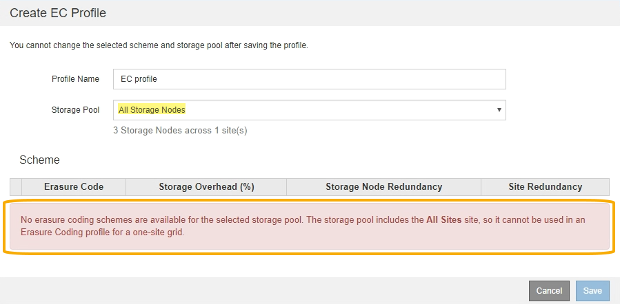

= Créez un profil de code d'effacement
:allow-uri-read: 
:icons: font
:imagesdir: ../media/

[role="lead"]
Pour créer un profil de code d'effacement, vous associez un pool de stockage contenant des nœuds de stockage à un schéma de code d'effacement. Cette association détermine le nombre de données et de fragments de parité créés et l'endroit où le système distribue ces fragments.

.Ce dont vous avez besoin
* Vous êtes connecté au Grid Manager à l'aide d'un xref:../admin/web-browser-requirements.adoc[navigateur web pris en charge].
* Vous disposez d'autorisations d'accès spécifiques.
* Vous avez créé un pool de stockage qui comprend exactement un site ou un pool de stockage comprenant trois sites ou plus. Aucun schéma de code d'effacement n'est disponible pour un pool de stockage possédant que deux sites seulement.

.Description de la tâche
Les pools de stockage utilisés dans les profils de code d'effacement doivent inclure exactement un ou trois sites ou plus. Si vous souhaitez fournir une redondance de site, le pool de stockage doit avoir au moins trois sites.

NOTE: Vous devez sélectionner un pool de stockage contenant des nœuds de stockage. Vous ne pouvez pas utiliser les nœuds d'archivage pour les données avec code d'effacement.

.Étapes
. Sélectionnez *ILM* *codage d'effacement*.
+
La page profils de code d'effacement s'affiche.

+
image::../media/ec_profiles_page.png[Page profils de codage d'effacement]

. Sélectionnez *Créer*.
+
La boîte de dialogue Créer un profil EC s'affiche.

+
image::../media/create_ec_profile_page.png[Créer un profil EC]

. Entrez un nom unique pour le profil de code d'effacement.
+
Les noms de profils de codage d'effacement doivent être uniques. Une erreur de validation se produit si vous utilisez le nom d'un profil existant, même si ce profil a été désactivé.

+

NOTE: Le nom du profil d'effacement Coding est ajouté au nom du pool de stockage dans l'instruction de placement pour une règle ILM.

+
image::../media/storage_pool_and_erasure_coding_profile.png[Nom du pool de stockage et du profil EC]

. Sélectionnez le pool de stockage que vous avez créé pour ce profil de code d'effacement.
+

NOTE: Si votre grille ne contient actuellement qu'un seul site, vous ne pouvez pas utiliser le pool de stockage par défaut, tous les nœuds de stockage ou tout pool de stockage incluant le site par défaut, tous les sites. Ce comportement empêche le profil de code d'effacement de devenir non valide si un second site est ajouté.

+

NOTE: Si un pool de stockage comprend exactement deux sites, vous ne pouvez pas utiliser ce pool de stockage pour le codage d'effacement. Aucun schéma de code d'effacement n'est disponible pour un pool de stockage possédant deux sites.

+
Lorsque vous sélectionnez un pool de stockage, la liste des schémas de code d'effacement disponibles s'affiche, en fonction du nombre de nœuds de stockage et de sites du pool.

+
image::../media/create_ec_profile_three_sites.png[Créer un profil EC trois sites]

+
Pour chaque schéma de code d'effacement, les informations suivantes sont répertoriées :

+
** *Code d’effacement* : le nom du schéma de codage d’effacement dans le format suivant : fragments de données + fragments de parité.
** *Surcharge de stockage (%)* : stockage supplémentaire requis pour les fragments de parité par rapport à la taille des données de l'objet. Frais de stockage = nombre total de fragments de parité / nombre total de fragments de données.
** *Redondance de nœud de stockage* : nombre de nœuds de stockage qui peuvent être perdus tout en conservant la possibilité de récupérer des données d'objet.
** *Redondance de site* : si le code d'effacement sélectionné permet de récupérer les données d'objet en cas de perte d'un site.
+
Pour prendre en charge la redondance des sites, le pool de stockage sélectionné doit inclure plusieurs sites, chacun disposant de suffisamment de nœuds de stockage pour permettre la perte d'un site. Par exemple, pour prendre en charge la redondance de site à l'aide d'un schéma de code d'effacement 6+3, le pool de stockage sélectionné doit inclure au moins trois sites avec au moins trois nœuds de stockage sur chaque site.

+
Les messages s'affichent dans les cas suivants :

+
** Le pool de stockage que vous avez sélectionné ne fournit pas de redondance de site. Le message suivant est attendu lorsque le pool de stockage sélectionné ne comprend qu'un seul site. Vous pouvez utiliser ce profil de code d'effacement dans les règles ILM pour une protection contre les défaillances de nœuds.
+
image::../media/create_ec_profile_no_site_redundancy.png[Créer un profil EC aucune redondance de site]

** Le pool de stockage que vous avez sélectionné ne répond pas aux exigences d'un schéma de code d'effacement. Par exemple, le message suivant est attendu lorsque le pool de stockage sélectionné comprend exactement deux sites. Si vous souhaitez utiliser le code d'effacement pour protéger les données d'objet, vous devez sélectionner un pool de stockage avec exactement un site ou un pool de stockage avec trois sites ou plus.
+
image::../media/ec_profile_error.png[Erreur de profil de codage d'effacement]

** Votre grille inclut un seul site et vous avez sélectionné le pool de stockage par défaut, tous les nœuds de stockage ou tout pool de stockage qui inclut le site par défaut, tous les sites.
+

** Le schéma de code d'effacement et le pool de stockage que vous avez sélectionnés se chevauchent avec un autre profil de code d'effacement.
+
image::../media/ilm_ec_profile_ec_scheme_warning.png[Avertissement de schéma de code d'effacement du profil ILM EC]

+
Dans cet exemple, un message d'avertissement apparaît car un autre profil de code d'effacement utilise le schéma 2+1 et le pool de stockage de l'autre profil utilise également l'un des sites du pool de stockage des 3 sites.

+
Vous n'avez pas pu créer ce nouveau profil, mais il est très prudent de vous en servir dans la politique ILM. Si ce nouveau profil est appliqué aux objets avec code d'effacement déjà protégés par l'autre profil, StorageGRID crée un jeu entièrement nouveau de fragments d'objet. Il ne réutilise pas les fragments 2+1 existants. Des problèmes de ressources peuvent survenir lorsque vous migrez d'un profil de code d'effacement à l'autre, même si les schémas de code d'effacement sont les mêmes.

. Si plusieurs codes d'effacement sont répertoriés, sélectionnez celui que vous souhaitez utiliser.
+
Lorsque vous décidez du schéma de code d'effacement à utiliser, vous devez équilibrer la tolérance aux pannes (obtenue en ayant plus de segments de parité) avec les exigences du trafic réseau pour les réparations (plus de fragments équivaut à davantage de trafic du réseau). Par exemple, lors du choix entre un schéma 4+2 et 6+3, sélectionnez le schéma 6+3 si une parité et une tolérance aux pannes supplémentaires sont requises. Sélectionnez le schéma 4+2 si les ressources réseau sont limitées pour réduire l'utilisation du réseau lors des réparations de nœuds.

. Sélectionnez *Enregistrer*.

