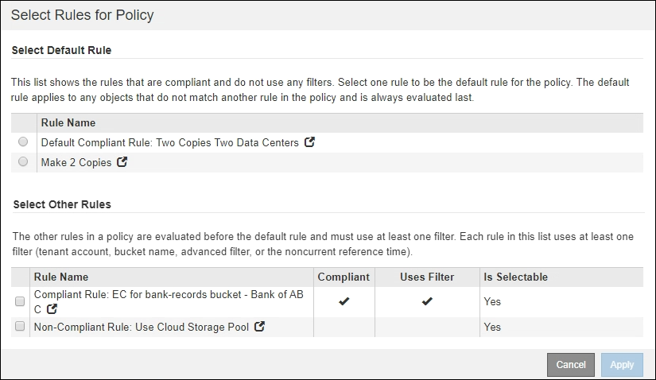

= Créez une règle ILM après l'activation du verrouillage d'objet S3
:allow-uri-read: 
:icons: font
:imagesdir: ../media/

[role="lead"]
Si le paramètre global de verrouillage d'objet S3 est activé, les étapes de création d'une stratégie sont légèrement différentes. Vous devez vous assurer que la règle ILM est conforme aux exigences des compartiments dont l'option de verrouillage des objets S3 est activée.

.Ce dont vous avez besoin, 8217;ll
* Vous êtes connecté au Grid Manager à l'aide d'un xref:../admin/web-browser-requirements.adoc[navigateur web pris en charge].
* Vous disposez d'autorisations d'accès spécifiques.
* Le paramètre global de verrouillage d'objet S3 est déjà activé pour le système StorageGRID.
+

NOTE: Si le paramètre de verrouillage d'objet S3 global n'a pas été activé, suivez les instructions générales pour xref:creating-proposed-ilm-policy.adoc[Création d'une politique ILM proposée].

* Vous avez créé les règles ILM conformes et non conformes que vous souhaitez ajouter à la politique proposée. Si nécessaire, vous pouvez enregistrer une stratégie proposée, créer des règles supplémentaires, puis modifier la stratégie proposée pour ajouter les nouvelles règles. Voirxref:example-7-compliant-ilm-policy-for-s3-object-lock.adoc[Exemple 7 : règle ILM conforme pour le verrouillage d'objet S3].
* Vous avez xref:creating-default-ilm-rule.adoc[Une règle ILM par défaut a été créée] de la règle qui est conforme.
* Vous pouvez également regarder la vidéo : https://netapp.hosted.panopto.com/Panopto/Pages/Viewer.aspx?id=c929e94e-353a-4375-b112-acc5013c81c7["Vidéo : règles ILM de StorageGRID"^]
+
[link=https://netapp.hosted.panopto.com/Panopto/Pages/Viewer.aspx?id=c929e94e-353a-4375-b112-acc5013c81c7]
image::../media/video-screenshot-ilm-policies.png[Vidéo : règles ILM de StorageGRID]

.Étapes
. Sélectionnez *ILM* *Policies*.
+
La page ILM Policies s'affiche. Si le paramètre global S3 Object Lock est activé, la page ILM Policies indique quelles règles ILM sont conformes.

+
image::../media/ilm_policies_page_compliant.png[Conforme à la page de règles ILM]

. Entrez un nom unique pour la stratégie proposée dans le champ *Nom*.
+
Vous devez entrer au moins 1 caractères et pas plus de 64 caractères.

. Entrez la raison pour laquelle vous créez une nouvelle stratégie proposée dans le champ *motif de changement*.
+
Vous devez entrer au moins 1 caractères et pas plus de 128 caractères.

. Pour ajouter des règles à la stratégie, sélectionnez *Sélectionner les règles*.
+
La boîte de dialogue Sélectionner les règles pour la stratégie s'affiche, avec toutes les règles définies répertoriées.

+
** La section Sélectionner la règle par défaut répertorie les règles qui peuvent être par défaut pour une stratégie conforme. Il comprend des règles conformes qui n'utilisent pas de filtres ou l'heure de référence non actuelle.
** La section Sélectionner autres règles répertorie les autres règles compatibles et non conformes qui peuvent être sélectionnées pour cette stratégie.
+

. Sélectionnez un nom de règle ou l'icône plus de détails image:../media/icon_nms_more_details.gif["icône plus de détails"] pour afficher les paramètres de cette règle.
. Dans la section *Sélectionner la règle par défaut*, sélectionnez une règle par défaut pour la stratégie proposée.
+
Le tableau de cette section répertorie uniquement les règles qui sont conformes et n'utilisent aucun filtre.

+

NOTE: Si aucune règle n'est répertoriée dans la section Sélectionner la règle par défaut, vous devez quitter la page de stratégie ILM et xref:creating-default-ilm-rule.adoc[Créez une règle ILM par défaut] c'est-à-dire conforme.

+

IMPORTANT: N'utilisez pas la règle de stock Make 2 copies comme règle par défaut pour une police. La règle Make 2 copies utilise un pool de stockage unique, tous les nœuds de stockage, qui contient tous les sites. Si vous utilisez cette règle, plusieurs copies d'un objet peuvent être placées sur le même site.

. Dans la section *Sélectionner autres règles*, sélectionnez les autres règles que vous souhaitez inclure dans la stratégie.
+
.. Si vous avez besoin d'une règle « par défaut » différente pour les objets dans des compartiments S3 non conformes, vous pouvez sélectionner une règle non conforme qui n'utilise pas de filtre.
+
Par exemple, vous pouvez utiliser un pool de stockage cloud ou un nœud d'archivage pour stocker des objets dans des compartiments où le verrouillage d'objet S3 n'est pas activé.

+

NOTE: Vous ne pouvez sélectionner qu'une règle non conforme qui n'utilise pas de filtre. Dès que vous sélectionnez une règle, la colonne *est sélectionnable* affiche *non* pour toute autre règle non compatible sans filtre.

.. Sélectionnez toutes les autres règles conformes ou non conformes que vous souhaitez utiliser dans la stratégie.
+
Les autres règles doivent utiliser au moins un filtre (compte du locataire, nom de compartiment ou filtre avancé, par exemple la taille de l'objet).

. Lorsque vous avez terminé de sélectionner les règles, sélectionnez *appliquer*.
+
Les règles que vous avez sélectionnées sont répertoriées. La règle par défaut est à la fin, avec les autres règles au-dessus. Si vous avez également sélectionné une règle "par défau" non conforme, cette règle est ajoutée comme règle de second à dernier dans la politique.

+
Dans cet exemple, la dernière règle, 2 copies 2 centres de données, est la règle par défaut : elle est conforme et ne comporte aucun filtre. La règle seconde à dernière, Cloud Storage Pool, n'a pas de filtres mais elle n'est pas conforme.

+
image::../media/ilm_policies_selected_rules_compliant.png[Règles ILM conformes aux règles sélectionnées]

. Faites glisser et déposez les lignes des règles autres que celles par défaut pour déterminer l'ordre dans lequel ces règles seront évaluées.
+
Vous ne pouvez pas déplacer la règle par défaut ou la règle "par défaut" non conforme.

+

IMPORTANT: Vous devez confirmer que les règles ILM sont dans l'ordre correct. Lorsque la stratégie est activée, les objets nouveaux et existants sont évalués par les règles dans l'ordre indiqué, à partir du haut.

. Si nécessaire, sélectionnez l'icône de suppression image:../media/icon_nms_delete_new.gif["icône supprimer"] Pour supprimer les règles que vous ne souhaitez pas inclure dans la stratégie ou *Sélectionner les règles* pour ajouter d'autres règles.
. Lorsque vous avez terminé, sélectionnez *Enregistrer*.
+
La page ILM de NetApp est mise à jour :

+
** La règle que vous avez enregistrée est affichée comme proposée. Les politiques proposées n'ont pas de dates de début et de fin.
** Les boutons *Simulate* et *Activate* sont activés.
+
image::../media/ilm_policy_proposed_policy_s3_object_lock.png[Règle ILM solution de règle S3 de verrouillage d'objet]

. Accédez à xref:simulating-ilm-policy.adoc[Simulation d'une règle ILM].

