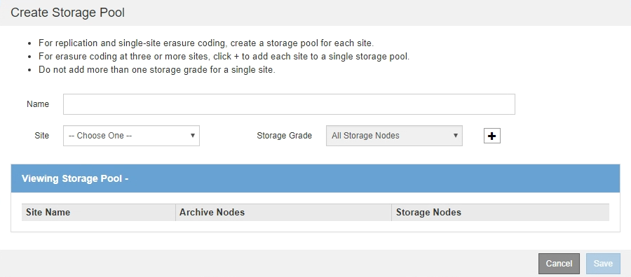

= Créer un pool de stockage
:allow-uri-read: 
:icons: font
:imagesdir: ../media/

[role="lead"]
Vous créez des pools de stockage afin de déterminer où le système StorageGRID stocke les données d'objet et le type de stockage utilisé. Chaque pool de stockage comprend un ou plusieurs sites et une ou plusieurs catégories de stockage.

.Ce dont vous avez besoin, 8217;ll
* Vous êtes connecté au Grid Manager à l'aide d'un xref:../admin/web-browser-requirements.adoc[navigateur web pris en charge].
* Vous disposez d'autorisations d'accès spécifiques.
* Vous avez passé en revue les instructions relatives à la création de pools de stockage.

Les pools de stockage déterminent l'emplacement de stockage des données d'objet. Le nombre de pools de stockage dont vous avez besoin dépend du nombre de sites de votre grid et des types de copies que vous souhaitez : répliquées ou avec code d'effacement.

* Pour la réplication et le code d'effacement à un seul site, créez un pool de stockage pour chaque site. Par exemple, si vous souhaitez stocker les copies d'objets répliquées sur trois sites, créez trois pools de stockage.
* Pour le codage d'effacement sur trois sites ou plus, créez un pool de stockage comprenant une entrée pour chaque site. Par exemple, si vous souhaitez effacement d'objets de code sur trois sites, créez un pool de stockage. Sélectionnez l'icône plus image:../media/icon_plus_sign_black_on_white.gif["insérer l'icône"] pour ajouter une entrée pour chaque site.
+

IMPORTANT: N'incluez pas le site par défaut tous les sites dans un pool de stockage qui sera utilisé dans un profil de code d'effacement. Ajoutez plutôt une entrée distincte au pool de stockage pour chaque site qui stocke les données codées d'effacement. Voir ,cette étape par exemple.

* Si vous disposez de plusieurs niveaux de stockage, ne créez pas de pool de stockage incluant différentes catégories de stockage sur un même site. Voir la xref:guidelines-for-creating-storage-pools.adoc[Instructions pour la création de pools de stockage].

.Étapes
. Sélectionnez *ILM* *Storage pools*.
+
La page Storage pools (pools de stockage) s'affiche et répertorie tous les pools de stockage définis.

+
image::../media/storage_pools_page.png[Page pools de stockage]

+
La liste inclut le pool de stockage par défaut du système, tous les nœuds de stockage, qui utilise le site par défaut du système, tous les sites et la qualité de stockage par défaut, tous les nœuds de stockage.

+

IMPORTANT: Le pool de stockage tous les nœuds de stockage est automatiquement mis à jour lors de l'ajout de nouveaux sites de data Center. Il n'est donc pas recommandé d'utiliser ce pool de stockage dans les règles ILM.

. Pour créer un nouveau pool de stockage, sélectionnez *Créer*.
+
La boîte de dialogue Créer un pool de stockage s'affiche.

+

. Entrez un nom unique pour le pool de stockage.
+
Utilisez un nom qui sera facilement identifié lors de la configuration des profils de code d'effacement et des règles ILM.

. Dans la liste déroulante *site*, sélectionnez un site pour ce pool de stockage.
+
Lorsque vous sélectionnez un site, le nombre de nœuds de stockage et de nœuds d'archivage dans le tableau est automatiquement mis à jour.

+
En général, n'utilisez pas le site par défaut tous les sites dans aucun pool de stockage. Les règles ILM utilisées par un pool de stockage tous les sites placent les objets sur n'importe quel site disponible, ce qui vous permet de réduire le contrôle du placement des objets. En outre, un pool de stockage tous les sites utilise immédiatement les nœuds de stockage sur un nouveau site, ce qui peut ne pas être le comportement que vous attendez.

. Dans la liste déroulante *grade de stockage*, sélectionnez le type de stockage à utiliser si une règle ILM utilise ce pool de stockage.
+
La qualité de stockage tous les nœuds de stockage par défaut inclut tous les nœuds de stockage du site sélectionné. Le niveau de stockage par défaut des nœuds d'archivage inclut tous les nœuds d'archivage du site sélectionné. Si vous avez créé des notes de stockage supplémentaires pour les nœuds de stockage de votre grille, elles sont répertoriées dans la liste déroulante.

. [[Entries]]si vous souhaitez utiliser le pool de stockage dans un profil de code d'effacement multisite, sélectionnez image:../media/icon_plus_sign_black_on_white.gif["insérer l'icône"] pour ajouter une entrée pour chaque site au pool de stockage.
+
image::../media/storage_pools_all_3_sites_for_ec.png[Pools de stockage les 3 sites pour EC]

+
[NOTE]
====
Vous ne pouvez pas créer d'entrées dupliquées ou créer un pool de stockage qui inclut à la fois la qualité de stockage *Archive Nodes* et toute classe de stockage contenant des nœuds de stockage.

Vous êtes averti si vous ajoutez plus d'une entrée pour un site mais avec des niveaux de stockage différents.

====
+
Pour supprimer une entrée, sélectionnez image:../media/icon_nms_delete_new.gif["icône supprimer"].

. Lorsque vous êtes satisfait de vos sélections, sélectionnez *Enregistrer*.
+
Le nouveau pool de stockage est ajouté à la liste.

