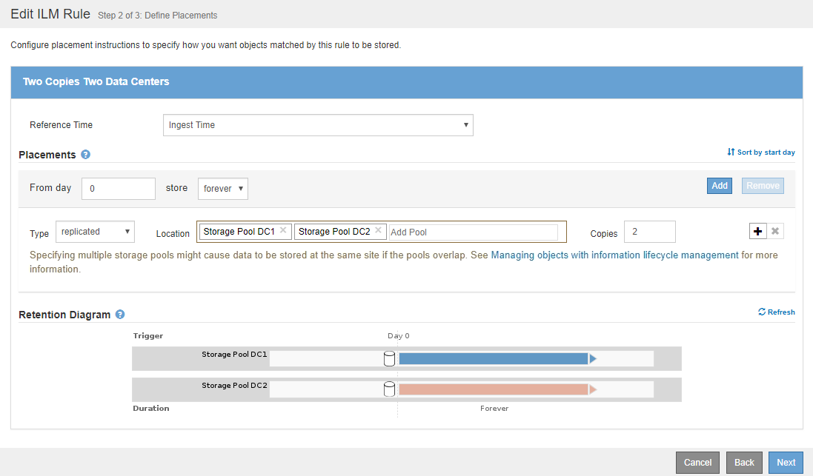

= Exemple 1 : règles et règles ILM pour le stockage objet
:allow-uri-read: 
:icons: font
:imagesdir: ../media/

[role="lead"]
Vous pouvez utiliser les exemples de règles et de règle suivants comme point de départ pour définir une règle ILM afin de répondre à vos exigences de protection et de conservation des objets.

CAUTION: Les règles et règles ILM suivantes ne sont que des exemples. Les règles ILM sont nombreuses. Avant d'activer une nouvelle stratégie, simulez la stratégie proposée pour confirmer qu'elle fonctionnera comme destinée à protéger le contenu contre la perte.

== Règle ILM 1, par exemple : copie des données d'objet dans deux data centers

Cet exemple de règle ILM copie les données d'objet vers les pools de stockage dans deux data centers.

[cols="1a,2a"]
|===
| Définition de règle | Exemple de valeur 

 a| 
Pools de stockage
 a| 
Deux pools de stockage, chacun dans des data centers différents, nommés Storage Pool DC1 et Storage Pool DC2.

 a| 
Nom de la règle
 a| 
Deux copies pour les data centers

 a| 
Heure de référence
 a| 
Temps d'ingestion

 a| 
Placement de contenu
 a| 
Au jour 0, conservez deux copies répliquées à jamais : une dans Storage Pool DC1 et une dans Storage Pool DC2.

|===

== Règle ILM 2, par exemple 1 : profil de codage d'effacement avec mise en correspondance des compartiments

Cette règle ILM utilise un profil de code d'effacement et un compartiment S3 pour déterminer l'emplacement et la durée de stockage de l'objet.

[cols="1a,2a"]
|===
| Définition de règle | Exemple de valeur 

 a| 
Profil de codage d'effacement
 a| 
* Un pool de stockage répartis sur trois data centers (les 3 sites)
* Utilisez le schéma de code d'effacement 6+3

 a| 
Nom de la règle
 a| 
EC pour les enregistrements financiers du compartiment S3

 a| 
Heure de référence
 a| 
Temps d'ingestion

 a| 
Placement de contenu
 a| 
Pour les objets du compartiment S3 appelés « enregistrements financiers », créez une copie avec code d'effacement dans le pool spécifié par le profil de code d'effacement. Conserver cette copie pour toujours.

|===
image:../media/ilm_rule_ec_for_s3_bucket_finance_records.png["Règle ILM 2, par exemple 1 : profil de codage d'effacement avec mise en correspondance des compartiments"]

== Règle ILM, par exemple 1

Le système StorageGRID vous permet de concevoir des règles ILM complexes et sophistiquées. Cependant, en pratique, la plupart des règles ILM sont simples.

Une règle ILM type pour une topologie multisite peut inclure des règles ILM telles que :

* Lors de l'ingestion, utilisez le code d'effacement 6+3 pour stocker tous les objets appartenant au compartiment S3 nommé `finance-records` sur trois data centers.
* Si un objet ne correspond pas à la première règle ILM, utilisez la règle ILM par défaut de la règle, deux copies deux Data Centers, pour stocker une copie de cet objet dans deux data centers, DC1 et DC2.
+
image::../media/policy_1_configured_policy.png[Règle ILM, par exemple 1]

