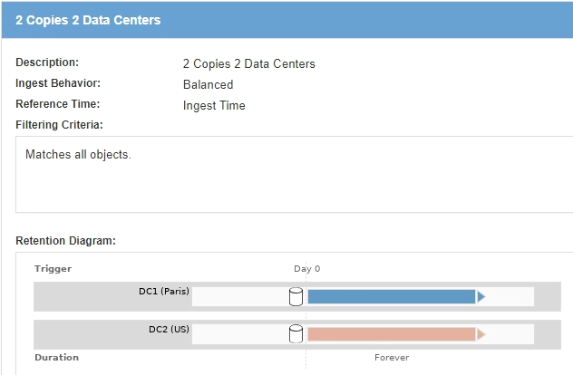

= Exemple 5 : règles et règles ILM pour un comportement d'ingestion strict
:allow-uri-read: 
:icons: font
:imagesdir: ../media/

[role="lead"]
Vous pouvez utiliser un filtre d'emplacement et un comportement d'ingestion strict dans une règle pour empêcher la sauvegarde des objets dans un emplacement de data Center spécifique.

Dans cet exemple, un locataire basé à Paris ne veut pas stocker certains objets en dehors de l'UE en raison de préoccupations réglementaires. Les autres objets, et notamment tous les objets des autres comptes locataires, peuvent être stockés dans le data Center de Paris ou dans le data Center des États-Unis.

CAUTION: Les règles et règles ILM suivantes ne sont que des exemples. Les règles ILM sont nombreuses. Avant d'activer une nouvelle stratégie, simulez la stratégie proposée pour confirmer qu'elle fonctionnera comme destinée à protéger le contenu contre la perte.

.Informations associées
* xref:data-protection-options-for-ingest.adoc[Options de protection des données pour l'ingestion]
* xref:step-3-of-3-define-ingest-behavior.adoc[Étape 3 sur 3 : définir le comportement d'entrée]

== La règle ILM 1, par exemple 5 : une ingestion stricte pour la garantie du data Center Paris

Cet exemple de règle ILM utilise un comportement d'ingestion strict afin de garantir que les objets enregistrés par un locataire Paris dans des compartiments S3 avec la région UE-West-3 (Paris) ne sont jamais stockés dans le data Center des États-Unis.

Cette règle s'applique aux objets appartenant au locataire Paris et dont la région du compartiment S3 est définie sur eu-West-3 (Paris).

[cols="1a,2a"]
|===
| Définition de règle | Exemple de valeur 

 a| 
Compte de locataire
 a| 
Locataire Paris

 a| 
Filtrage avancé
 a| 
La contrainte d'emplacement est égale à eu-West-3

 a| 
Pools de stockage
 a| 
DC1 (Paris)

 a| 
Nom de la règle
 a| 
Ingestion stricte pour le data Center de Paris

 a| 
Heure de référence
 a| 
Temps d'ingestion

 a| 
Placement de contenu
 a| 
Au premier jour, conservez deux copies répliquées à jamais dans DC1 (Paris)

 a| 
Comportement d'ingestion
 a| 
Stricte. Utilisez toujours les placements de cette règle lors de l'entrée. L'ingestion échoue s'il est impossible de stocker deux copies de l'objet dans le data Center de Paris.

|===
image::../media/ilm_rule_1_example_5_strict_ingest.png[Règle ILM 1 exemple 5 ingestion stricte]

== La règle ILM 2, par exemple 5, « ingestion équilibrée » pour d'autres objets

Cet exemple de règle ILM utilise le comportement d'ingestion équilibré pour offrir une efficacité ILM optimale pour tous les objets qui ne sont pas mis en correspondance avec la première règle. Deux copies de tous les objets correspondant à cette règle seront stockées : une dans le data Center des États-Unis et une dans le data Center de Paris. Si la règle ne peut pas être satisfaite immédiatement, des copies intermédiaires sont stockées à tout emplacement disponible.

Cette règle s'applique aux objets appartenant à n'importe quel locataire et à n'importe quelle région.

[cols="1a,2a"]
|===
| Définition de règle | Exemple de valeur 

 a| 
Compte de locataire
 a| 
Ignorer

 a| 
Filtrage avancé
 a| 
_Non spécifié_

 a| 
Pools de stockage
 a| 
DC1 (Paris) et DC2 (Etats-Unis)

 a| 
Nom de la règle
 a| 
2 copies 2 data centers

 a| 
Heure de référence
 a| 
Temps d'ingestion

 a| 
Placement de contenu
 a| 
Au premier jour, conservez deux copies répliquées à jamais dans deux data centers

 a| 
Comportement d'ingestion
 a| 
Équilibré. Si possible, les objets qui correspondent à cette règle sont placés conformément aux instructions de positionnement de la règle. Dans le cas contraire, des copies provisoires sont effectuées à tout emplacement disponible.

|===

== Règle ILM, par exemple 5 : combinaison de comportements d'ingestion

L'exemple de règle ILM comprend deux règles ayant des comportements d'entrée différents.

Deux règles ILM sont appliquées à deux comportements d'ingestion, notamment :

* Stockez des objets qui appartiennent au locataire Paris et qui disposent de la région du compartiment S3 définie sur eu-West-3 (Paris) uniquement dans le data Center de Paris. Echec de l'ingestion si le centre de données Paris n'est pas disponible.
* Stockez tous les autres objets (y compris ceux qui appartiennent à un locataire Paris mais qui disposent d'une région de compartiment différente) dans le data Center américain et dans le data Center de Paris. Effectuez des copies provisoires à tout emplacement disponible si l'instruction de placement ne peut pas être satisfaite.

image::../media/policy_5_ingest_options.png[Exemple d'options d'ingestion ILM Policy 5]

Lorsque vous simulez l'exemple de stratégie, vous vous attendez à ce que les objets test soient évalués comme suit :

* Tous les objets qui appartiennent au locataire Paris et qui disposent de la région du compartiment S3 définie sur eu-West-3 sont mis en correspondance par la première règle et stockés dans le data Center de Paris. La première règle utilise une ingestion stricte. Ces objets ne sont donc jamais stockés dans le data Center des États-Unis. Si les nœuds de stockage du data Center Paris ne sont pas disponibles, l'entrée échoue.
* Tous les autres objets sont mis en correspondance par la deuxième règle, y compris les objets appartenant au locataire Paris et dont la région du compartiment S3 n'est pas définie sur eu-West-3. Une copie de chaque objet est enregistrée dans chaque data Center. Cependant, la seconde règle utilise une ingestion équilibrée, si un data Center n'est plus disponible, deux copies intermédiaires sont enregistrées à tout emplacement disponible.

