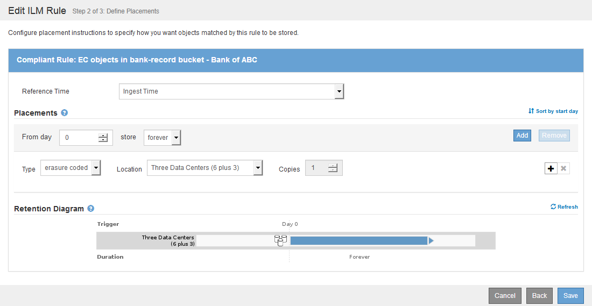

= Exemple 7 : règle ILM conforme pour le verrouillage d'objet S3
:allow-uri-read: 
:icons: font
:imagesdir: ../media/

[role="lead"]
Vous pouvez utiliser le compartiment S3, les règles ILM et la règle ILM dans cet exemple à partir d'un point de départ lors de la définition d'une règle ILM afin de répondre aux exigences de protection et de conservation des objets dans des compartiments où le verrouillage d'objet S3 est activé.

NOTE: Si vous avez utilisé la fonctionnalité de conformité héritée dans les versions précédentes de StorageGRID, vous pouvez également utiliser cet exemple pour gérer les compartiments existants pour lesquels la fonctionnalité de conformité héritée est activée.

CAUTION: Les règles et règles ILM suivantes ne sont que des exemples. Les règles ILM sont nombreuses. Avant d'activer une nouvelle stratégie, simulez la stratégie proposée pour confirmer qu'elle fonctionnera comme destinée à protéger le contenu contre la perte.

.Informations associées
* xref:managing-objects-with-s3-object-lock.adoc[Gestion des objets avec le verrouillage d'objets S3]
* xref:creating-ilm-policy.adoc[Création d'une règle ILM]

== Exemple de compartiment et d'objets pour le verrouillage d'objet S3

Dans cet exemple, un compte de locataire S3 nommé Bank of ABC a utilisé le gestionnaire de locataires pour créer un compartiment avec le verrouillage objet S3 activé pour stocker les enregistrements bancaires stratégiques.

[cols="1a,2a"]
|===
| Définition du compartiment | Exemple de valeur 

 a| 
Nom du compte du locataire
 a| 
Banque d'ABC

 a| 
Nom du compartiment
 a| 
les registres bancaires

 a| 
Région du godet
 a| 
us-east-1 (par défaut)

|===
image::../media/compliant_bucket.png[capture d'écran d'un exemple de compartiment conforme]

Chaque objet et version d'objet ajoutés au compartiment des enregistrements bancaires utilise les valeurs suivantes pour `retain-until-date` et `legal hold` paramètres.

[cols="1a,2a"]
|===
| Paramètre pour chaque objet | Exemple de valeur 

 a| 
`retain-until-date`
 a| 
`"2030-12-30T23:59:59Z"` (30 décembre 2030)

Chaque version d'objet a sa propre version `retain-until-date` réglage. Ce réglage peut être augmenté, mais pas diminué.

 a| 
`legal hold`
 a| 
`"OFF"` (Pas en vigueur)

Une mise en garde légale peut être placée ou levée sur n'importe quelle version d'objet à tout moment pendant la période de conservation. Si un objet est en attente légale, il ne peut pas être supprimé, même si `retain-until-date` a été atteint.

|===

== Règle ILM 1 pour exemple de verrouillage d'objet S3 : profil de codage d'effacement avec mise en correspondance de compartiment

Cet exemple de règle ILM s'applique uniquement au compte de locataire S3 nommé Bank of ABC. Il correspond à n'importe quel objet du `bank-records` Les compartiments utilisent ensuite le code d'effacement pour stocker l'objet sur les nœuds de stockage sur trois sites de data Center à l'aide d'un profil de code d'effacement 6+3. Cette règle répond aux exigences des compartiments avec le verrouillage objet S3 activé : une copie avec code d'effacement est conservée sur les nœuds de stockage du jour 0 à l'infini, en utilisant l'heure de récupération comme heure de référence.

[cols="1a,2a"]
|===
| Définition de règle | Exemple de valeur 

 a| 
Nom de la règle
 a| 
Règle conforme : objets EC dans le compartiment de documents bancaires - Banque d'ABC

 a| 
Compte de locataire
 a| 
Banque d'ABC

 a| 
Nom du compartiment
 a| 
`bank-records`

 a| 
Filtrage avancé
 a| 
Taille de l'objet (Mo) supérieure à 1

*Remarque :* ce filtre garantit que le codage d'effacement n'est pas utilisé pour les objets de 1 Mo ou plus.

|===
image::../media/compliant_rule_ec_copy_step_1.png[Capture d'écran de l'exemple de règle conforme copie EC Etape 1]

[cols="1a,2a"]
|===
| Définition de règle | Exemple de valeur 

 a| 
Heure de référence
 a| 
Temps d'ingestion

 a| 
Placements
 a| 
À partir du jour 0 magasin pour toujours

 a| 
Profil de codage d'effacement
 a| 
* Créez une copie avec code d'effacement sur les nœuds de stockage de trois sites de data Center
* Utilise le schéma de code d'effacement 6+3

|===

== Règle ILM 2 pour exemple de verrouillage d'objet S3 : règle non compatible

Cet exemple de règle ILM stocke au départ deux copies d'objet répliquées sur les nœuds de stockage. Après un an, il stocke une copie sur un pool de stockage cloud pour toujours. Cette règle utilise un pool de stockage cloud. Elle n'est pas conforme et ne s'applique pas aux objets des compartiments où le verrouillage des objets S3 est activé.

[cols="1a,2a"]
|===
| Définition de règle | Exemple de valeur 

 a| 
Nom de la règle
 a| 
Règle non conforme : utilisez le pool de stockage cloud

 a| 
Comptes de locataires
 a| 
Non spécifié

 a| 
Nom du compartiment
 a| 
Non spécifié, mais s'applique uniquement aux compartiments qui n'ont pas le verrouillage d'objet S3 (ou la fonctionnalité de conformité héritée) activé.

 a| 
Filtrage avancé
 a| 
Non spécifié

|===

[cols="1a,2a"]
|===
| Définition de règle | Exemple de valeur 

 a| 
Heure de référence
 a| 
Temps d'ingestion

 a| 
Placements
 a| 
* Le premier jour, conservez deux copies répliquées sur les nœuds de stockage dans le data Center 1 et dans le data Center 2 pendant 365 jours
* Après 1 an, conservez une copie répliquée dans un pool de stockage cloud à jamais

|===

== Règle ILM 3 pour l'exemple de verrouillage d'objet S3 : règle par défaut

Cet exemple de règle ILM copie les données d'objet vers les pools de stockage dans deux data centers. Cette règle conforme est conçue pour être la règle par défaut dans la politique ILM. Elle n'inclut aucun filtre, n'utilise pas l'heure de référence non actuelle et répond aux exigences des compartiments avec le verrouillage objet S3 activé : deux copies d'objet sont conservées sur les nœuds de stockage du jour 0 à l'infini, et l'ingestion comme heure de référence.

[cols="1a,2a"]
|===
| Définition de règle | Exemple de valeur 

 a| 
Nom de la règle
 a| 
Règle de conformité par défaut : deux copies deux centres de données

 a| 
Compte de locataire
 a| 
Non spécifié

 a| 
Nom du compartiment
 a| 
Non spécifié

 a| 
Filtrage avancé
 a| 
Non spécifié

|===
image::../media/compliant_rule_2_copies_2_data_centers_1.png[capture d'écran montrant l'étape 1 de la création de la règle par défaut pour un exemple de conformité]

[cols="1a,2a"]
|===
| Définition de règle | Exemple de valeur 

 a| 
Heure de référence
 a| 
Temps d'ingestion

 a| 
Placements
 a| 
Dès le premier jour, conservez deux copies répliquées : une sur des nœuds de stockage dans le data Center 1 et une sur des nœuds de stockage dans le data Center 2.

|===
image::../media/compliant_rule_2_copies_2_data_centers_2.png[capture d'écran montrant l'étape 2 de la création de la règle par défaut pour l'exemple de conformité]

== Exemple de règle ILM conforme pour l'exemple de verrouillage d'objet S3

Pour créer une règle ILM protégeant efficacement tous les objets de votre système, y compris ceux des compartiments avec le verrouillage objet S3 activé, vous devez sélectionner des règles ILM qui répondent aux besoins de stockage de tous les objets. Vous devez ensuite simuler et activer la règle proposée.

=== Ajouter des règles à la règle

Dans cet exemple, la politique ILM inclut trois règles ILM, dans l'ordre suivant :

. Règle conforme qui utilise le code d'effacement pour protéger les objets de plus de 1 Mo dans un compartiment spécifique avec le verrouillage objet S3 activé. Les objets sont stockés sur les nœuds de stockage du premier jour vers toujours.
. Une règle non conforme qui crée deux copies d'objets répliquées sur les nœuds de stockage pendant un an, puis déplace une copie d'objet vers un pool de stockage cloud à tout moment. Cette règle ne s'applique pas aux compartiments avec le verrouillage d'objet S3 activé car elle utilise un pool de stockage cloud.
. La règle de conformité par défaut qui crée deux copies d'objets répliquées sur les nœuds de stockage du jour 0 à l'infini.

=== Simuler la règle proposée

Une fois que vous avez ajouté des règles dans la stratégie proposée, choisi une règle conforme par défaut et arrangé les autres règles, vous devez simuler la règle en testant les objets à partir du compartiment avec le verrouillage d'objet S3 activé et à partir d'autres compartiments. Par exemple, lorsque vous simulez l'exemple de règle, vous attendez à ce que les objets test soient évalués comme suit :

* La première règle correspond uniquement aux objets de test supérieurs à 1 Mo dans les banques d'enregistrements du compartiment pour le locataire Bank of ABC.
* La deuxième règle fait correspondre tous les objets de tous les compartiments non conformes pour tous les autres comptes de tenant.
* La règle par défaut correspond à ces objets :
+
** Objets de 1 Mo ou plus petits dans les banques d'enregistrements du compartiment pour le locataire Banque d'ABC.
** Objets dans tout autre compartiment pour lequel le verrouillage objet S3 est activé pour tous les autres comptes locataires.

=== Activer la règle

Si vous êtes pleinement satisfait de la nouvelle règle assurant la protection des données d'objet comme prévu, vous pouvez l'activer.
