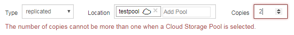

= Étape 2 sur 3 : définir les placements
:allow-uri-read: 
:icons: font
:imagesdir: ../media/

[role="lead"]
L'étape 2 (définir les Placements) de l'assistant de création de règles ILM permet de définir les instructions de placement qui déterminent la durée de stockage des objets, le type de copies (répliquées ou codées d'effacement), l'emplacement de stockage et le nombre de copies.

.Description de la tâche
Une règle ILM peut inclure une ou plusieurs instructions de placement. Chaque instruction de placement s'applique à une seule période de temps. Lorsque vous utilisez plusieurs instructions, les périodes doivent être contiguës et au moins une instruction doit commencer le jour 0. Les instructions peuvent se poursuivre indéfiniment ou jusqu'à ce que vous n'ayez plus besoin de copies d'objet.

Chaque instruction de placement peut avoir plusieurs lignes si vous voulez créer différents types de copies ou utiliser différents emplacements au cours de cette période.

Cet exemple de règle ILM crée deux copies répliquées pour la première année. Chaque copie est enregistrée dans un pool de stockage sur un site différent. Après un an, une copie avec code d'effacement pour 2+1 est effectuée et enregistrée sur un seul site.

image::../media/ilm_create_ilm_rule_wizard_2.png[Assistant création de règle ILM page 2]

.Étapes
. Pour *temps de référence*, sélectionnez le type de temps à utiliser lors du calcul de l'heure de début d'une instruction de positionnement.
+
[cols="1a,2a"]
|===
| Option | Description 

 a| 
Temps d'ingestion
 a| 
Heure à laquelle l'objet a été ingéré.

 a| 
Heure du dernier accès
 a| 
Heure à laquelle l'objet a été récupéré pour la dernière fois (lu ou affiché).

*Remarque :* pour utiliser cette option, les mises à jour de l'heure du dernier accès doivent être activées pour le compartiment S3 ou le conteneur Swift. Voir xref:using-last-access-time-in-ilm-rules.adoc[Utiliser l'heure du dernier accès dans les règles ILM].

 a| 
Heure non actuelle
 a| 
Lorsqu'une version d'objet est devenue non actuelle car une nouvelle version a été ingéré et la remplace en tant que version actuelle.

*Remarque :* le temps non courant s'applique uniquement aux objets S3 dans les compartiments avec gestion des versions.

Vous pouvez utiliser cette option pour réduire l'impact du stockage des objets multiversion en filtrant pour les versions d'objets non à jour. Voir xref:example-4-ilm-rules-and-policy-for-s3-versioned-objects.adoc[Exemple 4 : règles et règles ILM pour les objets avec version S3].

 a| 
Heure de création définie par l'utilisateur
 a| 
Heure spécifiée dans les métadonnées définies par l'utilisateur.

|===
+

NOTE: Si vous souhaitez créer une règle conforme, vous devez sélectionner *temps d'ingestion*.

. Dans la section *Placements*, sélectionnez une heure de début et une durée pour la première période.
+
Par exemple, vous pouvez spécifier où stocker des objets pour la première année ("day 0 for 365 Days"). Au moins une instruction doit commencer au jour 0.

. Pour créer des copies répliquées :
+
.. Dans la liste déroulante *Type*, sélectionnez *Replicated*.
.. Dans le champ *Location*, sélectionnez *Add Pool* pour chaque pool de stockage que vous souhaitez ajouter.
+
*Si vous spécifiez un seul pool de stockage*, sachez que StorageGRID ne peut stocker qu'une seule copie répliquée d'un objet sur un nœud de stockage donné. Si votre grid inclut trois nœuds de stockage et que vous sélectionnez 4 comme nombre de copies, seules trois copies sont effectuées, une copie pour chaque nœud de stockage.

+

NOTE: L'alerte *ILM placement inaccessible* est déclenchée pour indiquer que la règle ILM n'a pas pu être complètement appliquée.

+
*Si vous spécifiez plus d'un pool de stockage*, gardez ces règles à l'esprit :

+
*** Le nombre de copies ne peut pas être supérieur au nombre de pools de stockage.
*** Si le nombre de copies équivaut au nombre de pools de stockage, une copie de l'objet est stockée dans chaque pool de stockage.
*** Si le nombre de copies est inférieur au nombre de pools de stockage, une copie est stockée sur le site d'ingestion, puis le système distribue les copies restantes afin de maintenir un équilibre entre l'utilisation du disque dans les pools, tout en veillant à ce qu'aucun site ne reçoive plus d'une copie d'un objet.
*** Si les pools de stockage se chevauchent (contiennent les mêmes nœuds de stockage), toutes les copies de l'objet peuvent être enregistrées sur un seul site. Pour cette raison, ne spécifiez pas le pool de stockage tous les nœuds de stockage par défaut et un autre pool de stockage.
+
image::../media/ilm_rule_with_multiple_storage_pools.png[Instructions de placement pour plusieurs pools de stockage]

.. Sélectionnez le nombre de copies à effectuer.
+
Un avertissement s'affiche si vous changez le nombre de copies en 1. La règle ILM de création d'une seule copie répliquée pendant toute période met les données à risque de perte permanente. Voir xref:why-you-should-not-use-single-copy-replication.adoc[Pourquoi ne pas utiliser la réplication à copie unique].

+

+
Pour éviter ces risques, effectuez l'une ou plusieurs des opérations suivantes :

+
*** Augmentez le nombre de copies pour la période.
*** Sélectionnez l'icône du signe plus image:../media/icon_plus_sign_black_on_white.gif["signe plus noir sur blanc"] pour créer des copies supplémentaires pendant la période. Ensuite, sélectionnez un autre pool de stockage ou un pool de stockage cloud.
*** Sélectionnez *code d'effacement* pour Type, au lieu de *répliqué*. Vous pouvez ignorer cet avertissement en toute sécurité si cette règle crée déjà plusieurs copies pour toutes les périodes.

.. Si vous n'avez spécifié qu'un seul pool de stockage, ignorez le champ *emplacement temporaire*.
+

NOTE: Les emplacements temporaires sont obsolètes et seront supprimés dans une version ultérieure. Voir xref:using-storage-pool-as-temporary-location-deprecated.adoc[Utiliser un pool de stockage comme emplacement temporaire (obsolète)].

. Pour créer une copie avec code d'effacement :
+
.. Dans la liste déroulante *Type*, sélectionnez *code d'effacement*.
+
Le nombre de copies passe à 1. Un avertissement s'affiche si la règle n'a pas de filtre avancé pour ignorer les objets de 200 Ko ou moins.

+
image::../media/ilm_rule_warning_for_ec_size.png[Avertissement de règle ILM pour la taille EC]

+

IMPORTANT: Le codage d'effacement convient mieux aux objets de plus de 1 Mo. N'utilisez pas le code d'effacement pour des objets de moins de 200 Ko afin d'éviter toute surcharge liée à la gestion de fragments très petits codés d'effacement.

.. Si l'avertissement de taille d'objet s'affiche, sélectionnez *Retour* pour revenir à l'étape 1. Sélectionnez ensuite *filtre avancé* et définissez le filtre taille d'objet (MB) sur une valeur supérieure à 0.2.
.. Sélectionnez l'emplacement de stockage.
+
L'emplacement de stockage d'une copie avec code d'effacement inclut le nom du pool de stockage, suivi du nom du profil de code d'effacement.

+
image::../media/storage_pool_and_erasure_coding_profile.png[Nom du pool de stockage et du profil EC]

. Vous pouvez ajouter des périodes différentes ou créer des copies supplémentaires à différents emplacements :
+
** Sélectionnez l'icône plus pour créer des copies supplémentaires à un autre emplacement pendant la même période.
** Sélectionnez *Ajouter* pour ajouter une période différente aux instructions de placement.
+

NOTE: Les objets sont automatiquement supprimés à la fin de la période finale, sauf si la période finale se termine par *Forever*.

. Pour stocker des objets dans un pool de stockage cloud :
+
.. Dans la liste déroulante *Type*, sélectionnez *Replicated*.
.. Dans le champ *emplacement*, sélectionnez *Ajouter un pool*. Ensuite, sélectionnez un pool de stockage cloud.
+
image::../media/ilm_cloud_storage_pool.gif[Ajout d'un pool de stockage cloud à une instruction de placement]

+
Lorsque vous utilisez des pools de stockage cloud, gardez ces règles à l'esprit :

+
*** Vous ne pouvez pas sélectionner plusieurs pools de stockage cloud dans une instruction de placement unique. De même, vous ne pouvez pas sélectionner un pool de stockage cloud et un pool de stockage dans la même instruction de placement.
+
image::../media/ilm_cloud_storage_pool_error.gif[Erreur de pool de stockage cloud de la règle ILM]

*** Vous ne pouvez stocker qu'une seule copie d'un objet dans un pool de stockage cloud donné. Un message d'erreur s'affiche si vous définissez *copies* sur 2 ou plus.
+

*** Vous ne pouvez pas stocker plusieurs copies d'objet simultanément dans un pool de stockage cloud. Un message d'erreur apparaît si plusieurs parutions utilisant un pool de stockage cloud présentent des dates redondantes ou si plusieurs lignes du même placement utilisent un pool de stockage cloud.
+

*** Vous pouvez stocker un objet dans un pool de stockage cloud simultanément dans lequel celui-ci est stocké sous forme de copies répliquées ou avec code d'effacement dans StorageGRID. Toutefois, comme le montre cet exemple, vous devez inclure plusieurs lignes dans l'instruction de placement pour la période de temps, de sorte que vous puissiez spécifier le nombre et les types de copies pour chaque emplacement.
+
image::../media/ilm_cloud_storage_pool_multiple_locations.png[Règle ILM pool de stockage cloud et autre emplacement]

. Sélectionnez *Actualiser* pour mettre à jour le diagramme de conservation et confirmer vos instructions de placement.
+
Chaque ligne du diagramme indique où et quand les copies d'objet seront placées. Le type de copie est représenté par l'une des icônes suivantes :

+
[cols="1a,2a"]
|===

 a| 
image:../media/icon_nms_replicated.gif["Icône pour les copies répliquées"]
 a| 
La copie répliquée

 a| 
image:../media/icon_nms_erasure_coded.gif["Icône de copie avec code d'effacement"]
 a| 
Copie avec code d'effacement

 a| 

 a| 
Copie du pool de stockage cloud

|===
+
Dans cet exemple, deux copies répliquées seront enregistrées sur deux pools de stockage (DC1 et DC2) pendant un an. Ensuite, une copie avec code d'effacement sera économisé pendant 10 ans supplémentaires et sera recourir à un schéma de code d'effacement 6+3 sur trois sites. Au bout de 11 ans, les objets seront supprimés de StorageGRID.

+
image::../media/ilm_rule_retention_diagram.png[Schéma de conservation des règles ILM]

. Sélectionnez *Suivant*.
+
L'étape 3 (définir le comportement d'ingestion) s'affiche.

.Informations associées
* xref:what-ilm-rule-is.adoc[Définition d'une règle ILM]
* xref:managing-objects-with-s3-object-lock.adoc[Gestion des objets avec le verrouillage d'objets S3]
* xref:step-3-of-3-define-ingest-behavior.adoc[Étape 3 sur 3 : définir le comportement d'entrée]

