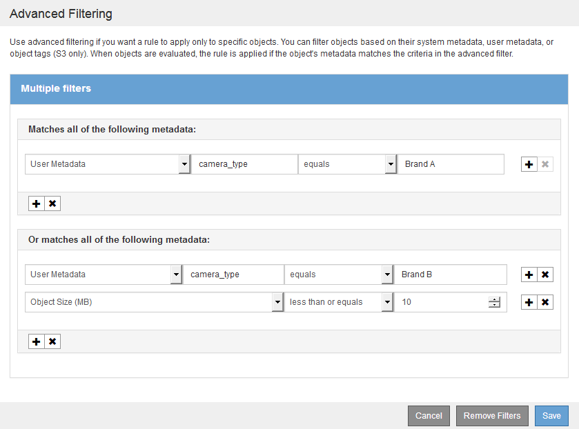

= Utilisation de filtres avancés dans les règles ILM
:allow-uri-read: 
:icons: font
:imagesdir: ../media/

[role="lead"]
Le filtrage avancé vous permet de créer des règles ILM qui s'appliquent uniquement à des objets spécifiques en fonction de leurs métadonnées. Lorsque vous configurez le filtrage avancé d'une règle, vous sélectionnez le type de métadonnées que vous souhaitez associer, sélectionnez un opérateur et spécifiez une valeur de métadonnées. Lors de l'évaluation des objets, la règle ILM s'applique uniquement aux objets dont les métadonnées correspondent au filtre avancé.

Le tableau indique les types de métadonnées que vous pouvez spécifier dans les filtres avancés, les opérateurs que vous pouvez utiliser pour chaque type de métadonnées et les valeurs de métadonnées attendues.

[cols="1a,1a,2a"]
|===
| Type de métadonnées | Opérateurs pris en charge | Valeur des métadonnées 

 a| 
Temps de récupération (microsecondes)
 a| 
* égal à
* n'est pas égal
* inférieur à
* inférieur ou égal à
* supérieur à
* supérieur ou égal à

 a| 
Heure et date d'ingestion de l'objet.

*Remarque :* pour éviter les problèmes de ressources lors de l'activation d'une nouvelle stratégie ILM, vous pouvez utiliser le filtre avancé de temps d'incorporation dans n'importe quelle règle qui pourrait modifier l'emplacement d'un grand nombre d'objets existants. Définissez le temps de transfert sur une valeur supérieure ou égale à la durée approximative de mise en œuvre de la nouvelle stratégie pour garantir que les objets existants ne sont pas déplacés inutilement.

 a| 
Clé
 a| 
* égal à
* n'est pas égal
* contient
* ne contient pas
* commence par
* ne commence pas par
* se termine par
* ne se termine pas par

 a| 
Une clé d'objet S3 ou Swift unique ou complète le système.

Par exemple, vous pouvez faire correspondre les objets qui se terminent avec `.txt` ou commencez par `test-object/`.

 a| 
Heure du dernier accès (microsecondes)
 a| 
* égal à
* n'est pas égal
* inférieur à
* inférieur ou égal à
* supérieur à
* supérieur ou égal à
* existe
* n'existe pas

 a| 
Heure et date de la dernière récupération de l'objet (lecture ou visualisation).

*Remarque :* si vous prévoyez d'utiliser l'heure du dernier accès comme filtre avancé, les mises à jour de l'heure du dernier accès doivent être activées pour le compartiment S3 ou le conteneur Swift.

xref:using-last-access-time-in-ilm-rules.adoc[Utiliser l'heure du dernier accès dans les règles ILM]

 a| 
Contrainte d'emplacement (S3 uniquement)
 a| 
* égal à
* n'est pas égal

 a| 
Région dans laquelle un compartiment S3 a été créé. Utilisez *ILM* *régions* pour définir les régions affichées.

*Note:* Une valeur US-est-1 fera correspondre des objets dans des compartiments créés dans la région US-est-1 ainsi que des objets dans des compartiments n'ayant pas de région spécifiée.

xref:configuring-regions-optional-and-s3-only.adoc[Configuration des régions (facultatif et S3 uniquement)]

 a| 
Taille de l'objet (Mo)
 a| 
* égal à
* n'est pas égal à
* inférieur à
* inférieur ou égal à
* supérieur à
* supérieur ou égal à

 a| 
Taille de l'objet en Mo.

Le codage d'effacement convient mieux aux objets de plus de 1 Mo. N'utilisez pas le code d'effacement pour des objets de moins de 200 Ko afin d'éviter toute surcharge liée à la gestion de fragments très petits codés d'effacement.

*Remarque :* pour filtrer des tailles d'objet inférieures à 1 Mo, entrez une valeur décimale. Le type de navigateur et les paramètres régionaux contrôlent si vous devez utiliser un point ou une virgule comme séparateur décimal.

 a| 
Métadonnées utilisateur
 a| 
* contient
* se termine par
* égal à
* existe
* ne contient pas
* ne se termine pas par
* n'est pas égal
* n'existe pas
* ne commence pas par
* commence par

 a| 
Paire clé-valeur, où *Nom de métadonnées utilisateur* est la clé et *valeur de métadonnées utilisateur* la valeur.

Par exemple, pour filtrer les objets dotés de métadonnées utilisateur de `color=blue`, spécifiez `color` Pour *Nom de métadonnées utilisateur*, `equals` pour l'opérateur, et `blue` Pour *valeur de métadonnées utilisateur*.

*Remarque :* les noms de métadonnées utilisateur ne sont pas sensibles à la casse; les valeurs des métadonnées utilisateur sont sensibles à la casse.

 a| 
Balise d'objet (S3 uniquement)
 a| 
* contient
* se termine par
* égal à
* existe
* ne contient pas
* ne se termine pas par
* n'est pas égal
* n'existe pas
* ne commence pas par
* commence par

 a| 
Paire clé-valeur, où *Nom de balise d'objet* est la clé et *valeur de balise d'objet* la valeur.

Par exemple, pour filtrer les objets qui ont une balise d'objet de `Image=True`, spécifiez `Image` Pour *Nom de balise d'objet*, `equals` pour l'opérateur, et `True` Pour *valeur de balise d'objet*.

*Remarque :* les noms de balise d'objet et les valeurs de balise d'objet sont sensibles à la casse. Vous devez entrer ces éléments exactement comme ils ont été définis pour l'objet.

|===

== Spécification de plusieurs types et valeurs de métadonnées

Lorsque vous définissez le filtrage avancé, vous pouvez spécifier plusieurs types de métadonnées et plusieurs valeurs de métadonnées. Par exemple, si vous souhaitez qu'une règle corresponde à des objets compris entre 10 Mo et 100 Mo, sélectionnez le type de métadonnées *Object Size* et spécifiez deux valeurs de métadonnées.

* La première valeur de métadonnées spécifie des objets supérieurs ou égaux à 10 Mo.
* La seconde valeur de métadonnées spécifie des objets inférieurs ou égaux à 100 Mo.

image::../media/advanced_filtering_size_between.gif[Exemple de filtrage avancé pour la taille d'objet]

L'utilisation de plusieurs entrées vous permet d'avoir un contrôle précis sur les objets à associer. Dans l'exemple suivant, la règle s'applique aux objets dont la marque A ou la marque B est la valeur des métadonnées utilisateur Camera_type. Toutefois, la règle s'applique uniquement aux objets de marque B dont la taille est inférieure à 10 Mo.

