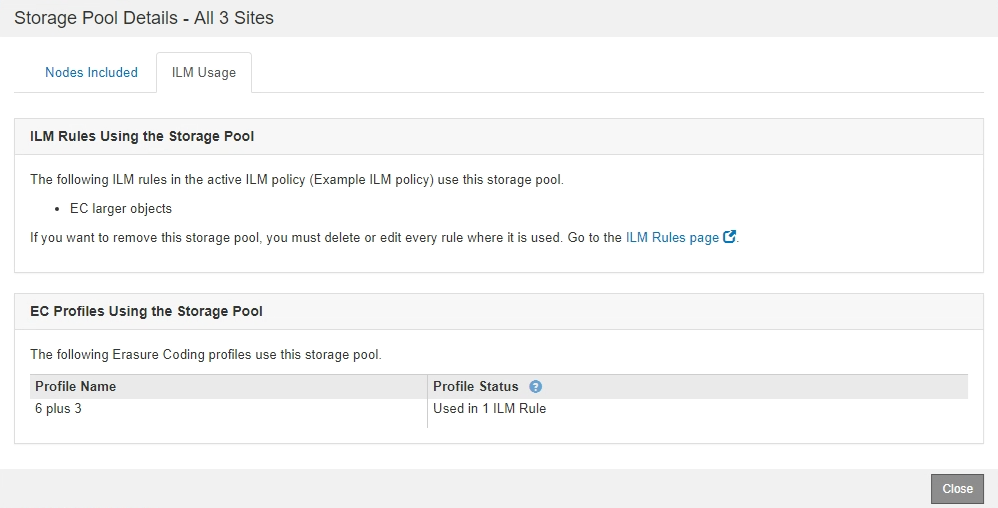

= Afficher les détails du pool de stockage
:allow-uri-read: 
:icons: font
:imagesdir: ../media/

[role="lead"]
Vous pouvez afficher les détails d'un pool de stockage pour déterminer où le pool de stockage est utilisé et pour voir quels nœuds et niveaux de stockage sont inclus.

.Ce dont vous avez besoin
* Vous êtes connecté au Grid Manager à l'aide d'un xref:../admin/web-browser-requirements.adoc[navigateur web pris en charge].
* Vous disposez d'autorisations d'accès spécifiques.

.Étapes
. Sélectionnez *ILM* *Storage pools*.
+
La page Storage pools s'affiche. Cette page répertorie tous les pools de stockage définis.

+
image::../media/storage_pools_page_with_pools.png[Pools de stockage page avec Pools.png]

+
Le tableau contient les informations suivantes pour chaque pool de stockage incluant les nœuds de stockage :

+
** *Nom* : nom d'affichage unique du pool de stockage.
** *Espace utilisé* : espace actuellement utilisé pour stocker des objets dans le pool de stockage.
** *Espace libre* : espace disponible pour stocker des objets dans le pool de stockage.
** *Capacité totale* : la taille du pool de stockage, qui équivaut à la quantité totale d'espace utilisable pour les données d'objet pour tous les nœuds du pool de stockage .
** *Utilisation ILM* : comment le pool de stockage est actuellement utilisé. Un pool de stockage peut être non utilisé, ou être utilisé dans une ou plusieurs règles ILM, les profils de code d'effacement, ou les deux.
+

NOTE: Vous ne pouvez pas supprimer un pool de stockage s'il est utilisé.

. Pour afficher les détails d'un pool de stockage spécifique, sélectionnez son bouton radio et sélectionnez *Afficher les détails*.
+
Le modal Storage Pool Details s'affiche.

. Consultez l'onglet *nœuds inclus* pour en savoir plus sur les nœuds de stockage ou les nœuds d'archivage inclus dans le pool de stockage.
+
image::../media/storage_pools_details_nodes.png[Détails des pools de stockage nœuds]

+
Le tableau inclut les informations suivantes pour chaque nœud :

+
** Nom du nœud
** Nom du site
** Utilisé (%) : pour les nœuds de stockage, pourcentage de l'espace total utilisable pour les données d'objet qui ont été utilisées. Cette valeur n'inclut pas les métadonnées d'objet.
+

NOTE: La même valeur utilisée (%) est également indiquée dans le tableau stockage utilisé - données d'objet pour chaque nœud de stockage (sélectionnez *NOEUDS* *_noeud de stockage_* *Storage*).

. Sélectionnez l'onglet *ILM usage* pour déterminer si le pool de stockage est actuellement utilisé dans les règles ILM ou les profils de code d'effacement.
+
Dans cet exemple, le pool de stockage DC1 est utilisé dans trois règles ILM : deux règles qui figurent dans la politique ILM active et une règle qui ne fait pas partie de la politique active.

+
image::../media/storage_pools_details_ilm.png[Détails de la gestion du cycle de vie des pools de]

+

NOTE: Vous ne pouvez pas supprimer un pool de stockage s'il est utilisé dans une règle ILM.

+
Dans cet exemple, le pool de stockage 3 sites est utilisé dans un profil de code d'effacement. Ensuite, ce profil de code d'effacement est utilisé par une règle ILM de la politique ILM active.

+

+

NOTE: Vous ne pouvez pas supprimer un pool de stockage s'il est utilisé dans un profil de code d'effacement.

. Vous pouvez également consulter la page *ILM Rules* pour en savoir plus sur les règles qui utilisent le pool de stockage et les gérer.
+
Voir les instructions d'utilisation des règles ILM.

. Lorsque vous avez terminé d'afficher les détails du pool de stockage, sélectionnez *Fermer*.

.Informations associées
xref:working-with-ilm-rules-and-ilm-policies.adoc[Utilisation des règles ILM et des règles ILM]
