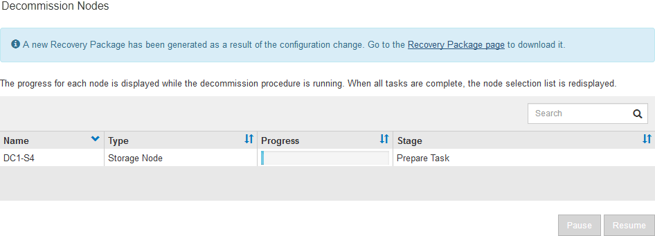

= Désaffectation des nœuds de la grille déconnectés
:allow-uri-read: 
:icons: font
:imagesdir: ../media/

[role="lead"]
Vous devrez peut-être désaffecter un nœud qui n'est pas actuellement connecté à la grille (dont l'état de santé est inconnu ou désactivé d'un point de vue administratif).

.Ce dont vous avez besoin
* Vous comprenez les exigences et xref:considerations-for-decommissioning-grid-nodes.adoc[facteurs à prendre en compte lors de la mise hors service des nœuds].
* Vous avez obtenu tous les éléments prérequis.
* Vous avez vérifié qu'aucun travail de réparation de données n'est actif. Voir xref:checking-data-repair-jobs.adoc[Vérifier les travaux de réparation des données].
* Vous avez confirmé que la restauration du nœud de stockage n'est pas en cours dans la grille. Si c'est le cas, vous devez attendre que la reconstruction Cassandra soit terminée. Vous pouvez ensuite procéder au déclassement.
* Vous avez vérifié que d'autres procédures de maintenance ne seront pas exécutées alors que la procédure de mise hors service du nœud est en cours d'exécution, à moins que la procédure de mise hors service du nœud soit interrompue.
* La colonne *Decommission possible* pour le ou les nœuds déconnectés que vous souhaitez désaffecter contient une coche verte.
* Vous devez disposer de la phrase secrète pour le provisionnement.

.Description de la tâche
Vous pouvez identifier les nœuds déconnectés en recherchant des icônes inconnues (bleu) ou administrativement déconnectées (gris) dans la colonne *Santé*. Dans l'exemple, le nœud de stockage nommé DC1-S4 est déconnecté ; tous les autres nœuds sont connectés.

image::../media/decommission_nodes_page_one_disconnected.png[Page Désaffectez les nœuds avec un nœud déconnecté]

Avant de désaffecter un nœud déconnecté, notez ce qui suit :

* Cette procédure est principalement destinée à supprimer un seul nœud déconnecté. Si votre grille contient plusieurs nœuds déconnectés, le logiciel requiert que vous les désinsaffectez tous en même temps, ce qui augmente le risque de résultats inattendus.
+

IMPORTANT: Soyez très prudent lorsque vous désaffecez plusieurs nœuds de grille déconnectés à la fois, notamment si vous sélectionnez plusieurs nœuds de stockage déconnectés.

* Si un nœud déconnecté ne peut pas être supprimé (par exemple, un nœud de stockage requis pour le quorum ADC), aucun autre nœud déconnecté ne peut être supprimé.

Avant de désaffecter un *noeud de stockage* déconnecté, notez ce qui suit

* Vous ne devez jamais mettre un nœud de stockage déconnecté sauf si vous êtes sûr qu'il ne peut pas être mis en ligne ou récupéré.
+

IMPORTANT: Si vous pensez que les données d'objet peuvent toujours être récupérées depuis le nœud, n'effectuez pas cette procédure. Contactez plutôt le support technique pour déterminer si la restauration du nœud est possible.

* Si vous désaffectez plusieurs nœuds de stockage déconnectés, une perte de données peut se produire. Il se peut que le système ne puisse pas reconstruire les données si les copies d'objet, les fragments avec code d'effacement ou les métadonnées d'objet restent disponibles.
+

IMPORTANT: Si vous ne pouvez pas récupérer plusieurs nœuds de stockage déconnectés, contactez le support technique afin de déterminer la meilleure façon d'agir.

* Lorsque vous désaffectez un nœud de stockage déconnecté, StorageGRID démarre les tâches de réparation des données à la fin du processus de désaffectation. Ces travaux tentent de reconstruire les données d'objet et les métadonnées stockées sur le nœud déconnecté.
* Lorsque vous désaffectez un nœud de stockage déconnecté, la procédure de mise hors service se termine relativement rapidement. Toutefois, l'exécution des tâches de réparation des données peut prendre des jours ou des semaines et ne sont pas surveillées par la procédure de mise hors service. Vous devez contrôler ces travaux manuellement et les redémarrer au besoin. Voir xref:checking-data-repair-jobs.adoc[Vérifier les travaux de réparation des données].
* Si vous désaffectez un nœud de stockage déconnecté qui contient la seule copie d'un objet, celui-ci sera perdu. Les tâches de réparation des données ne peuvent reconstruire et récupérer que des objets si au moins une copie répliquée ou suffisamment de fragments avec code d'effacement existent sur les nœuds de stockage actuellement connectés.

Avant de désaffecter un *noeud d'administration* ou *noeud de passerelle* déconnecté, notez ce qui suit :

* Lorsque vous désaffectez un nœud d'administration déconnecté, vous perdrez les journaux d'audit de ce nœud. Cependant, ces journaux doivent également exister sur le nœud d'administration principal.
* Vous pouvez désactiver un nœud de passerelle en toute sécurité lorsqu'il est déconnecté.

.Étapes
. Essayez de remettre en ligne ou de restaurer les nœuds de la grille déconnectée.
+
Reportez-vous aux procédures de récupération pour obtenir des instructions.

. Si vous ne pouvez pas récupérer un nœud de grille déconnecté et que vous souhaitez le désactiver alors qu'il est déconnecté, cochez la case correspondant à ce nœud.
+

NOTE: Si votre grille contient plusieurs nœuds déconnectés, le logiciel requiert que vous les désinsaffectez tous en même temps, ce qui augmente le risque de résultats inattendus.

+

IMPORTANT: Soyez très prudent lorsque vous choisissez de désaffecter plusieurs nœuds de grille déconnectés à la fois, notamment si vous sélectionnez plusieurs nœuds de stockage déconnectés. Si vous ne pouvez pas récupérer plusieurs nœuds de stockage déconnectés, contactez le support technique afin de déterminer la meilleure façon d'agir.

. Saisissez la phrase secrète pour le provisionnement.
+
Le bouton *Start Decommission* est activé.

. Cliquez sur *Start Decommission*.
+
Un avertissement apparaît, indiquant que vous avez sélectionné un nœud déconnecté et que ces données d'objet seront perdues si le nœud possède la seule copie d'un objet.

+
image::../media/decommission_warning.gif[capture d'écran du message d'avertissement de mise hors service]

. Consultez la liste des nœuds et cliquez sur *OK*.
+
La procédure de mise hors service démarre et la progression est affichée pour chaque nœud. Au cours de la procédure, un nouveau progiciel de récupération est généré contenant le changement de configuration de la grille.

+

. Dès que le nouveau progiciel de récupération est disponible, cliquez sur le lien ou sélectionnez *MAINTENANCE* *système* *progiciel de récupération* pour accéder à la page progiciel de récupération. Ensuite, téléchargez le `.zip` fichier.
+
Reportez-vous aux instructions pour xref:downloading-recovery-package.adoc[Téléchargement du progiciel de restauration].

+

NOTE: Téléchargez le progiciel de récupération dès que possible pour vous assurer que vous pouvez récupérer votre grille si un problème survient pendant la procédure de mise hors service.

+

IMPORTANT: Le fichier du progiciel de récupération doit être sécurisé car il contient des clés de cryptage et des mots de passe qui peuvent être utilisés pour obtenir des données du système StorageGRID.

. Surveillez régulièrement la page mise hors service pour vous assurer que tous les nœuds sélectionnés sont correctement mis hors service.
+
La désaffectation des nœuds de stockage peut prendre plusieurs jours ou semaines. Lorsque toutes les tâches sont terminées, la liste de sélection de nœud apparaît à nouveau avec un message de réussite. Si vous avez désactivé un nœud de stockage déconnecté, un message d'information indique que les tâches de réparation ont été lancées.

+
image::../media/decommission_nodes_data_repair.png[capture d'écran indiquant que les travaux de réparation ont démarré]

. Une fois les nœuds arrêtés automatiquement dans le cadre de la procédure de mise hors service, supprimez les machines virtuelles restantes ou d'autres ressources associées au nœud mis hors service.
+

IMPORTANT: Ne pas effectuer cette étape tant que les nœuds ne sont pas arrêtés automatiquement.

. Si vous désaffecez un nœud de stockage, surveillez l'état des tâches de réparation *données répliquées* et *données codées d'effacement (EC)* qui sont automatiquement lancées pendant le processus de mise hors service.

[role="tabbed-block"]
====
.Les données répliquées
--
* Pour déterminer si les réparations sont terminées :
+
.. Sélectionnez *NOEUDS* *_noeud de stockage en cours de réparation_* *ILM*.
.. Vérifiez les attributs dans la section évaluation. Lorsque les réparations sont terminées, l'attribut *attente - tous* indique 0 objets.

* Pour surveiller la réparation plus en détail :
+
.. Sélectionnez *SUPPORT* > *Outils* > *topologie de grille*.
.. Sélectionnez *_GRID_* *_Storage Node en cours de réparation_* *LDR* *Data Store*.
.. Utilisez une combinaison des attributs suivants pour déterminer, autant que possible, si les réparations répliquées sont terminées.
+

NOTE: Cassandra peut présenter des incohérences et les réparations qui ont échoué ne sont pas suivies.

+
*** *Réparations tentées (XRPA)* : utilisez cet attribut pour suivre la progression des réparations répliquées. Cet attribut augmente chaque fois qu'un nœud de stockage tente de réparer un objet à haut risque. Lorsque cet attribut n'augmente pas pendant une période plus longue que la période d'acquisition actuelle (fournie par l'attribut *période d'analyse -- estimation*), cela signifie que l'analyse ILM n'a trouvé aucun objet à haut risque qui doit être réparé sur n'importe quel nœud.
+

NOTE: Les objets à haut risque sont des objets qui risquent d'être complètement perdus. Cela n'inclut pas les objets qui ne satisfont pas leur configuration ILM.

*** *Période d'acquisition -- estimée (XSCM)* : utilisez cet attribut pour estimer quand une modification de règle sera appliquée aux objets précédemment ingérés. Si l'attribut *réparations tentées* n'augmente pas pendant une période supérieure à la période d'acquisition actuelle, il est probable que les réparations répliquées soient effectuées. Notez que la période d'acquisition peut changer. L'attribut *période d'acquisition -- estimée (XSCM)* s'applique à la grille entière et est le maximum de toutes les périodes d'acquisition de nœud. Vous pouvez interroger l'historique d'attributs *période de balayage -- estimation* de la grille pour déterminer une période appropriée.

* Si vous souhaitez obtenir un pourcentage d'achèvement estimé pour la réparation répliquée, ajoutez le `show-replicated-repair-status` option de la commande repair-data.
+
`repair-data show-replicated-repair-status`

+

IMPORTANT: Le `show-replicated-repair-status` Une option de présentation technique est disponible dans StorageGRID 11.6. Cette fonction est en cours de développement et la valeur renvoyée peut être incorrecte ou retardée. Pour déterminer si une réparation est terminée, utilisez *attente – tous*, *réparations tentées (XRPA)* et *période de balayage -- estimé (XSCM)* comme décrit dans xref:..//maintain/restoring-object-data-to-storage-volume-where-system-drive-is-intact.adoc[Surveiller les réparations].

--
.Données avec code d'effacement (EC)
--
Pour surveiller la réparation des données codées d'effacement et réessayer toute demande qui pourrait avoir échoué :

. Déterminez l'état des réparations des données par code d'effacement :
+
** Sélectionnez *SUPPORT* *Outils* *métriques* pour afficher le temps estimé jusqu'à l'achèvement et le pourcentage d'achèvement du travail en cours. Sélectionnez ensuite *EC Overview* dans la section Grafana. Examinez les tableaux de bord *Grid EC Job estimé Time to Completion* et *Grid EC Job Percentage Finted*.
** Utilisez cette commande pour afficher le statut d'un spécifique `repair-data` fonctionnement :
+
`repair-data show-ec-repair-status --repair-id repair ID`

** Utilisez cette commande pour lister toutes les réparations :
+
`repair-data show-ec-repair-status`

+
Les informations de sortie sont affichées, notamment `repair ID`, pour toutes les réparations précédentes et en cours.

. Si le résultat indique que l'opération de réparation a échoué, utilisez le `--repair-id` option permettant de réessayer la réparation.
+
Cette commande relance une réparation de nœud ayant échoué à l'aide de l'ID de réparation 6949309319275667690 :

+
`repair-data start-ec-node-repair --repair-id 6949309319275667690`

+
Cette commande relance une réparation de volume en échec à l'aide de l'ID de réparation 6949309319275667690 :

+
`repair-data start-ec-volume-repair --repair-id 6949309319275667690`

--
====
.Une fois que vous avez terminé
Dès que les nœuds déconnectés ont été désaffectés et que toutes les tâches de réparation de données ont été effectuées, vous pouvez désaffecter tous les nœuds de la grille connectés si nécessaire.

Ensuite, procédez comme suit après avoir effectué la procédure de mise hors service :

* Assurez-vous que les disques du nœud de la grille mis hors service sont nettoyés. Utilisez un outil ou un service d'effacement de données disponible dans le commerce pour supprimer définitivement et de manière sécurisée les données des lecteurs.
* Si vous désaffecté un nœud d'appliance et que les données de l'appliance étaient protégées à l'aide du chiffrement des nœuds, utilisez le programme d'installation de l'appliance StorageGRID pour effacer la configuration du serveur de gestion des clés (KMS transparent). Vous devez effacer la configuration KMS si vous souhaitez ajouter l'appliance à une autre grille.
+
** xref:../sg100-1000/index.adoc[Appareils de services SG100 et SG1000]
** xref:../sg5600/index.adoc[Appliances de stockage SG5600]
** xref:../sg5700/index.adoc[Appliances de stockage SG5700]
** xref:../sg6000/index.adoc[Dispositifs de stockage SG6000]

.Informations associées
xref:grid-node-recovery-procedures.adoc[Procédures de restauration des nœuds de la grille]
