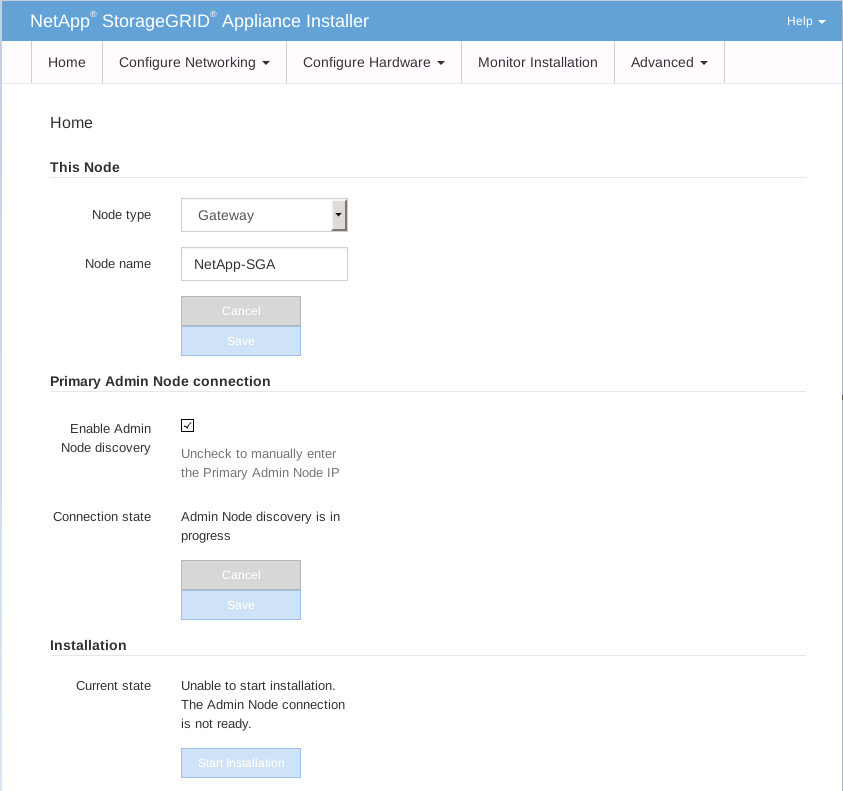
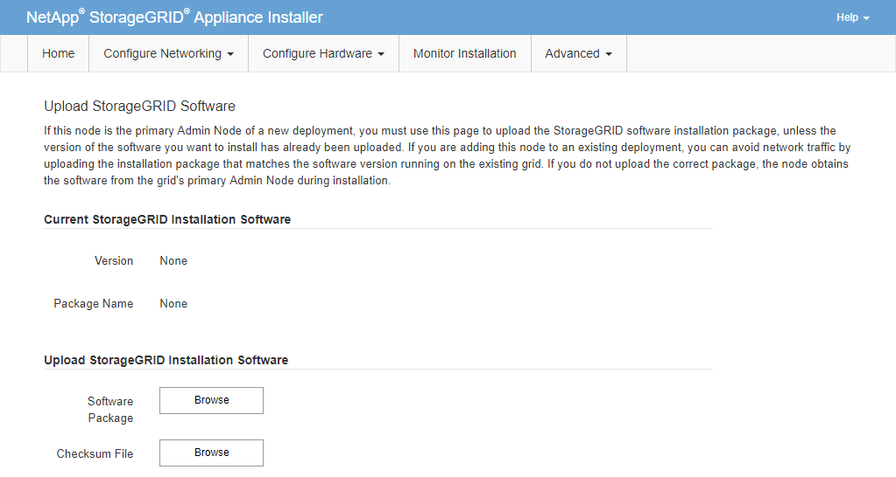

= Démarrez l'installation du logiciel sur l'appliance des services
:allow-uri-read: 
:icons: font
:imagesdir: ../media/

[role="lead"]
Pour installer un nœud de passerelle ou un nœud d'administration sur une appliance de services SG100 ou SG1000, utilisez le programme d'installation de l'appliance StorageGRID inclus sur l'appliance.

.Ce dont vous avez besoin, 8217;ll
* L'appliance doit être installée dans un rack, connectée à vos réseaux et sous tension.
* Les liens réseau et les adresses IP doivent être configurés pour l'appliance à l'aide du programme d'installation de l'appliance StorageGRID.
* Si vous installez un nœud de passerelle ou un nœud d'administration non primaire, vous connaissez l'adresse IP du nœud d'administration principal de la grille StorageGRID.
* Tous les sous-réseaux du réseau Grid répertoriés sur la page de configuration IP du programme d'installation de l'appliance StorageGRID doivent être définis dans la liste de sous-réseaux du réseau de la grille sur le nœud d'administration principal.

Pour obtenir des instructions sur l'exécution de ces tâches préalables, reportez-vous aux instructions d'installation et de maintenance d'un appareil de services SG100 ou SG1000.

* Vous devez utiliser un xref:../admin/web-browser-requirements.adoc[navigateur web pris en charge].
* Vous devez connaître l'une des adresses IP attribuées à l'appliance. Vous pouvez utiliser l'adresse IP du réseau Admin, du réseau Grid ou du réseau client.
* Si vous installez un nœud d'administration principal, vous disposez des fichiers d'installation Ubuntu ou Debian pour cette version de StorageGRID.
+

NOTE: Une version récente du logiciel StorageGRID est préchargée sur l'appliance de services pendant la fabrication. Si la version préchargée du logiciel correspond à la version utilisée dans votre déploiement StorageGRID, vous n'avez pas besoin des fichiers d'installation.

Pour installer le logiciel StorageGRID sur une appliance de services SG100 ou SG1000 :

* Pour un nœud d'administration principal, vous spécifiez le nom du nœud, puis téléchargez les packs logiciels appropriés (le cas échéant).
* Pour un noeud d'administration non primaire ou un noeud de passerelle, vous spécifiez ou confirmez l'adresse IP du noeud d'administration principal et le nom du noeud.
* Vous démarrez l'installation et attendez que les volumes soient configurés et que le logiciel soit installé.
* Partway tout au long du processus, l'installation se met en pause. Pour reprendre l'installation, vous devez vous connecter à Grid Manager et configurer le nœud en attente en remplacement du nœud ayant échoué.
* Une fois le nœud configuré, le processus d'installation de l'appliance est terminé et l'appliance est redémarrée.

.Étapes
. Ouvrez un navigateur et saisissez l'une des adresses IP de l'appliance de services SG100 ou SG1000.
+
`+https://Controller_IP:8443+`

+
La page d'accueil du programme d'installation de l'appliance StorageGRID s'affiche.

+

. Pour installer un nœud d'administration principal :
+
.. Dans la section noeud, pour *Type de noeud*, sélectionnez *Administrateur principal*.
.. Dans le champ *Nom du noeud*, entrez le même nom que celui utilisé pour le noeud que vous êtes en train de récupérer, puis cliquez sur *Enregistrer*.
.. Dans la section installation, vérifiez la version du logiciel répertoriée sous l'état actuel
+
Si la version du logiciel prêt à être installée est correcte, passez à l'étape ,Étape d'installation.

.. Si vous devez télécharger une autre version du logiciel, dans le menu *Avancé*, sélectionnez *Télécharger le logiciel StorageGRID*.
+
La page Télécharger le logiciel StorageGRID s'affiche.

+

.. Cliquez sur *Parcourir* pour télécharger le *progiciel* et le *fichier de somme de contrôle* pour le logiciel StorageGRID.
+
Les fichiers sont automatiquement chargés après leur sélection.

.. Cliquez sur *Accueil* pour revenir à la page d'accueil du programme d'installation de l'appliance StorageGRID.

. Pour installer un nœud de passerelle ou un nœud d'administration non primaire :
+
.. Dans la section noeud, pour *Type de noeud*, sélectionnez *passerelle* ou *non-administrateur principal*, selon le type de noeud que vous restaurez.
.. Dans le champ *Nom du noeud*, entrez le même nom que celui utilisé pour le noeud que vous êtes en train de récupérer, puis cliquez sur *Enregistrer*.
.. Dans la section connexion au noeud d'administration principal, déterminez si vous devez spécifier l'adresse IP du noeud d'administration principal.
+
Le programme d'installation de l'appliance StorageGRID peut détecter automatiquement cette adresse IP, en supposant que le nœud d'administration principal, ou au moins un autre nœud de grille avec ADMIN_IP configuré, soit présent sur le même sous-réseau.

.. Si cette adresse IP n'apparaît pas ou si vous devez la modifier, spécifiez l'adresse :

+
[cols="1a,2a"]
|===
| Option | Description 

 a| 
Entrée IP manuelle
 a| 
.. Désélectionnez la case à cocher *Activer la découverte du nœud d'administration*.
.. Saisissez l'adresse IP manuellement.
.. Cliquez sur *Enregistrer*.
.. Attendez que l'état de connexion de la nouvelle adresse IP devienne « prêt ».

 a| 
Détection automatique de tous les nœuds d'administration principaux connectés
 a| 
.. Cochez la case *Activer la découverte du noeud d'administration*.
.. Dans la liste des adresses IP découvertes, sélectionnez le nœud d'administration principal de la grille sur lequel cette appliance de services sera déployée.
.. Cliquez sur *Enregistrer*.
.. Attendez que l'état de connexion de la nouvelle adresse IP devienne « prêt ».

|===
. [[installation_section_STEP]]dans la section installation, vérifiez que l'état actuel est prêt à démarrer l'installation du nom du noeud et que le bouton *Démarrer l'installation* est activé.
+
Si le bouton *Start installation* n'est pas activé, vous devrez peut-être modifier la configuration réseau ou les paramètres de port. Pour obtenir des instructions, reportez-vous aux instructions d'installation et de maintenance de votre appareil.

. Dans la page d'accueil du programme d'installation de l'appliance StorageGRID, cliquez sur *Démarrer l'installation*.
+
L'état actuel passe à « installation en cours » et la page installation du moniteur s'affiche.

+

NOTE: Si vous devez accéder manuellement à la page installation du moniteur, cliquez sur *installation du moniteur* dans la barre de menus.

xref:../sg100-1000/index.adoc[Appareils de services SG100 et SG1000]
