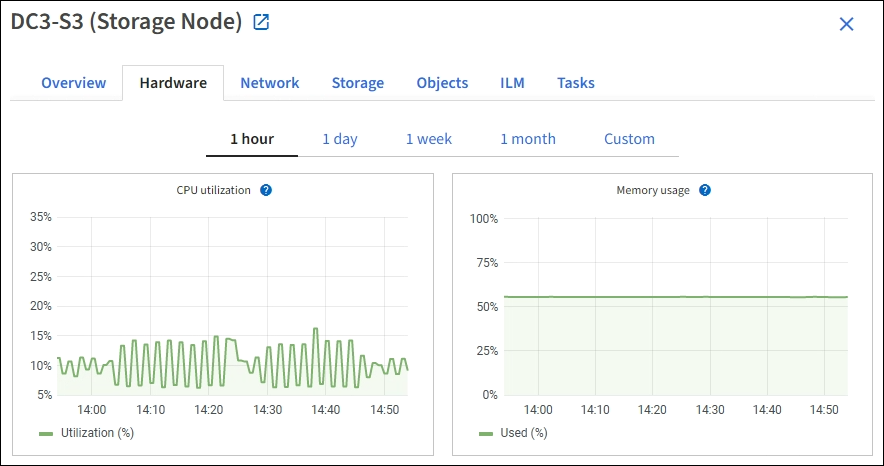

= Contrôle des ressources au niveau des nœuds
:allow-uri-read: 
:icons: font
:imagesdir: ../media/

[role="lead"]
Vous devez surveiller chaque nœud de la grille pour vérifier ses niveaux d'utilisation des ressources.

.Ce dont vous avez besoin, 8217;ll
* Vous devez être connecté au Grid Manager à l'aide d'un xref:../admin/web-browser-requirements.adoc[navigateur web pris en charge].

Si les nœuds sont constamment surchargés, un nombre plus élevé de nœuds peut être requis pour une efficacité optimale des opérations.

.Étapes
. Pour afficher des informations sur l'utilisation matérielle d'un nœud de grid :
+
.. Dans la page *NODES*, sélectionnez le noeud.
.. Sélectionnez l'onglet *matériel* pour afficher les graphiques de l'utilisation de l'UC et de la mémoire.
+

.. Pour afficher un intervalle de temps différent, sélectionnez l'une des commandes au-dessus du graphique ou du graphique. Vous pouvez afficher les informations disponibles pour les intervalles de 1 heure, 1 jour, 1 semaine ou 1 mois. Vous pouvez également définir un intervalle personnalisé, qui vous permet de spécifier des plages de date et d'heure.
.. Si le nœud est hébergé sur une appliance de stockage ou sur une appliance de services, faites défiler la page vers le bas pour afficher les tableaux des composants. L'état de tous les composants doit être « nominal ». Rechercher les composants ayant un autre état.

xref:viewing-hardware-tab.adoc#view-information-about-appliance-storage-nodes[Afficher des informations sur les nœuds de stockage de l'appliance]

xref:viewing-hardware-tab.adoc#view-information-about-appliance-admin-nodes-and-gateway-nodes[Affiche des informations sur les nœuds d'administration de l'appliance et les nœuds de passerelle]
