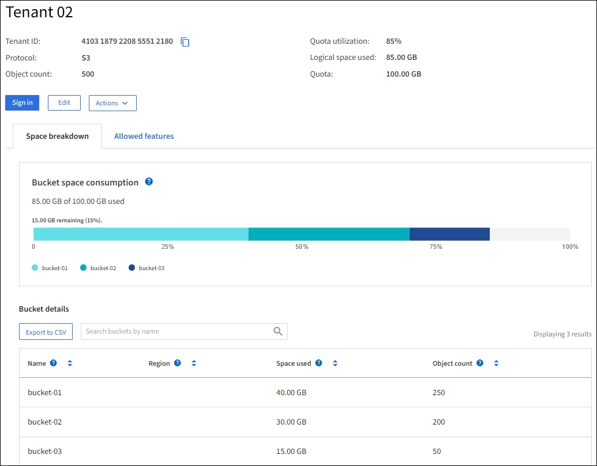

= Surveillez l'activité des locataires
:allow-uri-read: 
:icons: font
:imagesdir: ../media/

[role="lead"]
Toute l'activité client est associée à un compte de locataire. Vous pouvez utiliser Grid Manager pour surveiller l'utilisation du stockage ou du trafic réseau d'un locataire, ou encore utiliser le journal d'audit ou les tableaux de bord Grafana pour obtenir des informations plus détaillées sur l'utilisation de StorageGRID par les locataires.

.Ce dont vous avez besoin, 8217;ll
* Vous êtes connecté au Grid Manager à l'aide d'un xref:../admin/web-browser-requirements.adoc[navigateur web pris en charge].
* Vous disposez de l'autorisation accès racine ou Administrateur.

.Description de la tâche

IMPORTANT: Les valeurs de l'espace utilisé sont des estimations. Ces estimations sont affectées par le moment de l'ingestion, la connectivité réseau et l'état des nœuds.

.Étapes
. Sélectionnez *LOCATAIRES* pour examiner la quantité de stockage utilisée par tous les locataires.
+
L'espace logique utilisé, l'utilisation du quota, l'quota et le nombre d'objets sont répertoriés pour chaque locataire. Si un quota n'est pas défini pour un locataire, les champs utilisation du quota et quota contiennent un tiret (#8212;).

+
image::../media/tenant_accounts_page.png[Page comptes de tenant]

+
Vous pouvez vous connecter à un compte de tenant en sélectionnant le lien de connexion image:../media/icon_tenant_sign_in.png["Icône de connexion du locataire"] Dans la colonne URL * connexion/copie* de la table.

+
Vous pouvez copier l'URL de la page de connexion d'un locataire en sélectionnant le lien Copier l'URL image:../media/icon_tenant_copy_url.png["Icône URL de copie du locataire"] Dans la colonne URL * connexion/copie* de la table.

. Vous pouvez également sélectionner *Exporter au format CSV* pour afficher et exporter un fichier .csv contenant les valeurs d'utilisation de tous les locataires.
+
Vous êtes invité à ouvrir ou enregistrer le `.csv` fichier.

+
Le contenu d'un fichier .csv ressemble à l'exemple suivant :

+
image::../media/tenant_accounts_example_csv.png[Exemple de comptes de locataires .csv]

+
Vous pouvez ouvrir le fichier .csv dans une feuille de calcul ou l'utiliser pour l'automatisation.

. Pour afficher les détails d'un locataire spécifique, y compris les graphiques d'utilisation, sélectionnez le nom du compte de tenant dans la page des locataires.
+

+
** *Vue d'ensemble du locataire*
+
La zone de vue d'ensemble du locataire contient des valeurs pour le nombre d'objets, l'utilisation des quotas, l'espace logique utilisé et le paramètre de quota.

** *Ventilation de l'espace -- consommation d'espace*
+
L'onglet répartition de l'espace inclut des valeurs pour la consommation d'espace total du compartiment (S3) ou conteneur (Swift), ainsi que l'espace utilisé et le nombre d'objets pour chaque compartiment ou conteneur.

+
Si un quota a été défini pour ce locataire, le montant du quota utilisé et restant est affiché dans le texte (par exemple, `85.00 GB of 100 GB used`). Si aucun quota n'a été défini, le locataire a un quota illimité et le texte ne comprend qu'une quantité d'espace utilisé (par exemple, `85.00 GB used`). Le graphique à barres indique le pourcentage de quota dans chaque compartiment ou conteneur. Si le locataire a dépassé le quota de stockage de plus de 1 % et d'au moins 1 Go, le graphique indique le quota total et le montant de l'excès.

+
Vous pouvez placer le curseur sur le graphique à barres pour voir le stockage utilisé par chaque compartiment ou conteneur. Vous pouvez placer votre curseur sur le segment de l'espace libre pour voir la quantité de quota de stockage restant.

+
image::../media/tenant_bucket_space_consumption_GM.png[Tableau à barres de consommation du compartiment des locataires]

+

IMPORTANT: L'utilisation des quotas est basée sur des estimations internes et peut être dépassée dans certains cas. Par exemple, StorageGRID vérifie le quota lorsqu'un locataire commence à charger des objets et rejette les nouvelles ingère si le locataire a dépassé le quota. Cependant, StorageGRID ne prend pas en compte la taille du téléchargement actuel lors de la détermination du dépassement du quota. Si des objets sont supprimés, un locataire peut être temporairement empêché de charger de nouveaux objets jusqu'à ce que l'utilisation des quotas soit recalculée. Le calcul de l'utilisation des quotas peut prendre au moins 10 minutes.

+

NOTE: L'utilisation des quotas d'un locataire indique la quantité totale des données d'objet que le locataire a téléchargées sur StorageGRID (taille logique). L'utilisation du quota ne représente pas l'espace utilisé pour stocker les copies de ces objets et de leurs métadonnées (taille physique).

+

NOTE: Vous pouvez activer l'alerte *tenant quota usage high* pour déterminer si les locataires consomment leurs quotas. Si elle est activée, cette alerte est déclenchée lorsqu'un locataire a utilisé 90 % de son quota. Pour plus d'informations, reportez-vous à la référence des alertes.

** *Ventilation de l'espace -- Détails du godet ou du conteneur*
+
Le tableau *Détails du godet* (S3) ou *Détails du conteneur* (Swift) répertorie les compartiments ou les conteneurs du locataire. L'espace utilisé correspond à la quantité totale de données d'objet dans le compartiment ou le conteneur. Cette valeur ne représente pas l'espace de stockage requis pour les copies ILM et les métadonnées d'objet.

. Vous pouvez également sélectionner *Exporter au format CSV* pour afficher et exporter un fichier .csv contenant les valeurs d'utilisation de chaque compartiment ou conteneur.
+
Le contenu d'un fichier .csv d'un locataire S3 ressemble à l'exemple suivant :

+
image::../media/tenant_bucket_details_csv.png[Détails du compartiment locataire exemple CSV]

+
Vous pouvez ouvrir le fichier .csv dans une feuille de calcul ou l'utiliser pour l'automatisation.

. Si des stratégies de classification du trafic sont en place pour un locataire, examinez le trafic réseau de ce locataire.
+
.. Sélectionnez *CONFIGURATION* *réseau* *classification du trafic*.
+
La page règles de classification du trafic s'affiche et les stratégies existantes sont répertoriées dans le tableau.

+
image::../media/traffic_classification_policies_main_screen_w_examples.png[Politique de trafic pour un exemple de graphique]

.. Consultez la liste des politiques pour identifier celles qui s'appliquent à un locataire spécifique.
.. Pour afficher les mesures associées à une stratégie, sélectionnez le bouton radio à gauche de la stratégie, puis cliquez sur *métriques*.
.. Analysez les graphiques pour déterminer à quelle fréquence la stratégie limite le trafic et si vous devez ajuster la stratégie.
+
Pour créer, modifier ou supprimer des stratégies de classification de trafic, reportez-vous aux instructions d'administration de StorageGRID.

. Vous pouvez également utiliser le journal d'audit pour un contrôle plus granulaire des activités d'un locataire.
+
Par exemple, vous pouvez surveiller les types d'informations suivants :

+
** Des opérations client spécifiques, telles QUE METTRE, OBTENIR ou SUPPRIMER
** Tailles d'objet
** Règle ILM appliquée aux objets
** Adresse IP source des requêtes client
+
Les journaux d'audit sont écrits dans des fichiers texte que vous pouvez analyser à l'aide de l'outil d'analyse des journaux de votre choix. Vous pouvez ainsi mieux comprendre les activités des clients ou implémenter des modèles de facturation et de refacturation sophistiqués.

+
Pour plus d'informations, reportez-vous aux instructions relatives à la compréhension des messages d'audit.

. Vous pouvez également utiliser des metrics Prometheus pour fournir des rapports sur l'activité des locataires :
+
** Dans le Gestionnaire de grille, sélectionnez *SUPPORT* *Outils* *métriques*. Vous pouvez utiliser les tableaux de bord existants, tels que S3 Overview, pour examiner les activités des clients.
+

IMPORTANT: Les outils disponibles sur la page métriques sont principalement destinés au support technique. Certaines fonctions et options de menu de ces outils ne sont intentionnellement pas fonctionnelles.

** Dans la partie supérieure du Gestionnaire de grille, sélectionnez l'icône aide et sélectionnez *Documentation API*. Vous pouvez utiliser les mesures de la section Metrics de l'API de gestion du grid pour créer des règles d'alerte et des tableaux de bord personnalisés pour l'activité des locataires.

xref:alerts-reference.adoc[Référence des alertes]

xref:../audit/index.adoc[Examiner les journaux d'audit]

xref:../admin/index.adoc[Administrer StorageGRID]

xref:reviewing-support-metrics.adoc[Examinez les metrics de support]
