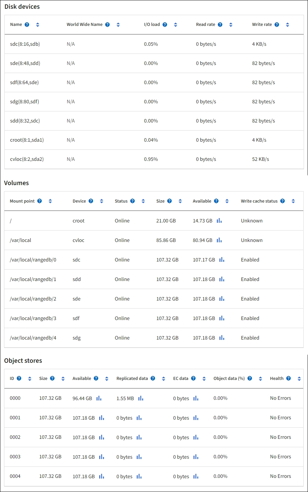

= Défaillances de stockage d'objets (volume de stockage)
:allow-uri-read: 
:icons: font
:imagesdir: ../media/

[role="lead"]
Le stockage sous-jacent d'un nœud de stockage est divisé en magasins d'objets. Les magasins d'objets sont également appelés volumes de stockage.

Vous pouvez afficher les informations de magasin d'objets pour chaque nœud de stockage. Les magasins d'objets sont affichés en bas de la page *NOEUDS* *_Storage Node_* *Storage*.

Pour plus de détails sur chaque nœud de stockage, procédez comme suit :

. Sélectionnez *SUPPORT* > *Outils* > *topologie de grille*.
. Sélectionnez *_site_* *_Storage Node_* *LDR* *Storage* *Présentation* *main*.

image::../media/storage_node_object_stores.png[Magasin d'objets nœud de stockage]

Selon la nature de la défaillance, des défaillances liées à un volume de stockage peuvent se refléter dans une alarme indiquant l'état du stockage ou l'état de santé d'un magasin d'objets. En cas de défaillance d'un volume de stockage, réparez le volume de stockage défectueux pour restaurer le nœud de stockage à son plein fonctionnement dès que possible. Si nécessaire, vous pouvez accéder à l'onglet *Configuration* et placer le nœud de stockage en lecture seule de sorte que le système StorageGRID puisse l'utiliser pour récupérer les données tout en préparant la récupération complète du serveur.

.Informations associées
xref:../maintain/index.adoc[Récupérer et entretenir]
