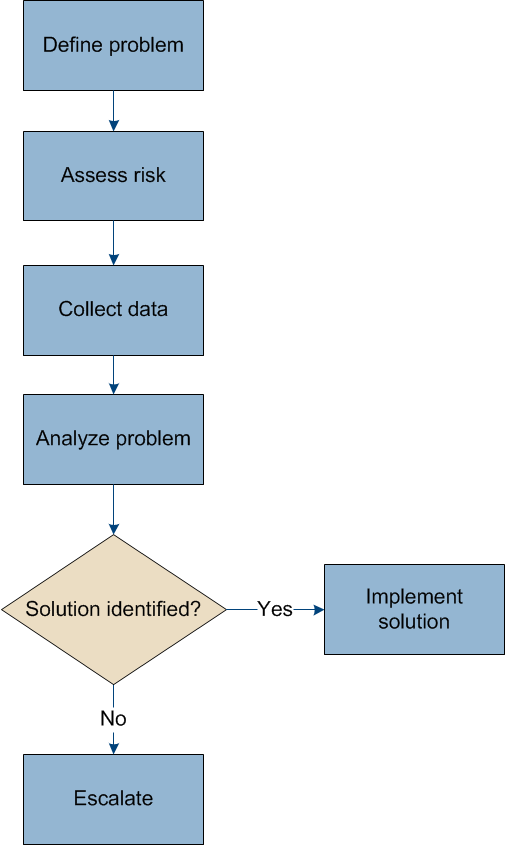

= Dépanner un système StorageGRID
:allow-uri-read: 
:icons: font
:imagesdir: ../media/

[role="lead"]
Si vous rencontrez un problème avec un système StorageGRID, consultez les conseils et les instructions de cette section pour déterminer et résoudre le problème.

== Présentation de la détection des problèmes

Si vous rencontrez un problème quand xref:../admin/index.adoc[Administration d'un système StorageGRID], vous pouvez utiliser le processus décrit dans cette figure pour identifier et analyser le problème. Dans de nombreux cas, vous pouvez résoudre vous-même les problèmes que vous rencontrez, mais vous devrez peut-être réaffecter quelques problèmes au support technique.

=== Définissez le problème

La première étape pour résoudre un problème est de définir clairement le problème.

Ce tableau fournit des exemples de types d'informations que vous pouvez collecter pour définir un problème :

[cols="1a,1a"]
|===
| Question | Exemple de réponse 

 a| 
Que fait ou ne fait pas le système StorageGRID ? Quels sont ses symptômes ?
 a| 
Les applications client signale que les objets ne peuvent pas être ingérées sur StorageGRID.

 a| 
Quand le problème a-t-il démarré ?
 a| 
L'ingestion d'objet a d'abord été refusée à environ 14:50 le 8 janvier 2020.

 a| 
Comment avez-vous remarqué le problème pour la première fois ?
 a| 
Notifié par la demande du client. Vous avez également reçu des notifications par e-mail d'alerte.

 a| 
Le problème se produit-il de manière cohérente ou seulement parfois ?
 a| 
Le problème est en cours.

 a| 
Si le problème se produit régulièrement, quelles sont les étapes à suivre
 a| 
Un problème se produit à chaque fois qu'un client tente d'ingérer un objet.

 a| 
Si le problème se produit par intermittence, quand cela se produit-il? Notez l'heure de chaque incident que vous connaissez.
 a| 
Le problème n'est pas intermittent.

 a| 
Avez-vous déjà vu ce problème ? À quelle fréquence avez-vous eu ce problème par le passé ?
 a| 
C'est la première fois que j'ai vu cette question.

|===

=== Évaluez les risques et l'impact sur le système

Une fois le problème défini, évaluez les risques et l'impact sur le système StorageGRID. Par exemple, la présence d'alertes critiques ne signifie pas nécessairement que le système ne fournit pas de services de base.

Ce tableau récapitule l'impact du problème exemple sur les opérations du système :

[cols="1a,1a"]
|===
| Question | Exemple de réponse 

 a| 
Le système StorageGRID est-il en mesure d'ingérer du contenu ?
 a| 
Non

 a| 
Les applications client peuvent-elles récupérer du contenu ?
 a| 
Certains objets peuvent être récupérés et d'autres ne peuvent pas être récupérés.

 a| 
Les données sont-elles menacées ?
 a| 
Non

 a| 
La capacité à mener des activités est-elle gravement affectée ?
 a| 
Oui, car les applications client ne peuvent pas stocker d'objets sur le système StorageGRID et les données ne peuvent pas être récupérées de manière cohérente.

|===

=== Collecte de données

Une fois que vous avez défini le problème et évalué ses risques et son impact, collectez des données pour analyse. Le type de données les plus utiles à recueillir dépend de la nature du problème.

[cols="1a,2a,1a"]
|===
| Type de données à collecter | Pourquoi recueillir ce dat | Instructions 

 a| 
Créer le calendrier des modifications récentes
 a| 
Toute modification de votre système StorageGRID, de sa configuration ou de son environnement peut provoquer un nouveau comportement.
 a| 
* ,Créer un calendrier des modifications récentes

 a| 
Examinez les alertes et les alarmes
 a| 
Les alertes et les alarmes peuvent vous aider à déterminer rapidement la cause première d'un problème en fournissant des indications importantes sur les problèmes sous-jacents qui pourraient l'être.

Consultez la liste des alertes et alarmes en cours pour voir si StorageGRID a identifié la cause principale d'un problème pour vous.

Pour en savoir plus, consultez les alertes et les alarmes déclenchées par le passé.
 a| 
* xref:viewing-current-alerts.adoc[Afficher les alertes en cours]
* xref:viewing-legacy-alarms.adoc[Afficher les anciennes alarmes]
* xref:viewing-resolved-alerts.adoc[Afficher les alertes résolues]
* xref:managing-alarms.adoc[Examiner les alarmes historiques et la fréquence des alarmes (système hérité)]

 a| 
Contrôle des événements
 a| 
Les événements incluent les événements d'erreur système ou de panne pour un nœud, y compris les erreurs telles que les erreurs réseau. Surveiller les événements pour en savoir plus sur les problèmes ou obtenir de l'aide pour les résoudre.
 a| 
* xref:monitoring-events.adoc[Contrôle des événements]

 a| 
Identifier les tendances à l'aide de graphiques et de rapports texte
 a| 
Les tendances peuvent donner des indications précieuses sur le moment où les problèmes sont apparus et vous aider à comprendre la rapidité à laquelle les choses évoluent.
 a| 
* xref:using-charts-and-reports.adoc[Utilisez des graphiques et des graphiques]
* xref:types-of-text-reports.adoc[Utilisez les rapports texte]

 a| 
Établir les lignes de base
 a| 
Collectez des informations sur les niveaux normaux de différentes valeurs opérationnelles. Ces valeurs de référence, ainsi que les écarts par rapport à ces lignes de base, peuvent fournir des indices précieux.
 a| 
* ,Établir les lignes de base

 a| 
Tests d'entrée et de récupération
 a| 
Pour résoudre les problèmes de performance liés à l'entrée et à la récupération, utilisez un poste de travail pour stocker et récupérer des objets. Comparez les résultats obtenus avec ceux observés lors de l'utilisation de l'application client.
 a| 
* xref:monitoring-put-and-get-performance.adoc[Surveillez L'PUT et OBTENEZ des performances]

 a| 
Examiner les messages d'audit
 a| 
Examinez les messages d'audit afin de suivre les opérations StorageGRID en détail. Les détails dans les messages d'audit peuvent être utiles pour le dépannage de nombreux types de problèmes, y compris les problèmes de performance.
 a| 
* xref:reviewing-audit-messages.adoc[Examiner les messages d'audit]

 a| 
Vérifier l'emplacement des objets et l'intégrité du stockage
 a| 
En cas de problèmes de stockage, vérifiez que les objets sont placés à l'endroit où vous vous attendez. Vérifiez l'intégrité des données d'objet sur un nœud de stockage.
 a| 
* xref:monitoring-object-verification-operations.adoc[Surveiller les opérations de vérification d'objets]
* xref:confirming-object-data-locations.adoc[Confirmer l'emplacement des données d'objet]
* xref:verifying-object-integrity.adoc[Vérifiez l'intégrité de l'objet]

 a| 
Collecte de données pour le support technique
 a| 
L'assistance technique peut vous demander de collecter des données ou de passer en revue des informations spécifiques pour résoudre les problèmes.
 a| 
* xref:collecting-log-files-and-system-data.adoc[Collecte de fichiers journaux et de données système]
* xref:manually-triggering-autosupport-message.adoc[Déclencher manuellement un message AutoSupport]
* xref:reviewing-support-metrics.adoc[Examinez les metrics de support]

|===

==== Créer un calendrier des modifications récentes

En cas de problème, vous devriez considérer ce qui a changé récemment et quand ces changements se sont produits.

* Toute modification de votre système StorageGRID, de sa configuration ou de son environnement peut provoquer un nouveau comportement.
* Un calendrier des modifications peut vous aider à identifier les changements susceptibles d'être responsables d'un problème, ainsi que la manière dont chaque changement pourrait avoir affecté son développement.

Créez un tableau des dernières modifications apportées à votre système, qui contient des informations sur la date à laquelle chaque modification a eu lieu, ainsi que des informations pertinentes sur la modification, telles que les autres événements survenus pendant que la modification a été en cours :

[cols="1a,1a,1a"]
|===
| Heure de la modification | Type de modification | Détails 

 a| 
Par exemple :

* Quand avez-vous démarré la restauration du nœud ?
* Quand la mise à niveau logicielle s'est-elle terminée ?
* Avez-vous interrompu le processus ?

 a| 
Que s'est-il passé ? Qu'avez-vous fait ?
 a| 
Documentez toute information pertinente concernant la modification. Par exemple :

* Détails des modifications du réseau.
* Quel correctif a été installé.
* Changement des workloads clients.

Assurez-vous de noter si plusieurs changements ont eu lieu en même temps. Par exemple, ce changement a-t-il été effectué pendant qu'une mise à niveau était en cours ?

|===

===== Exemples de changements récents importants

Voici quelques exemples de changements potentiellement importants :

* Le système StorageGRID a-t-il été récemment installé, étendu ou récupéré ?
* Le système a-t-il été mis à niveau récemment ? Un correctif a-t-il été appliqué ?
* Du matériel a-t-il été réparé ou modifié récemment ?
* La règle ILM a-t-elle été mise à jour ?
* La charge de travail client a-t-elle changé ?
* L'application client ou son comportement a-t-il changé ?
* Avez-vous modifié des équilibreurs de charge, ou ajouté ou supprimé un groupe haute disponibilité de nœuds d'administration ou de nœuds de passerelle ?
* Certaines tâches lancées peuvent-elles prendre un certain temps ? Voici quelques exemples :
+
** Récupération d'un noeud de stockage défaillant
** Désaffectation des nœuds de stockage

* Des modifications ont-elles été apportées à l'authentification utilisateur, par exemple l'ajout d'un locataire ou la modification de la configuration LDAP ?
* La migration des données a-t-elle lieu ?
* Les services de plateforme ont-ils été récemment activés ou modifiés ?
* La conformité a-t-elle été activée récemment ?
* Les pools de stockage cloud ont-ils été ajoutés ou supprimés ?
* La compression du stockage ou le chiffrement ont-ils été modifiés ?
* L'infrastructure réseau a-t-elle été modifiée ? Par exemple, VLAN, routeurs ou DNS.
* Des modifications ont-elles été apportées aux sources NTP ?
* Des modifications ont-elles été apportées aux interfaces réseau Grid, Admin ou client ?
* Des modifications de configuration ont-elles été apportées au nœud d'archivage ?
* Le système StorageGRID ou son environnement a-t-il subi d'autres modifications ?

==== Établir les lignes de base

Vous pouvez établir des lignes de base pour votre système en enregistrant les niveaux normaux de différentes valeurs opérationnelles. À l'avenir, vous pourrez comparer les valeurs actuelles à ces lignes de base afin de détecter et de résoudre les valeurs anormales.

[cols="1a,1a,1a"]
|===
| Propriété | Valeur | Comment obtenir 

 a| 
Consommation de stockage moyenne
 a| 
Go utilisés/jour

Pourcentage consommé/jour
 a| 
Accédez à Grid Manager. Sur la page nœuds, sélectionnez la totalité de la grille ou d'un site et accédez à l'onglet stockage.

Dans le graphique stockage utilisé - données d'objet, recherchez une période où la ligne est assez stable. Passez le curseur de la souris sur le graphique pour estimer la quantité de stockage consommée chaque jour

Vous pouvez collecter ces informations pour l'intégralité du système ou pour un data Center spécifique.

 a| 
Consommation moyenne des métadonnées
 a| 
Go utilisés/jour

Pourcentage consommé/jour
 a| 
Accédez à Grid Manager. Sur la page nœuds, sélectionnez la totalité de la grille ou d'un site et accédez à l'onglet stockage.

Dans le graphique stockage utilisé - métadonnées d'objet, recherchez une période où la ligne est assez stable. Passez le curseur de la souris sur le graphique pour estimer la quantité de stockage de métadonnées consommée chaque jour

Vous pouvez collecter ces informations pour l'intégralité du système ou pour un data Center spécifique.

 a| 
Vitesse des opérations S3/Swift
 a| 
Opérations/seconde
 a| 
Accédez au tableau de bord dans Grid Manager. Dans la section opérations de protocole, affichez les valeurs du taux S3 et du taux Swift.

Pour afficher les taux et les comptes d'entrée et de récupération d'un site ou d'un nœud spécifique, sélectionnez *NOEUDS* *_site ou noeud de stockage_* *objets*. Placez le curseur sur le tableau d'ingestion et de récupération pour S3 ou Swift.

 a| 
Échec des opérations S3/Swift
 a| 
Exploitation
 a| 
Sélectionnez *SUPPORT* *Outils* *topologie de grille*. Dans l'onglet Présentation de la section opérations d'API, affichez la valeur des opérations S3 - FAILED ou opérations Swift - FAILED.

 a| 
Évaluation des règles ILM
 a| 
Objets/seconde
 a| 
Dans la page noeuds, sélectionnez *_grid_* *ILM*.

Dans le graphique ILM Queue, recherchez une période où la ligne est assez stable. Placez le curseur sur le graphique pour estimer une valeur de référence pour *taux d'évaluation* pour votre système.

 a| 
Taux d'analyse ILM
 a| 
Objets/seconde
 a| 
Sélectionnez *NODES* *_grid_* *ILM*.

Dans le graphique ILM Queue, recherchez une période où la ligne est assez stable. Placez le curseur sur le graphique pour estimer une valeur de référence pour *Scan rate* pour votre système.

 a| 
Objets mis en file d'attente à partir des opérations client
 a| 
Objets/seconde
 a| 
Sélectionnez *NODES* *_grid_* *ILM*.

Dans le graphique ILM Queue, recherchez une période où la ligne est assez stable. Placez le curseur sur le graphique pour estimer une valeur de référence pour *objets mis en file d'attente (à partir des opérations client)* pour votre système.

 a| 
Latence moyenne des requêtes
 a| 
Millisecondes
 a| 
Sélectionnez *NOEUDS* *_noeud de stockage_* *objets*. Dans le tableau requêtes, affichez la valeur de la latence moyenne.

|===

=== Analysez les données

Utilisez les informations que vous recueillez pour déterminer la cause du problème et les solutions potentielles.

L'analyse dépend du problème, mais en général :

* Localiser les points de défaillance et les goulets d'étranglement à l'aide des alarmes.
* Reconstruire l'historique des problèmes à l'aide de l'historique des alarmes et des graphiques.
* Utiliser les tableaux pour rechercher des anomalies et comparer la situation du problème avec le fonctionnement normal.

=== Liste de contrôle des informations de réaffectation

Si vous ne pouvez pas résoudre le problème par vous-même, contactez le support technique. Avant de contacter le support technique, collectez les informations du tableau ci-dessous pour faciliter la résolution de votre problème.

[cols="2,2,4a"]
|===
| image:../media/feature_checkmark.gif["coche"] | Élément | Remarques 

|  | Énoncé du problème  a| 
Quels sont les symptômes du problème ? Quand le problème a-t-il démarré ? Cela se produit-il de manière cohérente ou intermittente ? Si elle est intermittente, à quelle heure s'est-elle produite ?

xref:troubleshooting-storagegrid-system.adoc[Définissez le problème]

|  | Évaluation de l'impact  a| 
Quelle est la gravité du problème ? Quel est l'impact sur l'application client ?

* Le client a-t-il déjà été connecté avec succès ?
* Le client est-il en mesure d'ingérer, de récupérer et de supprimer des données ?

|  | ID du système StorageGRID  a| 
Sélectionnez *MAINTENANCE* *système* *Licence*. L'ID système StorageGRID s'affiche dans le cadre de la licence actuelle.

|  | Version logicielle  a| 
Dans la partie supérieure du Gestionnaire de grille, sélectionnez l'icône d'aide et sélectionnez *About* pour afficher la version StorageGRID.

|  | Personnalisation  a| 
Résumez le mode de configuration de votre système StorageGRID. Par exemple, énumérez les éléments suivants :

* La grille utilise-t-elle la compression du stockage, le chiffrement du stockage ou la conformité ?
* ILM effectue-t-il des objets répliqués ou soumis à un code d'effacement ? La ILM permet-elle la redondance des sites ? Les règles ILM utilisent-elles des comportements d'entrée stricts, équilibrés ou à double engagement ?

|  | Fichiers journaux et données système  a| 
Collecte des fichiers journaux et des données système pour votre système. Sélectionnez *SUPPORT* *Outils* *journaux*.

Vous pouvez collecter les journaux pour toute la grille ou pour certains nœuds.

Si vous ne recueillez des journaux que pour les nœuds sélectionnés, veillez à inclure au moins un nœud de stockage disposant du service ADC. (Les trois premiers nœuds de stockage d'un site incluent le service ADC.)

xref:collecting-log-files-and-system-data.adoc[Collecte de fichiers journaux et de données système]

|  | Informations de base  a| 
Collectez les informations de base relatives aux opérations d'entrée, aux opérations de récupération et à la consommation du stockage.

,Établir les lignes de base

|  | Chronologie des modifications récentes  a| 
Créez un calendrier qui résume les modifications récentes apportées au système ou à son environnement.

,Créer un calendrier des modifications récentes

|  | Historique des efforts déployés pour diagnostiquer le problème  a| 
Si vous avez pris des mesures pour diagnostiquer ou résoudre vous-même le problème, assurez-vous d'enregistrer les mesures que vous avez prises et les résultats obtenus.

|===