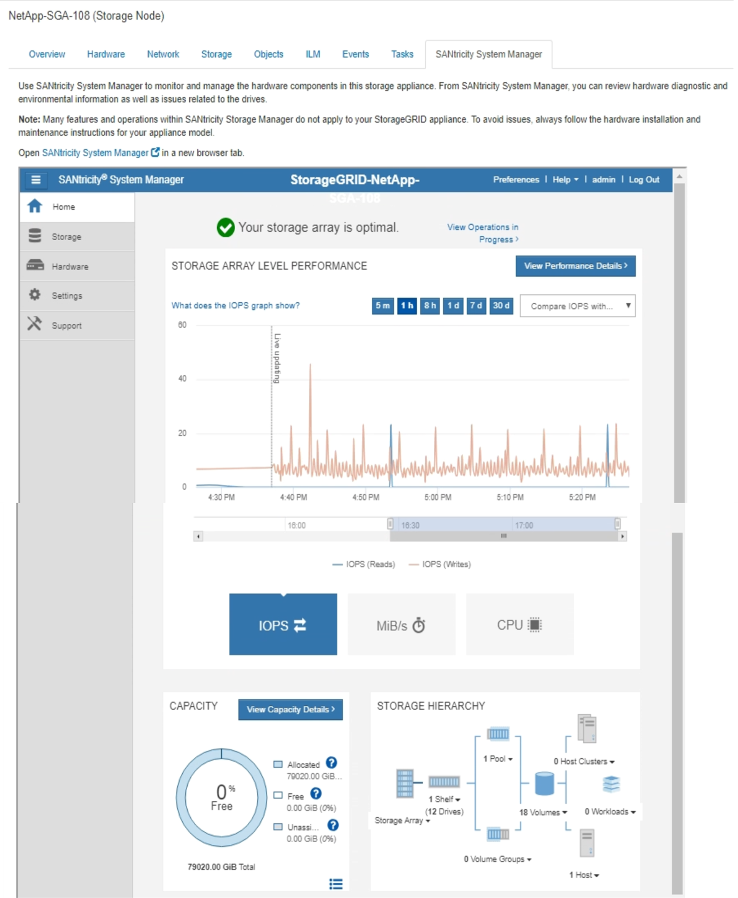

= Affichez l'onglet SANtricity System Manager
:allow-uri-read: 
:icons: font
:imagesdir: ../media/

[role="lead"]
L'onglet SANtricity System Manager vous permet d'accéder à SANtricity System Manager sans devoir configurer ni connecter le port de gestion de l'appliance de stockage. Cet onglet permet de consulter les informations de diagnostic du matériel et les informations environnementales, ainsi que les problèmes liés aux lecteurs.

L'onglet SANtricity System Manager s'affiche pour les nœuds d'appliance de stockage.

Grâce à SANtricity System Manager, vous pouvez effectuer les opérations suivantes :

* Affichez les données de performances telles que les performances au niveau de la baie de stockage, la latence d'E/S, l'utilisation du CPU du contrôleur de stockage et le débit
* Vérifier l'état des composants matériels
* Réaliser des fonctions de support, comme visualiser les données de diagnostic et configurer le système E-Series AutoSupport

NOTE: Pour utiliser SANtricity System Manager afin de configurer un proxy pour la baie AutoSupport E-Series, reportez-vous aux instructions du document d'administration deStorageGRID.

xref:../admin/index.adoc[Administrer StorageGRID]

Pour accéder à SANtricity System Manager via Grid Manager, vous devez disposer de l'autorisation Administrateur de l'appliance de stockage ou de l'autorisation accès racine.

NOTE: Vous devez disposer d'un firmware SANtricity 8.70 (11.70) ou supérieur pour accéder à SANtricity System Manager via Grid Manager.

IMPORTANT: L'accès à SANtricity System Manager à partir de Grid Manager se limite généralement à la surveillance du matériel de l'appliance et à la configuration des baies E-Series AutoSupport. De nombreuses fonctionnalités et opérations dans SANtricity System Manager, telles que la mise à niveau du firmware, ne s'appliquent pas à la surveillance de votre appliance StorageGRID. Pour éviter tout problème, suivez toujours les instructions d'installation et de maintenance du matériel de votre appareil.

L'onglet affiche la page d'accueil de SANtricity System Manager.

NOTE: Pour plus de facilité, vous pouvez utiliser le lien SANtricity System Manager pour ouvrir SANtricity System Manager dans une nouvelle fenêtre de navigateur.

Pour obtenir des informations détaillées sur les performances et l'utilisation de la capacité au niveau des baies de stockage, passez le curseur de la souris sur chaque graphique.

Pour plus de détails sur l'affichage des informations accessibles depuis l'onglet SANtricity System Manager, reportez-vous à la section https://["Documentation sur les systèmes NetApp E-Series et SANtricity"^].
