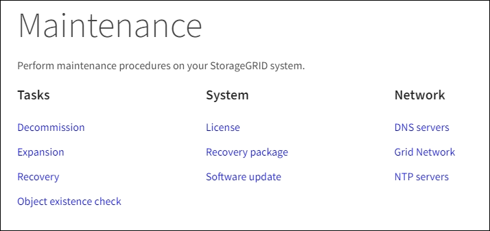
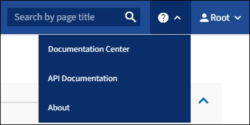

= Explorez le Grid Manager
:allow-uri-read: 
:icons: font
:imagesdir: ../media/

[role="lead"]
L'interface graphique Web du gestionnaire de grid permet de configurer, de gérer et de surveiller votre système StorageGRID.

Lorsque vous vous connectez à Grid Manager, vous vous connectez à un noeud d'administration. Chaque système StorageGRID comprend un nœud d'administration principal et un nombre quelconque de nœuds d'administration non primaires. Vous pouvez vous connecter à n'importe quel nœud d'administration et chaque nœud d'administration affiche une vue similaire du système StorageGRID.

Vous pouvez accéder au Gestionnaire de grille à l'aide d'un xref:../admin/web-browser-requirements.adoc[navigateur web pris en charge].

== Tableau de bord de Grid Manager

Lorsque vous vous connectez à Grid Manager pour la première fois, vous pouvez utiliser le tableau de bord pour surveiller en un coup d'œil les activités du système.

Le tableau de bord inclut un résumé des informations sur l'état du système, l'utilisation du stockage, les processus ILM et les opérations S3 et Swift.

image::../media/grid_manager_dashboard.png[Tableau de bord dans Grid Manager]

Pour obtenir une explication des informations de chaque panneau, cliquez sur l'icône aide image:../media/icon_nms_question.png["icône point d'interrogation"] pour ce panneau.

.En savoir plus >>
* xref:../monitor/index.adoc[Surveiller et résoudre les problèmes]

== Champ de recherche

Le champ *Search* de la barre d'en-tête vous permet de naviguer rapidement vers une page spécifique dans Grid Manager. Par exemple, vous pouvez entrer *km* pour accéder à la page Key Management Server (KMS). Vous pouvez utiliser *Search* pour rechercher des entrées dans la barre latérale du Gestionnaire de grille et dans les menus Configuration, Maintenance et support.

== Menu alertes

Le menu alertes offre une interface facile à utiliser pour détecter, évaluer et résoudre les problèmes susceptibles de se produire lors du fonctionnement de StorageGRID.

image::../media/alerts_menu.png[Menu alertes]

Dans le menu alertes, vous pouvez effectuer les opérations suivantes :

* Examiner les alertes en cours
* Examiner les alertes résolues
* Configurez les silences pour supprimer les notifications d'alerte
* Définissez des règles d'alerte pour les conditions qui déclenchent des alertes
* Configurez le serveur de messagerie pour les notifications d'alerte

.En savoir plus >>
* xref:monitoring-and-managing-alerts.adoc[Contrôle et gestion des alertes]
* xref:../monitor/index.adoc[Surveiller et résoudre les problèmes]

== Page nœuds

La page nœuds affiche des informations sur l'ensemble de la grille, sur chaque site de la grille et sur chaque nœud d'un site.

La page d'accueil nœuds affiche des mesures combinées pour l'ensemble de la grille. Pour afficher les informations d'un site ou nœud particulier, sélectionnez le site ou le nœud.

image::../media/nodes_menu.png[page principale des nœuds]

.En savoir plus >>
* xref:viewing-nodes-page.adoc[Afficher la page nœuds]
* xref:../monitor/index.adoc[Surveiller et résoudre les problèmes]

== Page locataires

La page des locataires vous permet de créer et de surveiller les comptes de locataires pour votre système StorageGRID. Vous devez créer au moins un compte de tenant pour spécifier qui peut stocker et récupérer des objets et la fonctionnalité qui leur est disponible.

La page locataires fournit également des détails sur l'utilisation pour chaque locataire, y compris la quantité de stockage utilisée et le nombre d'objets. Si vous définissez un quota lors de la création du locataire, vous pouvez voir la part utilisée de ce quota.

image::../media/tenants_menu_and_page.png[Menu et page locataires]

.En savoir plus >>
* xref:managing-tenants-and-client-connections.adoc[Gérez les locataires et les connexions clients]
* xref:../admin/index.adoc[Administrer StorageGRID]
* xref:../tenant/index.adoc[Utilisez un compte de locataire]

== Menu ILM

Le menu ILM vous permet de configurer les règles et règles de gestion du cycle de vie des informations (ILM) qui régissent la durabilité et la disponibilité des données. Vous pouvez également saisir un identifiant d'objet pour afficher les métadonnées de cet objet.

image::../media/ilm_menu_and_page.png[Menu et page ILM]

.En savoir plus >>
* xref:using-information-lifecycle-management.adoc[Utilisation de la gestion du cycle de vie des informations]
* xref:../ilm/index.adoc[Gestion des objets avec ILM]

== Menu Configuration

Le menu Configuration vous permet de spécifier les paramètres réseau, les paramètres de sécurité, les paramètres système, les options de surveillance et les options de contrôle d'accès.

image::../media/configuration_menu.png[Menu Configuration]

.En savoir plus >>
* xref:configuring-network-settings.adoc[Configurez les paramètres réseau]
* xref:managing-tenants-and-client-connections.adoc[Gérez les locataires et les connexions clients]
* xref:reviewing-audit-messages.adoc[Examiner les messages d'audit]
* xref:controlling-storagegrid-access.adoc[Contrôlez l'accès au StorageGRID]
* xref:../admin/index.adoc[Administrer StorageGRID]
* xref:../monitor/index.adoc[Surveiller et résoudre les problèmes]
* xref:../audit/index.adoc[Examiner les journaux d'audit]

== Menu Maintenance

Le menu Maintenance vous permet d'effectuer des tâches de maintenance, de maintenance du système et de maintenance du réseau.

=== Tâches

Les tâches de maintenance sont les suivantes :

* Déclassez les opérations pour supprimer les nœuds et sites grid inutilisés.
* Étendez vos opérations pour ajouter des nœuds et des sites grid.
* Opérations de récupération pour le remplacement d'un nœud défaillant et la restauration des données.
* Vérification de l'existence de l'objet pour vérifier l'existence (bien que pas l'exactitude) des données de l'objet.

=== Système

Les tâches de maintenance du système que vous pouvez effectuer sont les suivantes :

* Vérification des détails de la licence StorageGRID actuelle ou téléchargement d'une nouvelle licence.
* Génération d'un progiciel de restauration.
* Effectuer des mises à jour logicielles StorageGRID, y compris les mises à niveau logicielles, les correctifs et les mises à jour du logiciel SANtricity OS sur les appliances sélectionnées

=== Le réseau

Les tâches de maintenance réseau que vous pouvez effectuer sont les suivantes :

* Modification des informations relatives aux serveurs DNS.
* Configuration des sous-réseaux utilisés sur le réseau grille.
* Modification des informations relatives aux serveurs NTP.

.En savoir plus >>
* xref:performing-maintenance-procedures.adoc[Effectuer l'entretien]
* xref:downloading-recovery-package.adoc[Téléchargez le progiciel de restauration]
* xref:../expand/index.adoc[Développez votre grille]
* xref:../upgrade/index.adoc[Mise à niveau du logiciel]
* xref:../maintain/index.adoc[Récupérer et entretenir]
* xref:../sg6000/index.adoc[Dispositifs de stockage SG6000]
* xref:../sg5700/index.adoc[Appliances de stockage SG5700]
* xref:../sg5600/index.adoc[Appliances de stockage SG5600]

== Menu support

Le menu support fournit des options qui vous aident à analyser et à dépanner votre système. Le menu support comprend deux parties : Outils et alarmes (hérité).

image::../media/support_menu.png[Menu support]

=== Outils

À partir de la section Outils du menu support, vous pouvez :

* Activez AutoSupport.
* Effectuer un ensemble de contrôles de diagnostic sur l'état actuel de la grille.
* Accédez à l'arborescence de la grille pour afficher des informations détaillées sur les nœuds, services et attributs de la grille.
* Récupère les fichiers journaux et les données système.
* Examiner les indicateurs et les graphiques détaillés
+

IMPORTANT: Les outils disponibles dans l'option *Metrics* sont destinés à être utilisés par le support technique. Certaines fonctions et options de menu de ces outils ne sont intentionnellement pas fonctionnelles.

=== Alarmes (existantes)

Dans la section alarmes (anciennes) du menu support, vous pouvez consulter les alarmes actuelles, historiques et globales, configurer des événements personnalisés et configurer des notifications par e-mail pour les alarmes héritées et AutoSupport.

NOTE: Bien que le système d'alarme existant continue d'être pris en charge, le système d'alerte offre des avantages significatifs et est plus facile à utiliser.

.En savoir plus >>
* xref:storagegrid-architecture-and-network-topology.adoc[Architecture StorageGRID et topologie réseau]
* xref:viewing-nodes-page.adoc[Attributs des StorageGRID]
* xref:using-storagegrid-support-options.adoc[Utilisez les options de prise en charge de StorageGRID]
* xref:../admin/index.adoc[Administrer StorageGRID]
* xref:../monitor/index.adoc[Surveiller et résoudre les problèmes]

== Menu aide

L'option aide permet d'accéder au Centre de documentation StorageGRID pour la version actuelle et à la documentation de l'API. Vous pouvez également déterminer la version de StorageGRID actuellement installée.

.En savoir plus >>
* xref:../admin/index.adoc[Administrer StorageGRID]

