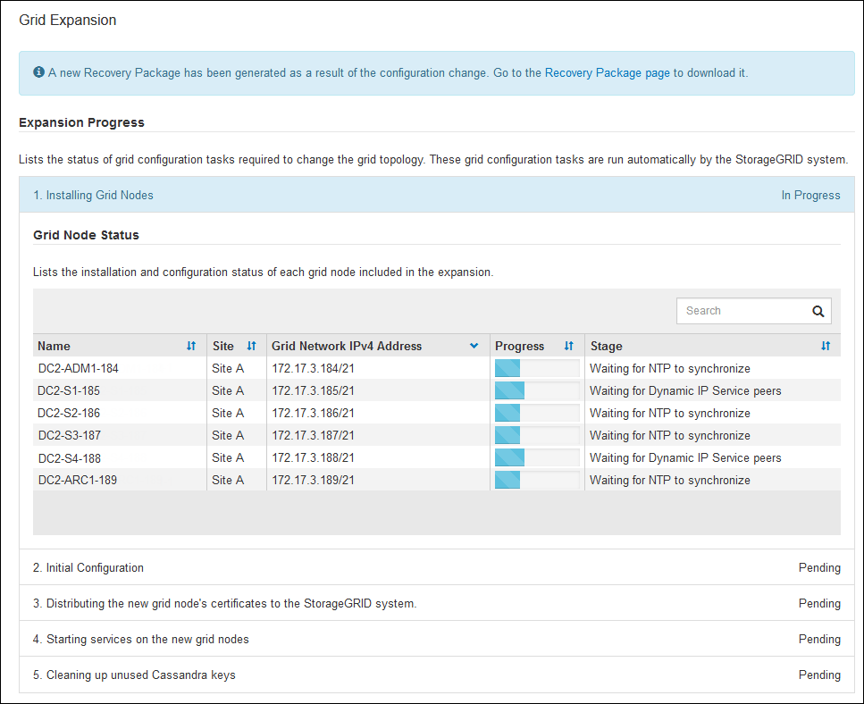

= Effectuer l'entretien
:allow-uri-read: 
:icons: font
:imagesdir: ../media/

[role="lead"]
Vous effectuez diverses procédures de maintenance pour maintenir votre système StorageGRID à jour et vous assurer qu'il fonctionne efficacement. Le gestionnaire de grille fournit des outils et des options pour faciliter le processus d'exécution des tâches de maintenance.

== Mises à jour de logiciels

Vous pouvez effectuer trois types de mises à jour logicielles à partir de la page mise à jour logicielle dans Grid Manager :

* Mise à niveau du logiciel StorageGRID
* Correctif StorageGRID
* Mise à niveau de SANtricity OS

== Mises à niveau logicielles de StorageGRID

Lorsqu'une nouvelle version de StorageGRID est disponible, la page mise à niveau du logiciel vous guide tout au long du processus de téléchargement du fichier requis et de mise à niveau du système StorageGRID. Vous devez mettre à niveau tous les nœuds de la grille de tous les sites de data Center à partir du nœud d'administration principal.

Lors de la mise à niveau du logiciel StorageGRID, les applications client peuvent continuer à ingérer et à récupérer les données d'objet.

== Correctifs

Si des problèmes liés au logiciel sont détectés et résolus entre les versions de fonction, vous devrez peut-être appliquer un correctif à votre système StorageGRID.

Les correctifs StorageGRID contiennent des modifications logicielles qui sont disponibles en dehors d'une version de fonctionnalité ou de correctif. Les mêmes modifications seront incluses dans une prochaine version.

La page correctif de StorageGRID, illustrée ci-dessous, vous permet de télécharger un fichier de correctif.

image::../media/hotfix_choose_file.png[StorageGRID première page correctif]

Le correctif est d'abord appliqué au nœud d'administration principal. Vous devez ensuite approuver l'application du correctif sur d'autres nœuds de la grille jusqu'à ce que tous les nœuds de votre système StorageGRID exécutent la même version logicielle. Vous pouvez personnaliser la séquence d'approbation en sélectionnant pour approuver des nœuds de grille individuels, des groupes de nœuds de grille ou tous les nœuds de la grille.

NOTE: Bien que tous les nœuds de la grille soient mis à jour avec la nouvelle version de correctif, les modifications réelles d'un correctif peuvent uniquement affecter des services spécifiques sur des types spécifiques de nœuds. Par exemple, un correctif peut uniquement affecter le service LDR sur les nœuds de stockage.

== Mises à niveau de SANtricity OS

Vous devrez peut-être mettre à niveau le logiciel de système d'exploitation SANtricity sur les contrôleurs de stockage de vos dispositifs de stockage si les contrôleurs ne fonctionnent pas de façon optimale. Vous pouvez charger le fichier SANtricity OS sur le nœud d'administration principal de votre système StorageGRID et appliquer la mise à niveau à partir de Grid Manager.

La page SANtricity, illustrée ci-dessous, vous permet de charger le fichier de mise à niveau du système d'exploitation SANtricity.

image::../media/santricity_os_upgrade_first.png[StorageGRID First sur la page SANtricity OS]

Une fois le fichier téléchargé, vous pouvez approuver la mise à niveau sur des nœuds de stockage individuels ou sur tous les nœuds. La planification de la mise à niveau est plus simple grâce à la possibilité d'approuver les nœuds de manière sélective. Après avoir approuvé un nœud pour la mise à niveau, le système effectue une vérification de l'état et installe la mise à niveau, le cas échéant.

== Procédures d'expansion

Plusieurs options sont envisageables pour étendre un système StorageGRID : ajouter des volumes de stockage aux nœuds de stockage, des nœuds grid à un site déjà en place ou un tout nouveau site de data Center. Si vous disposez de nœuds de stockage utilisant l'appliance de stockage SG6060 ou SG6060X, vous pouvez ajouter un ou deux tiroirs d'extension pour doubler ou tripler la capacité de stockage du nœud.

Les expansions ne nécessitent aucune interruption du fonctionnement du système. Lorsque vous ajoutez des nœuds ou un site, vous devez d'abord déployer les nouveaux nœuds, puis effectuer la procédure d'extension à partir de la page d'extension de la grille.

== Procédures de restauration des nœuds

Les nœuds du grid peuvent tomber en panne si une panne matérielle, de virtualisation, de système d'exploitation ou logicielle rend le nœud inutilisable ou peu fiable.

Les étapes de restauration d'un nœud grid dépendent de la plateforme sur laquelle le nœud grid est hébergé et du type de nœud grid. Chaque type de nœud de la grille dispose d'une procédure de restauration spécifique, que vous devez suivre exactement. En général, vous tentez de préserver les données du nœud de grille défaillant dans la mesure du possible, réparez ou remplacez le nœud défaillant, utilisez la page de récupération pour configurer le nœud de remplacement et restaurez les données du nœud.

Par exemple, cet organigramme montre la procédure de restauration en cas d'échec d'un noeud d'administration.

image::../media/overview_admin_node_recovery.png[Présentation : Restauration du nœud d'administration]

== Procédures de mise hors service

Vous pouvez supprimer définitivement des nœuds grid ou un site de data Center complet de votre système StorageGRID.

Par exemple, vous pouvez désaffecter un ou plusieurs nœuds grid dans les cas suivants :

* Vous avez ajouté un nœud de stockage plus grand au système et souhaitez supprimer un ou plusieurs nœuds de stockage plus petits, tout en préservant les objets.
* Vous avez besoin de moins de stockage total.
* Vous n'avez plus besoin d'un nœud de passerelle ou d'un nœud d'administration non primaire.
* Votre grille inclut un nœud déconnecté que vous ne pouvez pas restaurer ou rétablir en ligne.

Vous pouvez utiliser la page nœuds de mise hors service dans Grid Manager pour supprimer les types de nœuds de grille suivants :

* Nœuds de stockage, à moins que le nombre de nœuds ne soit pas suffisant pour répondre à certaines exigences au niveau du site
* Nœuds de passerelle
* Nœuds d'administration non primaires

image::../media/decommission_nodes_page_all_connected.png[Capture d'écran de la page de mise hors service]

Vous pouvez utiliser la page site de mise hors service dans Grid Manager pour supprimer un site. La mise hors service d'un site connecté supprime un site opérationnel et préserve les données. Une mise hors service du site déconnecté supprime un site en panne mais ne conserve pas les données. L'assistant Decommission site vous guide tout au long du processus de sélection du site, d'affichage des détails du site, de révision de la politique ILM, de suppression des références de site des règles ILM et de résolution des conflits de nœud.

image::../media/decommission_site_step_select_site.png[Désaffecter le site étape 1]

== Procédures de maintenance du réseau

Voici quelques-unes des procédures de maintenance du réseau que vous devrez peut-être effectuer :

* Mise à jour des sous-réseaux sur le réseau Grid
* Utilisation de l'outil Modifier IP pour modifier la configuration réseau initialement définie lors du déploiement de la grille
* Ajout, suppression ou mise à jour de serveurs DNS (Domain Name System)
* L'ajout, la suppression ou la mise à jour de serveurs NTP (Network Time Protocol) afin de garantir la synchronisation précise des données entre les nœuds de la grille
* Restauration de la connectivité réseau vers des nœuds qui auraient pu être isolés du reste de la grille

== Procédures au niveau de l'hôte et du middleware

Certaines procédures de maintenance sont spécifiques aux nœuds StorageGRID déployés sous Linux ou VMware, ou qui sont spécifiques à d'autres composants de la solution StorageGRID. Par exemple, vous pouvez migrer un nœud de grille vers un autre hôte Linux ou effectuer une maintenance sur un nœud d'archivage connecté à Tivoli Storage Manager (TSM).

== Clonage de nœuds d'appliance

Le clonage de nœuds d'appliance vous permet de remplacer facilement un nœud d'appliance existant dans votre grid par une appliance plus récente ou des fonctionnalités améliorées faisant partie du même site StorageGRID logique. Le processus transfère toutes les données vers la nouvelle appliance, en les plaçant en service pour remplacer l'ancien nœud d'appliance et laisser l'ancienne appliance dans un état de préinstallation. Le clonage offre un processus de mise à niveau matérielle facile à effectuer et constitue une autre méthode de remplacement des appliances.

== Procédures des nœuds de la grille

Vous devrez peut-être effectuer certaines procédures sur un nœud de grid spécifique. Par exemple, vous devrez peut-être redémarrer un nœud de grille ou arrêter manuellement et redémarrer un service de nœud de grille spécifique. Certaines procédures de nœud de grille peuvent être effectuées à partir de Grid Manager. D'autres nécessitent de vous connecter au nœud de grille et d'utiliser la ligne de commande du nœud.

.Informations associées
* xref:../admin/index.adoc[Administrer StorageGRID]
* xref:../upgrade/index.adoc[Mise à niveau du logiciel]
* xref:../expand/index.adoc[Développez votre grille]
* xref:../maintain/index.adoc[Récupérer et entretenir]

