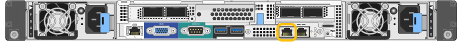

= Accédez au programme d'installation de l'appliance StorageGRID
:allow-uri-read: 
:icons: font
:imagesdir: ../media/

[role="lead"]
Vous devez accéder au programme d'installation de l'appliance StorageGRID pour configurer les connexions entre l'appliance et les trois réseaux StorageGRID : le réseau Grid, le réseau d'administration (facultatif) et le réseau client (facultatif).

.Ce dont vous avez besoin
* Vous utilisez n'importe quel client de gestion pouvant se connecter au réseau d'administration StorageGRID.
* Le client a un xref:../admin/web-browser-requirements.adoc[navigateur web pris en charge].
* L'appliance de services est connectée à tous les réseaux StorageGRID que vous envisagez d'utiliser.
* Vous connaissez l'adresse IP, la passerelle et le sous-réseau du dispositif de services sur ces réseaux.
* Vous avez configuré les commutateurs réseau que vous prévoyez d'utiliser.

.Description de la tâche
Pour accéder initialement au programme d'installation de l'appliance StorageGRID, vous pouvez utiliser l'adresse IP attribuée par DHCP pour le port réseau de l'administrateur de l'appliance Services (en supposant qu'elle soit connectée au réseau Admin) ou connecter un ordinateur portable de service directement à l'appliance de services.

.Étapes
. Si possible, utilisez l'adresse DHCP du port réseau d'administration de l'appliance de services pour accéder au programme d'installation de l'appliance StorageGRID.
+
*Port réseau d'administration SG100*

+
image:../media/sg100_admin_network_port.png["Port réseau Admin sur le SG100"]

+
*Port réseau d'administration SG1000*

+

+
.. Repérez l'étiquette d'adresse MAC située à l'avant de l'appliance serrices et déterminez l'adresse MAC du port réseau d'administration.
+
L'étiquette d'adresse MAC répertorie l'adresse MAC du port de gestion BMC.

+
Pour déterminer l'adresse MAC du port réseau Admin, vous devez ajouter *2* au numéro hexadécimal sur l'étiquette. Par exemple, si l'adresse MAC de l'étiquette se termine par *09*, l'adresse MAC du port d'administration se terminera par *0B*. Si l'adresse MAC de l'étiquette se termine dans *(_y_)FF*, l'adresse MAC du port d'administration se terminera dans *(_y_+1)01*. Vous pouvez facilement effectuer ce calcul en ouvrant Calculator sous Windows, en le définissant en mode programmateur, en sélectionnant Hex, en saisissant l'adresse MAC, puis en tapant *+ 2 =*.

.. Indiquez l'adresse MAC à votre administrateur réseau pour qu'il puisse rechercher l'adresse DHCP de l'appliance sur le réseau d'administration.
.. Dans le client, saisissez cette URL pour le programme d'installation de l'appliance StorageGRID : +
`*https://_services-appliance_IP_:8443*`
+
Pour `_services-appliance_IP_`, Utilisez l'adresse DHCP.

.. Si vous êtes invité à recevoir une alerte de sécurité, affichez et installez le certificat à l'aide de l'assistant d'installation du navigateur.
+
L'alerte n'apparaît pas la prochaine fois que vous accédez à cette URL.

+
La page d'accueil du programme d'installation de l'appliance StorageGRID s'affiche. Les informations et les messages affichés lorsque vous accédez pour la première fois à cette page dépendent de la manière dont votre appareil est actuellement connecté aux réseaux StorageGRID. Des messages d'erreur peuvent s'afficher et seront résolus dans les étapes suivantes.

. Si vous ne pouvez pas obtenir d'adresse IP à l'aide de DHCP, utilisez une connexion lien-local pour accéder au programme d'installation de l'appliance StorageGRID.
+
.. Connectez un ordinateur portable de service directement au port RJ-45 le plus à droite de l'appareil de services à l'aide d'un câble Ethernet.
+
*SG100 connexion lien-local*

+
image::../media/sg100_link_local_port.png[Liaison SG100 - connexion locale]

+
*SG1000 connexion lien-local*

+
image::../media/sg1000_link_local_port.png[Liaison SG1000 - connexion locale]

.. Ouvrez un navigateur Web.
.. Entrez l'URL suivante pour le programme d'installation de l'appliance StorageGRID : +
`*\https://169.254.0.1:8443*`
+
La page d'accueil du programme d'installation de l'appliance StorageGRID s'affiche. Les informations et les messages affichés lorsque vous accédez pour la première fois à cette page dépendent de la manière dont votre appareil est actuellement connecté aux réseaux StorageGRID. Des messages d'erreur peuvent s'afficher et seront résolus dans les étapes suivantes.

+

NOTE: Si vous ne pouvez pas accéder à la page d'accueil via une connexion lien-local, configurez l'adresse IP de l'ordinateur portable de service comme `169.254.0.2`, et réessayez.

. Vérifiez les messages affichés sur la page d'accueil et configurez la configuration de liaison et la configuration IP, selon les besoins.
+
image::../media/appliance_installer_home_services_appliance.png[Accueil du programme d'installation de l'appareil - SG100 et SG1000]

