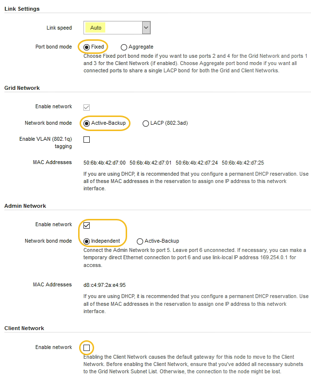

= Configuration des liaisons réseau (SG100 et SG1000)
:allow-uri-read: 
:icons: font
:imagesdir: ../media/

[role="lead"]
Vous pouvez configurer des liaisons réseau pour les ports utilisés pour connecter l'appliance au réseau Grid, au réseau client et au réseau Admin. Vous pouvez définir la vitesse de liaison ainsi que les modes de port et de liaison réseau.

.Ce dont vous avez besoin, 8217;ll
* Vous avez obtenu l'équipement supplémentaire requis pour votre type de câble et la vitesse de liaison.
* Vous avez connecté les ports réseau à des commutateurs qui prennent en charge la vitesse choisie.

Si vous prévoyez d'utiliser le mode de liaison de port d'agrégat, le mode de liaison réseau LACP ou le balisage VLAN :

* Vous avez connecté les ports réseau de l'appliance à des commutateurs capables de prendre en charge VLAN et LACP.
* Si plusieurs commutateurs participent au lien LACP, les commutateurs prennent en charge les groupes d'agrégation de liens multi-châssis (MLAG), ou un équivalent.
* Vous comprenez comment configurer les commutateurs pour utiliser VLAN, LACP et MLAG ou équivalent.
* Vous connaissez la balise VLAN unique à utiliser pour chaque réseau. Cette balise VLAN sera ajoutée à chaque paquet réseau pour s'assurer que le trafic réseau est acheminé vers le réseau approprié.

Les figures montrent comment les quatre ports réseau sont liés en mode de liaison de port fixe (configuration par défaut).

*Mode de liaison de port fixe SG100*

image::../media/sg100_fixed_port_draft.png[Mode de liaison de port fixe SG100]

*Mode de liaison de port fixe SG1000*

image::../media/sg1000_fixed_port.png[Mode de liaison de port fixe SG1000]

|===
| Légende | Quels ports sont liés 

 a| 
C
 a| 
Les ports 1 et 3 sont liés ensemble pour le réseau client, si ce réseau est utilisé.

 a| 
G
 a| 
Les ports 2 et 4 sont liés ensemble pour le réseau de grille.

|===
Cette figure montre comment les quatre ports réseau sont liés en mode de liaison de port agrégé.

*SG100 mode de liaison de port agrégé*

image::../media/sg100_aggregate_ports.png[Mode de liaison de port agrégé SG100]

*SG1000 mode de liaison du port agrégé*

image::../media/sg1000_aggregate_ports.png[Mode de liaison de port agrégé SG1000]

|===
| Légende | Quels ports sont liés 

 a| 
1
 a| 
Les quatre ports sont regroupés en une seule liaison LACP, ce qui permet d'utiliser tous les ports pour le trafic Grid Network et client Network.

|===
Le tableau récapitule les options de configuration des quatre ports réseau. Les paramètres par défaut sont indiqués en gras. Vous ne devez configurer les paramètres de la page Configuration des liens que si vous souhaitez utiliser un paramètre autre que celui par défaut.

NOTE: Le LACP transmet la règle de hachage par défaut en mode layer2+3. Si nécessaire, vous pouvez utiliser l'API Grid Management pour passer en mode layer3+4.

* *Mode de liaison de port fixe (par défaut)*
+
|===
| Mode de liaison réseau | Réseau client désactivé (par défaut) | Réseau client activé 

 a| 
Sauvegarde active/active (par défaut)
 a| 
** Les ports 2 et 4 utilisent une liaison de sauvegarde active pour le réseau Grid.
** Les ports 1 et 3 ne sont pas utilisés.
** Une balise VLAN est facultative.

 a| 
** Les ports 2 et 4 utilisent une liaison de sauvegarde active pour le réseau Grid.
** Les ports 1 et 3 utilisent une liaison de sauvegarde active pour le réseau client.
** Des balises VLAN peuvent être spécifiées pour les deux réseaux.

 a| 
LACP (802.3ad)
 a| 
** Les ports 2 et 4 utilisent une liaison LACP pour le réseau Grid.
** Les ports 1 et 3 ne sont pas utilisés.
** Une balise VLAN est facultative.

 a| 
** Les ports 2 et 4 utilisent une liaison LACP pour le réseau Grid.
** Les ports 1 et 3 utilisent une liaison LACP pour le réseau client.
** Des balises VLAN peuvent être spécifiées pour les deux réseaux.

|===
* *Mode de liaison de port agrégé*
+
|===
| Mode de liaison réseau | Réseau client désactivé (par défaut) | Réseau client activé 

 a| 
LACP (802.3ad) uniquement
 a| 
** Les ports 1-4 utilisent une liaison LACP unique pour le réseau Grid.
** Une balise VLAN unique identifie les paquets réseau Grid.

 a| 
** Les ports 1-4 utilisent une liaison LACP unique pour le réseau Grid et le réseau client.
** Deux balises VLAN permettent de isoler les paquets réseau Grid des paquets réseau client.

|===

Pour plus d'informations, consultez l'article à propos des connexions de ports GbE pour l'appliance de services.

Cette figure montre comment les deux ports de gestion 1 GbE du SG100 sont liés en mode de liaison réseau Active-Backup pour le réseau Admin.

Ces figures montrent comment les deux ports de gestion 1 GbE de l'appliance sont liés en mode de liaison réseau Active-Backup pour le réseau Admin.

*Ports réseau d'administration SG100 liés*

image::../media/sg100_bonded_management_ports.png[Ports réseau d'administration solidés SG100]

*Ports réseau d'administration SG1000 liés*

image::../media/sg1000_bonded_management_ports.png[Ports réseau d'administration solidés SG1000]

.Étapes
. Dans la barre de menus du programme d'installation de l'appliance StorageGRID, cliquez sur *configurer le réseau* *Configuration des liens*.
+
La page Configuration de la liaison réseau affiche un schéma de votre appliance avec le réseau et les ports de gestion numérotés.

+
*Ports SG100*

+
image::../media/sg100_configuring_network_ports.png[Connecteurs arrière SG100]

+
*Ports SG1000*

+
image::../media/sg1000_configuring_network_ports.png[Ports SG1000]

+
Le tableau État de la liaison répertorie l'état et la vitesse de la liaison des ports numérotés (SG1000 illustré).

+
image::../media/sg1000_configuring_network_link_status.png[Statut de la liaison SG1000]

+
La première fois que vous accédez à cette page :

+
** *Vitesse de liaison* est définie sur *Auto*.
** *Le mode de liaison de port* est défini sur *fixe*.
** *Le mode de liaison réseau* est défini sur *Active-Backup* pour le réseau de grille.
** Le *réseau d'administration* est activé et le mode de liaison réseau est défini sur *indépendant*.
** Le *réseau client* est désactivé.
+

. Sélectionnez la vitesse de liaison des ports réseau dans la liste déroulante *Link Speed*.
+
Les commutateurs réseau que vous utilisez pour le réseau Grid et le réseau client doivent également prendre en charge et être configurés pour cette vitesse. Vous devez utiliser les adaptateurs ou émetteurs-récepteurs appropriés pour la vitesse de liaison configurée. Utilisez la vitesse de liaison automatique lorsque cela est possible car cette option négocie à la fois la vitesse de liaison et le mode de correction d'erreur de marche avant (FEC) avec le partenaire de liaison.

. Activez ou désactivez les réseaux StorageGRID que vous souhaitez utiliser.
+
Le réseau Grid est requis. Vous ne pouvez pas désactiver ce réseau.

+
.. Si l'appliance n'est pas connectée au réseau Admin, décochez la case *Activer le réseau* du réseau Admin.
+
image::../media/admin_network_disabled.gif[Capture d'écran affichant la case à cocher pour activer ou désactiver le réseau Admin]

.. Si l'appliance est connectée au réseau client, cochez la case *Activer le réseau* pour le réseau client.
+
Les paramètres réseau du client pour les ports de carte réseau de données sont maintenant affichés.

. Reportez-vous au tableau et configurez le mode de liaison de port et le mode de liaison réseau.
+
Cet exemple montre :

+
** *Agrégat* et *LACP* sélectionnés pour la grille et les réseaux clients. Vous devez spécifier une balise VLAN unique pour chaque réseau. Vous pouvez sélectionner des valeurs comprises entre 0 et 4095.
** *Sauvegarde active* sélectionnée pour le réseau d'administration.
+
image::../media/sg1000_network_link_configuration_aggregate.png[Agrégat de configuration de Network Link]

. Lorsque vous êtes satisfait de vos sélections, cliquez sur *Enregistrer*.
+

NOTE: Vous risquez de perdre votre connexion si vous avez apporté des modifications au réseau ou au lien auquel vous êtes connecté. Si vous n'êtes pas reconnecté dans une minute, entrez à nouveau l'URL du programme d'installation de l'appliance StorageGRID à l'aide de l'une des autres adresses IP attribuées à l'appliance : +
`*https://_services_appliance_IP_:8443*`

xref:obtaining-additional-equipment-and-tools-sg100-and-sg1000.adoc[Obtenir des équipements et des outils supplémentaires (SG100 et SG1000)]
