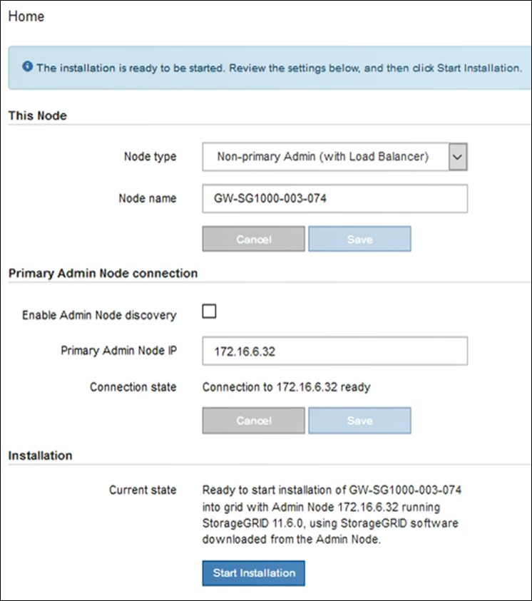

= Déployez une appliance de services en tant que passerelle ou nœud d'administration non primaire
:allow-uri-read: 
:icons: font
:imagesdir: ../media/

[role="lead"]
Lorsque vous déployez une appliance de services en tant que nœud de passerelle ou nœud d'administration non primaire, utilisez le programme d'installation de l'appliance StorageGRID inclus sur l'appliance.

.Ce dont vous avez besoin
* L'appliance a été installée dans un rack ou une armoire, connectée à vos réseaux et sous tension.
* Les liens réseau, les adresses IP et le remappage des ports (si nécessaire) ont été configurés pour le serveur à l'aide du programme d'installation de l'appliance StorageGRID.
+

IMPORTANT: Si vous avez mappé de nouveau des ports, vous ne pouvez pas utiliser les mêmes ports pour configurer les points finaux de l'équilibreur de charge. Vous pouvez créer des noeuds finaux à l'aide de ports remappés, mais ces noeuds finaux seront remappés vers les ports et le service CLB d'origine, et non le service Load Balancer. Suivez les étapes de la section xref:../maintain/removing-port-remaps.adoc[Supprimer les mappages de port].

+

NOTE: Le service CLB est obsolète.

* Le nœud d'administration principal du système StorageGRID a été déployé.
* Tous les sous-réseaux de réseau Grid répertoriés sur la page de configuration IP du programme d'installation de l'appliance StorageGRID ont été définis dans la liste de sous-réseaux de réseau de grille sur le nœud d'administration principal.
* Vous avez un ordinateur portable de service avec un xref:../admin/web-browser-requirements.adoc[navigateur web pris en charge].
* Vous connaissez l'adresse IP attribuée à l'appliance. Vous pouvez utiliser l'adresse IP de n'importe quel réseau StorageGRID connecté.

.Description de la tâche
Pour installer StorageGRID sur un nœud d'appliance de services :

* Vous spécifiez ou confirmez l'adresse IP du nœud d'administration principal et le nom du nœud d'appliance.
* Vous démarrez l'installation et attendez que le logiciel soit installé.
+
L'installation s'interrompt via les tâches d'installation du nœud de passerelle de l'appliance. Pour reprendre l'installation, connectez-vous au Grid Manager, approuvez tous les nœuds de la grille et terminez le processus d'installation de StorageGRID. L'installation d'un noeud d'administration non primaire ne nécessite pas votre approbation.

IMPORTANT: Ne déployez pas les appareils de service SG100 et SG1000 sur le même site. Cela peut entraîner des performances imprévisibles.

NOTE: Si vous devez déployer plusieurs nœuds d'appliance à la fois, vous pouvez automatiser le processus d'installation à l'aide du `configure-sga.py` Script d'installation de l'appliance. Vous pouvez également utiliser le programme d'installation de l'appliance pour télécharger un fichier JSON qui contient des informations de configuration. Voir xref:automating-appliance-installation-and-configuration.adoc[Automatisation de l'installation et de la configuration de l'appliance (SG100 et SG1000)] pour plus d'informations sur l'automatisation de l'installation.

.Étapes
. Ouvrez un navigateur et saisissez l'adresse IP de l'appliance.
+
`*https://_Controller_IP_:8443*`

+
La page d'accueil du programme d'installation de l'appliance StorageGRID s'affiche.

. Dans la section connexion au noeud d'administration principal, déterminez si vous devez spécifier l'adresse IP du noeud d'administration principal.
+
Si vous avez déjà installé d'autres nœuds dans ce centre de données, le programme d'installation de l'appliance StorageGRID peut détecter automatiquement cette adresse IP, en supposant que le nœud d'administration principal, ou au moins un autre nœud de grille avec ADMIN_IP configuré, soit présent sur le même sous-réseau.

. Si cette adresse IP n'apparaît pas ou si vous devez la modifier, spécifiez l'adresse :
+
|===
| Option | Description 

 a| 
Entrée IP manuelle
 a| 
.. Désélectionnez la case à cocher *Activer la découverte du nœud d'administration*.
.. Saisissez l'adresse IP manuellement.
.. Cliquez sur *Enregistrer*.
.. Attendez que l'état de connexion de la nouvelle adresse IP soit prêt.

 a| 
Détection automatique de tous les nœuds d'administration principaux connectés
 a| 
.. Cochez la case *Activer la découverte du noeud d'administration*.
.. Attendez que la liste des adresses IP découvertes s'affiche.
.. Sélectionnez le nœud d'administration principal de la grille dans laquelle ce nœud de stockage de l'appliance sera déployé.
.. Cliquez sur *Enregistrer*.
.. Attendez que l'état de connexion de la nouvelle adresse IP soit prêt.

|===
. Dans le champ *Nom de noeud*, entrez le nom que vous souhaitez utiliser pour ce noeud d'appliance, puis cliquez sur *Enregistrer*.
+
Le nom de nœud est attribué à ce nœud d'appliance dans le système StorageGRID. Elle s'affiche sur la page nœuds (onglet Présentation) dans Grid Manager. Si nécessaire, vous pouvez modifier le nom du nœud lors de l'approbation.

. Si vous souhaitez installer une autre version du logiciel StorageGRID, procédez comme suit :
+
.. Téléchargez l'archive d'installation :https://["Téléchargement NetApp : appliance StorageGRID"^].
.. Extrayez l'archive.
.. Dans le programme d'installation de l'appliance StorageGRID, sélectionnez *Avancé* *Télécharger le logiciel StorageGRID*.
.. Cliquez sur *Supprimer* pour supprimer le progiciel actuel.
+
image::../media/appliance_installer_rmv_current_software.png[Programme d'installation de l'appliance - Supprimer le logiciel actuel]

.. Cliquez sur *Parcourir* pour le progiciel que vous avez téléchargé et extrait, puis cliquez sur *Parcourir* pour le fichier de somme de contrôle.
+
image::../media/appliance_installer_upload_sg_software.png[Programme d'installation de l'appliance - Téléchargement du logiciel SG]

.. Sélectionnez *Accueil* pour revenir à la page d'accueil.

. Dans la section installation, vérifiez que l'état actuel est « prêt à démarrer l'installation de `_node name_` Dans le grid avec le nœud d'administration principal `_admin_ip_` " Et que le bouton *Start installation* est activé.
+
Si le bouton *Start installation* n'est pas activé, vous devrez peut-être modifier la configuration réseau ou les paramètres de port. Pour obtenir des instructions, reportez-vous aux instructions d'installation et de maintenance de votre appareil.

. Dans la page d'accueil du programme d'installation de l'appliance StorageGRID, cliquez sur *Démarrer l'installation*.
+

+
L'état actuel passe à « installation en cours » et la page installation du moniteur s'affiche.

+

NOTE: Si vous devez accéder manuellement à la page installation du moniteur, cliquez sur *installation du moniteur* dans la barre de menus.

. Si votre grid inclut plusieurs nœuds d'appliance, répétez les étapes précédentes pour chaque appliance.

