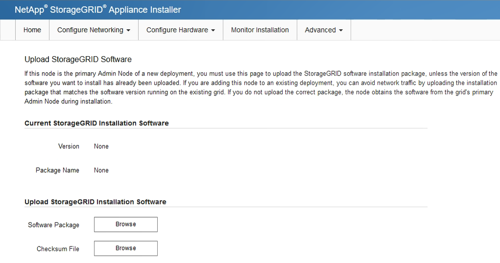

= Déployez l'appliance de services en tant que nœud d'administration principal
:allow-uri-read: 
:icons: font
:imagesdir: ../media/

[role="lead"]
Lorsque vous déployez une appliance de services en tant que nœud d'administration principal, utilisez le programme d'installation de l'appliance StorageGRID inclus sur l'appliance pour installer le logiciel StorageGRID ou téléchargez la version du logiciel que vous souhaitez installer. Vous devez installer et configurer le nœud d'administration principal avant d'installer tout autre type de nœud d'appliance. Un nœud d'administration principal peut se connecter au réseau Grid et au réseau d'administration et au réseau client en option, si un ou les deux sont configurés.

.Ce dont vous avez besoin
* L'appliance a été installée dans un rack ou une armoire, connectée à vos réseaux et sous tension.
* Les liens réseau, les adresses IP et le remappage des ports (si nécessaire) ont été configurés pour le serveur à l'aide du programme d'installation de l'appliance StorageGRID.
+

IMPORTANT: Si vous avez mappé de nouveau des ports, vous ne pouvez pas utiliser les mêmes ports pour configurer les points finaux de l'équilibreur de charge. Vous pouvez créer des noeuds finaux à l'aide de ports remappés, mais ces noeuds finaux seront remappés vers les ports et le service CLB d'origine, et non le service Load Balancer. Suivez les étapes de la section xref:../maintain/removing-port-remaps.adoc[Supprimer les mappages de port].

+
Voir xref:../admin/how-load-balancing-works-clb-service.adoc[Fonctionnement de l'équilibrage des charges - service CLB (obsolète)] Pour plus d'informations sur le service CLB.

+

NOTE: Le service CLB est obsolète.

* Vous avez un ordinateur portable de service avec un xref:../admin/web-browser-requirements.adoc[navigateur web pris en charge].
* Vous connaissez l'une des adresses IP attribuées à l'appliance. Vous pouvez utiliser l'adresse IP de n'importe quel réseau StorageGRID connecté.

.Description de la tâche
Pour installer StorageGRID sur un nœud d'administration principal de l'appliance :

* Vous utilisez le programme d'installation de l'appliance StorageGRID pour installer le logiciel StorageGRID. Si vous souhaitez installer une autre version du logiciel, vous devez d'abord la télécharger à l'aide du programme d'installation de l'appliance StorageGRID.
* Vous attendez que le logiciel soit installé.
* Lorsque le logiciel a été installé, l'appliance est redémarrée automatiquement.

.Étapes
. Ouvrez un navigateur et saisissez l'adresse IP de l'appliance. +
`*https://_services_appliance_IP_:8443*`
+
La page d'accueil du programme d'installation de l'appliance StorageGRID s'affiche.

. Dans la section *ce noeud*, sélectionnez *Administrateur principal*.
. Dans le champ *Nom de noeud*, entrez le nom que vous souhaitez utiliser pour ce noeud d'appliance, puis cliquez sur *Enregistrer*.
+
Le nom de nœud est attribué à ce nœud d'appliance dans le système StorageGRID. Elle s'affiche sur la page Grid Nodes dans Grid Manager.

. Si vous souhaitez installer une autre version du logiciel StorageGRID, procédez comme suit :
+
.. Téléchargez l'archive d'installation :https://["Téléchargement NetApp : appliance StorageGRID"^].
.. Extrayez l'archive.
.. Dans le programme d'installation de l'appliance StorageGRID, sélectionnez *Avancé* *Télécharger le logiciel StorageGRID*.
.. Cliquez sur *Supprimer* pour supprimer le progiciel actuel.
+
image::../media/appliance_installer_rmv_current_software.png[Programme d'installation de l'appliance - Supprimer le logiciel actuel]

.. Cliquez sur *Parcourir* pour le progiciel que vous avez téléchargé et extrait, puis cliquez sur *Parcourir* pour le fichier de somme de contrôle.
+

.. Sélectionnez *Accueil* pour revenir à la page d'accueil.

. Confirmez que l'état actuel est « prêt à démarrer l'installation du noeud d'administration principal avec la version x.y du logiciel » et que le bouton *Start installation* est activé.
+

NOTE: Si vous déployez l'appliance de nœud d'administration en tant que cible de clonage de nœud, arrêtez le processus de déploiement ici et poursuivez la procédure de clonage de nœud en suivant la procédure xref:../maintain/index.adoc[Récupérer et entretenir] instructions.

. Dans la page d'accueil du programme d'installation de l'appliance StorageGRID, cliquez sur *Démarrer l'installation*.
+
image::../media/appliance_installer_home_start_installation_enabled_primary_an.png[Installation du nœud d'administration principal de l'appliance]

+
L'état actuel passe à « installation en cours » et la page installation du moniteur s'affiche.

+

NOTE: Si vous devez accéder manuellement à la page installation du moniteur, cliquez sur *installation du moniteur* dans la barre de menus.

