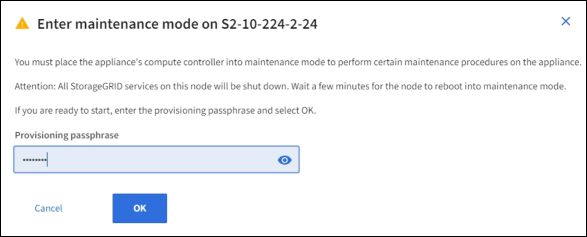

= Mettez l'appareil en mode maintenance
:allow-uri-read: 
:icons: font
:imagesdir: ../media/

[role="lead"]
Vous devez mettre l'appareil en mode maintenance avant d'effectuer des procédures de maintenance spécifiques.

.Ce dont vous avez besoin
* Vous êtes connecté au Grid Manager à l'aide d'un xref:../admin/web-browser-requirements.adoc[navigateur web pris en charge].
* Vous disposez de l'autorisation Maintenance ou accès racine. Pour plus de détails, reportez-vous aux instructions d'administration de StorageGRID.

.Description de la tâche
Dans de rares cas, le fait de placer une appliance StorageGRID en mode de maintenance peut rendre l'appliance indisponible pour l'accès à distance.

NOTE: Le mot de passe du compte admin et les clés d'hôte SSH d'une appliance StorageGRID en mode maintenance restent identiques à ceux de l'appliance lorsqu'elle était en service.

.Étapes
. Dans Grid Manager, sélectionnez *NODES*.
. Dans l'arborescence de la page nœuds, sélectionnez le nœud de stockage de l'appliance.
. Sélectionnez l'onglet *tâches*.
+
image::../media/maintenance_mode.png[Bouton mode maintenance pour l'appareil]

. Sélectionnez *Maintenance mode*.
+
Une boîte de dialogue de confirmation s'affiche.

+

. Entrez la phrase de passe de provisionnement et sélectionnez *OK*.
+
Une barre de progression et une série de messages, notamment « demande envoyée », « arrêt de StorageGRID » et « redémarrage », indiquent que l'appliance effectue les étapes de passage en mode maintenance.

+
image::../media/maintenance_mode_progress_bar.png[Barre de progression du mode maintenance]

+
Lorsque l'appliance est en mode maintenance, un message de confirmation répertorie les URL que vous pouvez utiliser pour accéder au programme d'installation de l'appliance StorageGRID.

+
image::../media/maintenance_mode_urls.png[URL du mode maintenance]

. Pour accéder au programme d'installation de l'appliance StorageGRID, accédez à l'une des URL affichées.
+
Si possible, utilisez l'URL contenant l'adresse IP du port réseau d'administration de l'appliance.

+

NOTE: Si vous disposez d'une connexion directe au port de gestion de l'appliance, utilisez `+https://169.254.0.1:8443+` Pour accéder à la page du programme d'installation de l'appliance StorageGRID.

. Dans le programme d'installation de l'appliance StorageGRID, vérifiez que l'appliance est en mode de maintenance.
+
image::../media/maintenance_mode_notification_bar.png[message du mode maintenance]

. Effectuez toutes les tâches de maintenance requises.
. Une fois les tâches de maintenance effectuées, quittez le mode de maintenance et reprenez le fonctionnement normal du nœud. Dans le programme d'installation de l'appliance StorageGRID, sélectionnez *Advanced* *Reboot Controller*, puis sélectionnez *Reboot into StorageGRID*.
+
image::../media/reboot_controller_from_maintenance_mode.png[Redémarrez le contrôleur en mode de maintenance]

+
L'appliance peut redémarrer et rejoindre la grille en 20 minutes. Pour confirmer que le redémarrage est terminé et que le nœud a rejoint la grille, retournez à la grille Manager. La page *NODES* doit afficher un état normal (aucune icône) pour le nœud de l'appliance, indiquant qu'aucune alerte n'est active et que le nœud est connecté à la grille.

+
image::../media/nodes_menu.png[État normal des pages nœuds]

