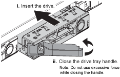

= Remplacez le disque de l'appliance de services
:allow-uri-read: 
:icons: font
:imagesdir: ../media/

[role="lead"]
Les disques SSD de l'appliance de services contiennent le système d'exploitation StorageGRID. En outre, lorsque l'appliance est configurée en tant que nœud d'administration, les disques SSD contiennent également des journaux d'audit, des mesures et des tables de base de données. Les disques sont mis en miroir à l'aide de RAID1 pour la redondance. Si l'un des lecteurs tombe en panne, vous devez le remplacer dès que possible pour assurer la redondance.

.Ce dont vous avez besoin, 8217;ll
* Vous avez xref:locating-controller-in-data-center.adoc[l'appareil se trouve physiquement].
* Vous avez vérifié quel lecteur est défectueux en notant que le voyant de gauche est orange clignotant.
+

IMPORTANT: Si vous retirez le disque en fonctionnement, le nœud de l'appliance est arrêté. Reportez-vous aux informations sur l'affichage des indicateurs d'état pour vérifier l'échec.

* Vous avez obtenu le disque de remplacement.
* Vous avez obtenu une protection ESD appropriée.

.Étapes
. Vérifiez que le voyant de gauche du lecteur clignote en orange.
+
Vous pouvez également utiliser Grid Manager pour contrôler l'état des disques SSD. Sélectionnez *NOEUDS*. Puis faire `*Appliance Node*` *Matériel*. Si un lecteur est défectueux, le champ Storage RAID mode contient un message indiquant quel lecteur est défectueux.

. Enroulez l'extrémité du bracelet antistatique autour de votre poignet et fixez l'extrémité du clip à une masse métallique afin d'éviter toute décharge statique.
. Déballez le lecteur de remplacement et placez-le sur une surface plane et sans électricité statique près de l'appareil.
+
Conservez tous les matériaux d'emballage.

. Appuyez sur le bouton de déverrouillage du disque défectueux.
+
image::../media/h600s_driveremoval.gif[Dépose de l'entraînement]

+
La poignée des ressorts d'entraînement s'ouvre partiellement et l'entraînement se relâche de la fente.

. Ouvrez la poignée, faites glisser l'entraînement vers l'extérieur et placez-le sur une surface plane et non statique.
. Appuyez sur le bouton de dégagement du disque de remplacement avant de l'insérer dans le slot.
+
Les ressorts de verrouillage s'ouvrent.

+

. Insérez le lecteur de remplacement dans son logement, puis fermez la poignée du lecteur.
+

IMPORTANT: Ne pas exercer de force excessive lors de la fermeture de la poignée.

+
Lorsque le lecteur est complètement inséré, vous entendez un clic.

+
Le lecteur est automatiquement reconstruit à l'aide de données en miroir provenant du disque de travail. Vous pouvez vérifier l'état de la reconstruction à l'aide du Gestionnaire de grille. Sélectionnez *NOEUDS*. Puis faire `*Appliance Node*` *Matériel*. Le champ Storage RAID mode contient un message de « reconstitution » jusqu'à ce que le disque soit entièrement reconstruit.

. Contactez le support technique concernant le remplacement des disques.
+
Le support technique fournit des instructions pour renvoyer le disque défectueux.

