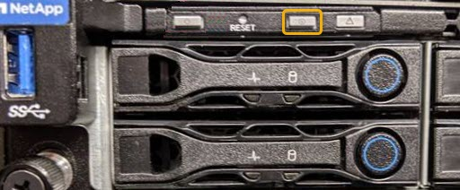

= Allumer et éteindre la LED d'identification du contrôleur
:allow-uri-read: 
:icons: font
:imagesdir: ../media/

[role="lead"]
Il est possible d'allumer la LED d'identification bleue à l'avant et à l'arrière du contrôleur pour localiser l'appliance dans un data Center.

.Ce dont vous avez besoin
Vous devez disposer de l'adresse IP du contrôleur que vous souhaitez identifier.

.Étapes
. Accéder à l'interface du contrôleur BMC.
. Sélectionnez *identification du serveur*.
. Sélectionnez *ACTIVÉ*, puis *Exécuter l'action*.
+
image::../media/sg6060_service_identify_turn_on.jpg[Activez la LED d'identification du contrôleur BMC]

.Résultat
Les LED d'identification s'allument en bleu à l'avant (illustration) et à l'arrière du contrôleur.

image::../media/sg6060_front_panel_service_led_on.jpg[Voyant d'identification avant - allumé]

NOTE: Si un panneau est installé sur le contrôleur, il peut être difficile de voir le voyant d'identification avant.

.Une fois que vous avez terminé
Pour éteindre le voyant d'identification du contrôleur :

* Appuyez sur le commutateur LED identifier sur le panneau avant du contrôleur.
* Dans l'interface du contrôleur BMC, sélectionnez *Server Identify*, sélectionnez *OFF*, puis *Perform action*.

Les LED bleues d'identification à l'avant et à l'arrière du contrôleur s'éteignent.

.Informations associées
xref:locating-controller-in-data-center.adoc[Localiser le contrôleur dans le data Center]

xref:accessing-bmc-interface-sg1000.adoc[Accéder à l'interface BMC]
