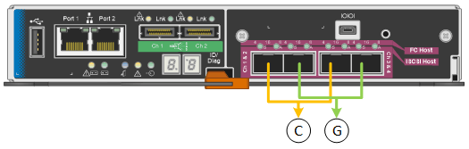
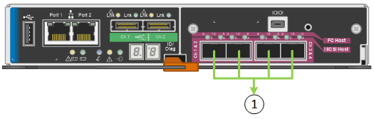
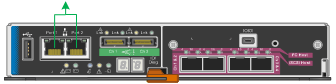
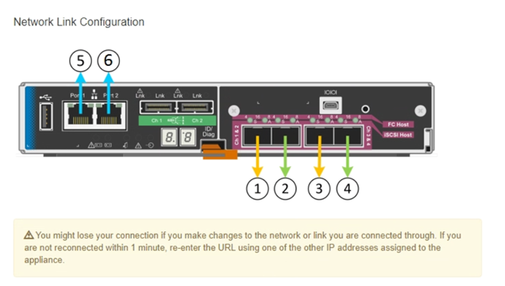

= Configuration des liaisons réseau (SG5600)
:allow-uri-read: 
:icons: font
:imagesdir: ../media/

[role="lead"]
Vous pouvez configurer des liaisons réseau pour les ports utilisés pour connecter l'appliance au réseau Grid, au réseau client et au réseau Admin. Vous pouvez définir la vitesse de liaison ainsi que les modes de port et de liaison réseau.

Si vous prévoyez d'utiliser le mode de liaison de port d'agrégat, le mode de liaison réseau LACP ou le balisage VLAN :

* Vous avez connecté les ports 10 GbE de l'appliance à des switchs capables de prendre en charge les VLAN et LACP.
* Si plusieurs commutateurs participent au lien LACP, les commutateurs prennent en charge les groupes d'agrégation de liens multi-châssis (MLAG), ou un équivalent.
* Vous comprenez comment configurer les commutateurs pour utiliser VLAN, LACP et MLAG ou équivalent.
* Vous connaissez la balise VLAN unique à utiliser pour chaque réseau. Cette balise VLAN sera ajoutée à chaque paquet réseau pour s'assurer que le trafic réseau est acheminé vers le réseau approprié.

Cette figure montre comment les quatre ports 10 GbE sont liés en mode de liaison de port fixe (configuration par défaut).

|===
| Légende | Quels ports sont liés 

 a| 
C
 a| 
Les ports 1 et 3 sont liés ensemble pour le réseau client, si ce réseau est utilisé.

 a| 
G
 a| 
Les ports 2 et 4 sont liés ensemble pour le réseau de grille.

|===
Cette figure montre comment les quatre ports 10 GbE sont liés en mode de liaison de port agrégé.

|===
| Légende | Quels ports sont liés 

 a| 
1
 a| 
Les quatre ports sont regroupés en une seule liaison LACP, ce qui permet d'utiliser tous les ports pour le trafic Grid Network et client Network.

|===
Le tableau récapitule les options de configuration des quatre ports 10 GbE. Vous ne devez configurer les paramètres de la page Configuration des liens que si vous souhaitez utiliser un paramètre autre que celui par défaut.

* *Mode de liaison de port fixe (par défaut)*
+
|===
| Mode de liaison réseau | Réseau client désactivé (par défaut) | Réseau client activé 

 a| 
Sauvegarde active/active (par défaut)
 a| 
** Les ports 2 et 4 utilisent une liaison de sauvegarde active pour le réseau Grid.
** Les ports 1 et 3 ne sont pas utilisés.
** Une balise VLAN est facultative.

 a| 
** Les ports 2 et 4 utilisent une liaison de sauvegarde active pour le réseau Grid.
** Les ports 1 et 3 utilisent une liaison de sauvegarde active pour le réseau client.
** Des balises VLAN peuvent être spécifiées pour les deux réseaux.

 a| 
LACP (802.3ad)
 a| 
** Les ports 2 et 4 utilisent une liaison LACP pour le réseau Grid.
** Les ports 1 et 3 ne sont pas utilisés.
** Une balise VLAN est facultative.

 a| 
** Les ports 2 et 4 utilisent une liaison LACP pour le réseau Grid.
** Les ports 1 et 3 utilisent une liaison LACP pour le réseau client.
** Des balises VLAN peuvent être spécifiées pour les deux réseaux.

|===
* *Mode de liaison de port agrégé*
+
|===
| Mode de liaison réseau | Réseau client désactivé (par défaut) | Réseau client activé 

 a| 
LACP (802.3ad) uniquement
 a| 
** Les ports 1-4 utilisent une liaison LACP unique pour le réseau Grid.
** Une balise VLAN unique identifie les paquets réseau Grid.

 a| 
** Les ports 1-4 utilisent une liaison LACP unique pour le réseau Grid et le réseau client.
** Deux balises VLAN permettent de isoler les paquets réseau Grid des paquets réseau client.

|===

Pour plus d'informations sur les modes de liaison de port et de liaison réseau, reportez-vous à la section « connexions de port 10 GbE pour le contrôleur E5600SG ».

Cette figure montre comment les deux ports de gestion 1 GbE du contrôleur E5600SG sont liés en mode de liaison réseau Active-Backup pour le réseau d'administration.

.Étapes
. Dans la barre de menus du programme d'installation de l'appliance StorageGRID, cliquez sur *configurer le réseau* *Configuration des liens*.
+
La page Configuration de la liaison réseau affiche un schéma de votre appliance avec le réseau et les ports de gestion numérotés.

+

+
Le tableau Statut de la liaison répertorie l'état de la liaison (haut/bas) et la vitesse (1/10/25/40/100 Gbit/s) des ports numérotés.

+
image::../media/sg5612_configuring_network_linkstatus.png[5612 État de la liaison]

+
La première fois que vous accédez à cette page :

+
** *Vitesse de liaison* est définie sur *10GbE*. Il s'agit de la seule vitesse de liaison disponible pour le contrôleur E5600SG.
** *Le mode de liaison de port* est défini sur *fixe*.
** *Le mode de liaison réseau* pour le réseau Grid est défini sur *Active-Backup*.
** Le *réseau d'administration* est activé et le mode de liaison réseau est défini sur *indépendant*.
** Le *réseau client* est désactivé.
+
image::../media/network_link_configuration_fixed.png[Config. De liaison réseau fixe]

. Activez ou désactivez les réseaux StorageGRID que vous souhaitez utiliser.
+
Le réseau Grid est requis. Vous ne pouvez pas désactiver ce réseau.

+
.. Si l'appliance n'est pas connectée au réseau Admin, décochez la case *Activer le réseau* du réseau Admin.
+
image::../media/admin_network_disabled.gif[Capture d'écran affichant la case à cocher pour activer ou désactiver le réseau Admin]

.. Si l'appliance est connectée au réseau client, cochez la case *Activer le réseau* pour le réseau client.
+
Les paramètres du réseau client pour les ports 10 GbE sont maintenant affichés.

. Reportez-vous au tableau et configurez le mode de liaison de port et le mode de liaison réseau.
+
Cet exemple présente :

+
** *Agrégat* et *LACP* sélectionnés pour les réseaux Grid et client. Vous devez spécifier une balise VLAN unique pour chaque réseau. Vous pouvez sélectionner des valeurs comprises entre 0 et 4095.
** *Sauvegarde active* sélectionnée pour le réseau d'administration.
+
image::../media/network_link_configuration_aggregate.gif[Capture d'écran montrant les paramètres de configuration de liaison pour le mode d'agrégation]

. Lorsque vous êtes satisfait de vos sélections, cliquez sur *Enregistrer*.
+

NOTE: Vous risquez de perdre votre connexion si vous avez apporté des modifications au réseau ou au lien auquel vous êtes connecté. Si vous n'êtes pas reconnecté dans une minute, entrez à nouveau l'URL du programme d'installation de l'appliance StorageGRID à l'aide de l'une des autres adresses IP attribuées à l'appliance : +
`*https://_E5600SG_Controller_IP_:8443*`

xref:port-bond-modes-for-e5600sg-controller-ports.adoc[Modes de liaison des ports pour les ports du contrôleur E5600SG]
