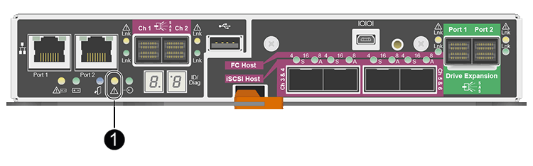

= Remplacement du contrôleur E2700
:allow-uri-read: 
:icons: font
:imagesdir: ../media/

[role="lead"]
Vous devrez peut-être remplacer le contrôleur E2700 s'il ne fonctionne pas de manière optimale ou en cas de défaillance.

.Ce dont vous avez besoin
* Vous disposez d'un contrôleur de remplacement avec la même référence que le contrôleur que vous remplacez.
* Vous avez des étiquettes pour identifier chaque câble connecté au contrôleur.
* Vous bénéficiez d'une protection antistatique.
* Vous devez disposer de l'autorisation Maintenance ou accès racine. Pour plus de détails, reportez-vous aux instructions d'administration de StorageGRID.

.Description de la tâche
Vous pouvez déterminer si le contrôleur est défectueux en vérifiant le voyant orange Service action Requied (action de maintenance requise) sur le contrôleur (1 sur l'illustration). Si cette LED est allumée, le contrôleur doit être remplacé.

L'appliance Storage Node ne sera pas accessible lors du remplacement du contrôleur. Si le contrôleur E2700 fonctionne correctement, vous pouvez placer le contrôleur E5600SG en mode de maintenance.

Lorsque vous remplacez un contrôleur, vous devez retirer la batterie du contrôleur d'origine et l'installer dans le contrôleur de remplacement.

.Étapes
. Préparez-vous à retirer le contrôleur.
+
Procédez comme suit avec le gestionnaire de stockage SANtricity.

+
.. Notez la version du logiciel SANtricity OS actuellement installée sur le contrôleur.
.. Notez quelle version de NVSRAM est actuellement installée.
.. Si la fonction de sécurité du lecteur est activée, assurez-vous qu'une clé enregistrée existe et que vous connaissez la phrase de passe requise pour l'installer.
+

IMPORTANT: *Perte possible de l'accès aux données #8212;* si tous les lecteurs de l'appliance sont activés pour la sécurité, le nouveau contrôleur ne pourra pas accéder à l'appliance tant que vous ne déverrouillerez pas les disques sécurisés à l'aide de la fenêtre gestion entreprise de SANtricity Storage Manager.

.. Sauvegardez la base de données de configuration.
+
Si un problème survient lorsque vous supprimez un contrôleur, vous pouvez utiliser le fichier enregistré pour restaurer votre configuration.

.. Collecte des données d'assistance pour l'appareil.
+

NOTE: La collecte des données de support avant et après le remplacement d'un composant vous permet d'envoyer un ensemble complet de journaux au support technique si le remplacement ne résout pas le problème.

. Si l'appliance StorageGRID s'exécute sur un système StorageGRID, xref:placing-appliance-into-maintenance-mode.adoc[Placez le contrôleur E5600SG en mode de maintenance].
. Si le contrôleur E2700 fonctionne suffisamment pour permettre un arrêt contrôlé, vérifiez que toutes les opérations sont terminées.
+
.. Dans la barre de titre de la fenêtre gestion des matrices, sélectionnez *moniteur* *Rapports* *opérations en cours*.
.. Confirmez que toutes les opérations ont été effectuées.

. Suivez les instructions de la procédure de remplacement d'un contrôleur E2700 simplex pour procéder à la procédure suivante :
+
.. Etiqueter les câbles puis débrancher les câbles.
+

IMPORTANT: Pour éviter de dégrader les performances, ne pas tordre, plier, pincer ou marcher sur les câbles.

.. Retirez le contrôleur défectueux de l'appliance.
.. Retirer le capot du contrôleur
.. Dévissez la vis moletée et retirez la batterie du contrôleur défectueux.
.. Installez la batterie dans le contrôleur de remplacement, puis remettez le capot du contrôleur en place.
.. Installez le contrôleur de remplacement sur l'appliance.
.. Remplacez les câbles.
.. Attendez que le contrôleur E2700 redémarre. Vérifiez que l'affichage à sept segments indique l'état de `99`.

. Si l'appareil utilise des disques sécurisés, importez la clé de sécurité du lecteur.
. Ramenez l'appareil en mode de fonctionnement normal. Dans le programme d'installation de l'appliance StorageGRID, sélectionnez *Advanced* *Reboot Controller*, puis sélectionnez *Reboot into StorageGRID*.
+
image::../media/reboot_controller_from_maintenance_mode.png[Redémarrez le contrôleur en mode de maintenance]

+
Pendant le redémarrage, l'écran suivant s'affiche :

+
image::../media/reboot_controller_in_progress.png[Redémarrage en cours]

+
L'appareil redémarre et rejoint la grille. Ce processus peut prendre jusqu'à 20 minutes.

. Vérifiez que le redémarrage est terminé et que le nœud a rejoint à nouveau la grille. Dans Grid Manager, vérifiez que la page nœuds affiche un état normal (aucune icône à gauche du nom du nœud) pour le nœud d'appliance, indiquant qu'aucune alerte n'est active et que le nœud est connecté à la grille.
+
image::../media/node_rejoin_grid_confirmation.png[Le nœud d'appliance a rejoint la grille]

. Depuis SANtricity Storage Manager, vérifiez que le nouveau contrôleur est optimal et collectez les données de support.

.Informations associées
https://mysupport.netapp.com/info/web/ECMP11751516.html["Procédures de remplacement du matériel NetApp E-Series et EF-Series"^]

http://mysupport.netapp.com/documentation/productlibrary/index.html?productID=61765["Documentation NetApp : gamme E2700"^]
