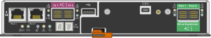
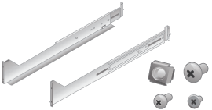
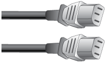

= Déballer les boîtes (SG5600)
:allow-uri-read: 
:icons: font
:imagesdir: ../media/

[role="lead"]
Avant d'installer l'appareil StorageGRID, déballez toutes les boîtes et comparez le contenu aux éléments du bordereau d'expédition.

* *Boîtier SG5660, châssis 4U avec 60 disques*
+
image::../media/appliance_enclosure.gif[Boîtier 4U]

* *Boîtier SG5612, châssis 2U avec 12 disques*
+
image::../media/appliance_enclosure_2u.gif[Châssis 2U DE1600]

* *Cadre 4U ou têtes de gondole 2U*
+
image:../media/appliance_bezel.gif["Panneau 4U"] image:../media/appliance_bezel_2u_endcaps.gif["Têtes de gondole 2U"]

* *Disques NL-SAS*
+
image::../media/appliance_drive.gif[Lecteur]

+
Les disques sont préinstallés dans le modèle SG5612 2U, mais pas dans le modèle SG5660 4U pour la sécurité d'expédition.

* *Contrôleur E5600SG*
+
image::../media/sga_controller_5600_diagram.gif[Contrôleur E5600]

* *Contrôleur E2700*
+

* *Rails de montage et vis*
+

* *Poignées de boîtier (boîtiers 4U uniquement)*
+
image::../media/appliance_enclosure_handles.gif[Poignées du boîtier]

== Câbles et connecteurs

Le produit de livraison du dispositif StorageGRID comprend les câbles et connecteurs suivants :

* *Cordons d'alimentation pour votre pays*
+

+
L'appareil est livré avec deux cordons d'alimentation CA pour la connexion à une source d'alimentation externe, telle qu'une prise murale. Il se peut que votre armoire soit équipée de cordons d'alimentation spéciaux à la place des câbles d'alimentation fournis avec l'appliance.

* *Câbles d'interconnexion SAS*
+
image::../media/appliance_mini_sas_cables.gif[Câbles mini SAS]

+
Deux câbles d'interconnexion SAS de 0.5 mètres avec connecteurs mini-SAS-HD et mini-SAS.

+
Le connecteur carré se branche dans le contrôleur E2700 et le connecteur rectangulaire s'branche dans le contrôleur E5600SG.

