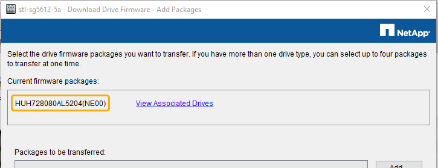

= Mise à niveau du firmware des disques à l'aide du gestionnaire de stockage SANtricity
:allow-uri-read: 
:icons: font
:imagesdir: ../media/

[role="lead"]
Vous mettez à niveau le micrologiciel de votre lecteur pour vous assurer que vous disposez de toutes les dernières fonctionnalités et correctifs.

.Ce dont vous avez besoin
* Le dispositif de stockage est à l'état optimal.
* Tous les disques ont un état optimal.
* La dernière version de SANtricity Storage Manager est installée et compatible avec votre version de StorageGRID.
+
xref:upgrading-santricity-os-on-storage-controllers-using-grid-manager-sg5600.adoc[Mettez à niveau le système d'exploitation SANtricity sur les contrôleurs de stockage à l'aide de Grid Manager]

+
xref:upgrading-santricity-os-on-e2700-controller-using-maintenance-mode.adoc[Mettre à niveau le système d'exploitation SANtricity sur le contrôleur E2700 à l'aide du mode de maintenance]

* Vous avez xref:placing-appliance-into-maintenance-mode.adoc[Placez l'appliance StorageGRID en mode de maintenance].
+

NOTE: Le mode maintenance interrompt la connexion au contrôleur de stockage, en arrêtant toutes les activités d'E/S et en plaçant tous les disques hors ligne.

IMPORTANT: Ne mettez pas à niveau le micrologiciel du lecteur sur plusieurs appareils StorageGRID à la fois. Cela peut entraîner l'indisponibilité des données, en fonction de votre modèle de déploiement et de vos règles ILM.

.Étapes
. Vérifiez que l'appareil est dans xref:placing-appliance-into-maintenance-mode.adoc[mode maintenance].
. Ouvrez un navigateur Web et entrez l'adresse IP comme URL pour SANtricity Storage Manager : +
`*https://_E2700_Controller_IP_*`
. Entrez le nom d'utilisateur et le mot de passe de l'administrateur SANtricity Storage Manager, si nécessaire.
. Dans SANtricity Enterprise Management, sélectionnez l'onglet *périphériques*.
+
La fenêtre SANtricity Array Management s'ouvre.

. Dans SANtricity Array Management, double-cliquez sur la baie de stockage avec les lecteurs à mettre à niveau.
. Vérifiez que la matrice de stockage et les lecteurs disposent d'un état optimal.
. Vérifiez la version du micrologiciel du lecteur actuellement installé sur l'appliance de stockage :
+
.. Dans SANtricity Enterprise Management, sélectionnez *Upgrade* *Drive Firmware*.
+
La fenêtre Download Drive Firmware - Add Packages (Télécharger le micrologiciel du lecteur - Ajouter des modules) affiche les fichiers de micrologiciel du lecteur actuellement utilisés.

.. Notez les révisions actuelles du firmware des disques et les identifiants des disques dans les packages de firmware.
+

+
Dans cet exemple :

+
*** La version du micrologiciel du lecteur est *NE00*.
*** L'identifiant du lecteur est *HUH7280AL5204*.

+
Sélectionnez *Afficher les lecteurs associés* pour afficher l'emplacement d'installation de ces lecteurs dans votre appliance de stockage.

. Téléchargez et préparez la mise à niveau disponible du firmware des disques :
+
.. Ouvrez votre navigateur Web, accédez au site Web de support de NetApp et connectez-vous en utilisant votre ID et votre mot de passe.
+
https://["Support NetApp"^]

.. Sur le site Web de support de NetApp, sélectionnez l'onglet *Downloads*, puis sélectionnez *E-Series Disk drive Firmware*.
+
La page firmware des disques E-Series s'affiche.

.. Recherchez chaque *Drive identifier* installé dans votre appliance de stockage et vérifiez que chaque identificateur de lecteur dispose de la dernière révision du micrologiciel.
+
*** Si la révision du micrologiciel n'est pas un lien, cet identificateur de lecteur a la dernière révision du micrologiciel.
*** Si un ou plusieurs numéros de référence de lecteur sont répertoriés pour un identificateur de lecteur, une mise à niveau du micrologiciel est disponible pour ces lecteurs. Vous pouvez sélectionner n'importe quel lien pour télécharger le fichier de micrologiciel.
+
image::../media/sg_storage_mgr_download_drive_firmware.png[Firmware des disques E-Series]

.. Si une version ultérieure du micrologiciel est répertoriée, sélectionnez le lien dans la révision du micrologiciel (Télécharger) pour télécharger un `.zip` archive contenant le fichier du micrologiciel.
.. Extrayez (décompressez le fichier d'archive du micrologiciel du lecteur que vous avez téléchargé sur le site de support.

. Installez la mise à niveau du micrologiciel du lecteur :
+
.. Dans la fenêtre SANtricity Storage Manager Download Drive Firmware - Add Packages, sélectionnez *Add*.
.. Accédez au répertoire contenant les fichiers du micrologiciel et sélectionnez jusqu'à quatre fichiers du micrologiciel.
+
Les fichiers du micrologiciel du lecteur ont un nom de fichier similaire à +
`D_HUC101212CSS600_30602291_MS01_2800_0002.dlp`

+
La sélection de plusieurs fichiers de micrologiciel pour mettre à niveau le micrologiciel d'un même lecteur peut entraîner une erreur de conflit de fichier. Si une erreur de conflit de fichier se produit, une boîte de dialogue d'erreur s'affiche. Pour résoudre cette erreur, sélectionnez *OK* et supprimez tous les autres fichiers de micrologiciel, à l'exception de ceux que vous souhaitez utiliser pour mettre à niveau le micrologiciel du lecteur. Pour supprimer un fichier de micrologiciel, sélectionnez le fichier de micrologiciel dans la zone informations sur les paquetages à transférer, puis sélectionnez *Supprimer*. En outre, vous ne pouvez sélectionner qu'un maximum de quatre packs de firmware de disques à la fois.

.. Sélectionnez *OK*.
+
Le système met à jour la zone d'informations Packages à transférer avec les fichiers de micrologiciel que vous avez sélectionnés.

.. Sélectionnez *Suivant*.
+
La fenêtre Download Drive Firmware - Select Drives s'ouvre.

+
*** Tous les disques de l'appliance sont analysés pour vérifier leur configuration et leur éligibilité à la mise à niveau.
*** Vous pouvez afficher une sélection (selon la variété de lecteurs que vous possédez dans la matrice de stockage) de lecteurs compatibles pouvant être mis à niveau avec le micrologiciel que vous avez sélectionné. Les lecteurs pouvant être mis à niveau en tant qu'opération en ligne sont affichés par défaut.
*** Le micrologiciel sélectionné pour le lecteur s'affiche dans la zone d'informations du micrologiciel proposé. Si vous devez modifier le micrologiciel, sélectionnez *Retour* pour revenir à la boîte de dialogue précédente.

.. Dans la fonction de mise à niveau du lecteur, sélectionnez l'opération de téléchargement *Parallel* ou *All*.
+
Vous pouvez utiliser l'une de ces méthodes de mise à niveau car l'appliance est en mode maintenance, où les E/S sont arrêtées pour tous les disques et tous les volumes.

.. Dans lecteurs compatibles, sélectionnez les lecteurs pour lesquels vous souhaitez mettre à niveau les fichiers de micrologiciel sélectionnés.
+
*** Pour un ou plusieurs lecteurs, sélectionnez chaque lecteur que vous souhaitez mettre à niveau.
*** Pour tous les lecteurs compatibles, sélectionnez *Sélectionner tout*.
+
La meilleure pratique consiste à mettre à niveau tous les lecteurs du même modèle vers la même révision du micrologiciel.

.. Sélectionnez *Terminer*, puis tapez `yes` Et sélectionnez *OK*.
+
*** Le téléchargement et la mise à niveau du micrologiciel du lecteur commencent, avec le téléchargement du micrologiciel du lecteur - progression indiquant l'état du transfert du micrologiciel pour tous les lecteurs.
*** L'état de chaque lecteur participant à la mise à niveau apparaît dans la colonne progression du transfert des périphériques mis à jour.
+
La mise à niveau du firmware des disques parallèles peut prendre jusqu'à 90 secondes si tous les lecteurs sont mis à niveau sur un système à 24 disques. Sur un système plus grand, le temps d'exécution est légèrement plus long.

.. Pendant le processus de mise à niveau du micrologiciel, vous pouvez : +
+
*** Sélectionnez *Stop* pour arrêter la mise à niveau du micrologiciel en cours. Toute mise à niveau du micrologiciel en cours est terminée. Tous les lecteurs qui ont tenté de mettre à niveau le micrologiciel affichent leur état individuel. Les lecteurs restants sont répertoriés avec l'état non tenté.
+

IMPORTANT: L'arrêt de la mise à niveau du firmware du disque en cours peut entraîner une perte de données ou l'indisponibilité des disques.

*** Sélectionnez *Enregistrer sous* pour enregistrer un rapport texte du résumé de la progression de la mise à niveau du micrologiciel. Le rapport enregistre avec une extension de fichier .log par défaut. Si vous souhaitez modifier l'extension ou le répertoire du fichier, modifiez les paramètres dans le journal de téléchargement de l'unité d'enregistrement.

.. Utilisez Télécharger le micrologiciel du lecteur - progression pour surveiller la progression des mises à niveau du micrologiciel du lecteur. La zone lecteurs mis à jour contient une liste de lecteurs qui sont programmés pour la mise à niveau du micrologiciel et l'état de transfert de chaque lecteur de téléchargement et de mise à niveau.
+
La progression et l'état de chaque lecteur participant à la mise à niveau s'affichent dans la colonne progression du transfert. Prenez l'action recommandée appropriée si des erreurs se produisent pendant la mise à niveau.

+
*** *En attente*
+
Cet état s'affiche pour une opération de téléchargement de micrologiciel en ligne qui a été planifiée mais n'a pas encore démarré.

*** *En cours*
+
Le micrologiciel est en cours de transfert vers le lecteur.

*** *Reconstruction en cours*
+
Ce statut est affiché si un transfert de volume a lieu pendant la reconstruction rapide d'un disque. Cette situation est généralement due à une réinitialisation ou à une défaillance du contrôleur et le propriétaire du contrôleur transfère le volume.

+
Le système lance une reconstruction complète du disque.

*** *Échec - partiel*
+
Le micrologiciel n'a été transféré que partiellement vers le lecteur avant qu'un problème n'empêche le transfert du reste du fichier.

*** *Échec - état non valide*
+
Le firmware n'est pas valide.

*** *Échec - autre*
+
Le micrologiciel n'a pas pu être téléchargé, peut-être en raison d'un problème physique avec le lecteur.

*** *Non tenté*
+
Le micrologiciel n'a pas été téléchargé, ce qui peut être dû à un certain nombre de raisons différentes, telles que l'arrêt du téléchargement avant qu'il ne se produise, ou le lecteur n'a pas été éligible à la mise à niveau, ou le téléchargement n'a pas pu se produire en raison d'une erreur.

*** *Réussi*
+
Le firmware a été téléchargé.

. Une fois la mise à niveau du micrologiciel du lecteur terminée :
+
** Pour fermer l'Assistant de téléchargement du micrologiciel du lecteur, sélectionnez *Fermer*.
** Pour redémarrer l'assistant, sélectionnez *transférer plus*.

. Si cette procédure s'est terminée avec succès et que vous disposez de procédures supplémentaires pour effectuer cette opération pendant que le nœud est en mode de maintenance, effectuez-les maintenant. Lorsque vous avez terminé, ou si vous avez rencontré des échecs et souhaitez recommencer, sélectionnez *Advanced* *Reboot Controller*, puis sélectionnez l'une des options suivantes :
+
** Sélectionnez *redémarrer dans StorageGRID*
** Sélectionnez *redémarrer en mode maintenance* pour redémarrer le contrôleur avec le nœud restant en mode de maintenance. Sélectionnez cette option si vous avez rencontré des échecs au cours de la procédure et souhaitez recommencer. Une fois le redémarrage du nœud en mode maintenance terminé, redémarrez à partir de l'étape appropriée de la procédure ayant échoué.
+
image::../media/reboot_controller_from_maintenance_mode.png[Redémarrez le contrôleur en mode de maintenance]

+
L'appliance peut redémarrer et rejoindre la grille en 20 minutes. Pour confirmer que le redémarrage est terminé et que le nœud a rejoint la grille, retournez à la grille Manager. La page *Nodes* doit afficher un état normal (aucune icône à gauche du nom du nœud) pour le nœud d'appliance, indiquant qu'aucune alerte n'est active et que le nœud est connecté à la grille.

+
image::../media/node_rejoin_grid_confirmation.png[Le nœud d'appliance a rejoint la grille]

