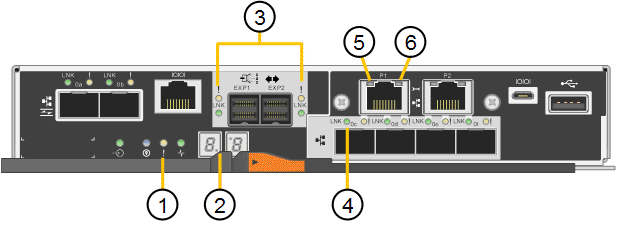

= Voyants d'état sur le contrôleur E5700SG
:allow-uri-read: 
:icons: font
:imagesdir: ../media/

[role="lead"]
L'écran à sept segments et les voyants du contrôleur E5700SG indiquent les codes d'état et d'erreur pendant la mise sous tension et l'initialisation du matériel. Vous pouvez utiliser ces affichages pour déterminer l'état et résoudre les erreurs.

Une fois le programme d'installation de l'appliance StorageGRID démarré, il est conseillé de vérifier régulièrement les voyants d'état du contrôleur E5700SG.

|===
|  | Afficher | Description 

 a| 
1
 a| 
LED d'avertissement
 a| 
Orange : le contrôleur est défectueux et nécessite l'intervention de l'opérateur, ou le script d'installation est introuvable.

OFF : le contrôleur fonctionne normalement.

 a| 
2
 a| 
Affichage à sept segments
 a| 
Affiche un code de diagnostic

Les séquences d'affichage à sept segments permettent de comprendre les erreurs et l'état de fonctionnement de l'appareil.

 a| 
3
 a| 
Voyants d'avertissement du port d'extension
 a| 
Orange : ces voyants sont toujours orange (aucune liaison établie) car le dispositif n'utilise pas les ports d'extension.

 a| 
4
 a| 
Voyants d'état de la liaison du port hôte
 a| 
Vert : le lien fonctionne.

OFF : le lien ne fonctionne pas.

 a| 
5
 a| 
Voyants d'état de la liaison Ethernet
 a| 
Vert : un lien est établi.

Désactivé : aucun lien n'est établi.

 a| 
6
 a| 
LED d'activités Ethernet
 a| 
Vert : la liaison entre le port de gestion et le périphérique auquel il est connecté (par exemple, un commutateur Ethernet) est active.

Éteint : il n'y a pas de lien entre le contrôleur et le périphérique connecté.

Vert clignotant : activité Ethernet.

|===

== Codes de démarrage généraux

Lors du démarrage ou après une réinitialisation matérielle de l'appareil, les événements suivants se produisent :

. L'affichage à sept segments sur le contrôleur E5700SG montre une séquence générale de codes qui n'est pas spécifique au contrôleur. La séquence générale se termine par les codes AA et FF.
. Les codes de démarrage spécifiques au contrôleur E5700SG apparaissent.

== Codes de démarrage du contrôleur E5700SG

Lors d'un démarrage normal de l'appareil, l'écran à sept segments du contrôleur E5700SG affiche les codes suivants dans l'ordre indiqué :

|===
| Code | Indique 

 a| 
BONJOUR
 a| 
Le script de démarrage principal a démarré.

 a| 
PP
 a| 
Le système vérifie si le FPGA doit être mis à jour.

 a| 
HP
 a| 
Le système vérifie si le micrologiciel du contrôleur 10/25-GbE doit être mis à jour.

 a| 
RB
 a| 
Le système redémarre après l'application des mises à jour du firmware.

 a| 
FP
 a| 
Les vérifications de mise à jour du micrologiciel du sous-système matériel sont terminées. Les services de communication inter-contrôleurs sont en cours de démarrage.

 a| 
IL
 a| 
Le système attend la connectivité avec le contrôleur E2800 et la synchronisation avec le système d'exploitation SANtricity.

*Remarque :* si cette procédure de démarrage n'est pas en cours au-delà de cette étape, vérifier les connexions entre les deux contrôleurs.

 a| 
PC
 a| 
Le système recherche les données d'installation StorageGRID existantes.

 a| 
HO
 a| 
Le programme d'installation de l'appliance StorageGRID est en cours d'exécution.

 a| 
HAUTE DISPONIBILITÉ
 a| 
StorageGRID est en cours d'exécution.

|===

== Codes d'erreur du contrôleur E5700SG

Ces codes représentent des conditions d'erreur qui peuvent s'afficher sur le contrôleur E5700SG au démarrage de l'appareil. Des codes hexadécimaux supplémentaires à deux chiffres sont affichés si des erreurs matérielles spécifiques de bas niveau se produisent. Si l'un de ces codes persiste pendant plus d'une seconde ou deux, ou si vous ne parvenez pas à résoudre l'erreur en suivant l'une des procédures de dépannage prescrites, contactez le support technique.

|===
| Code | Indique 

 a| 
22
 a| 
Aucun enregistrement d'amorçage maître trouvé sur un périphérique d'amorçage.

 a| 
23
 a| 
Le disque flash interne n'est pas connecté.

 a| 
2A, 2B
 a| 
Bus bloqué, impossible de lire les données du démon DIMM.

 a| 
40
 a| 
Modules DIMM non valides.

 a| 
41
 a| 
Modules DIMM non valides.

 a| 
42
 a| 
Échec du test de la mémoire.

 a| 
51
 a| 
Échec de lecture du SPD.

 a| 
92 à 96
 a| 
Initialisation du bus PCI.

 a| 
A0 à A3
 a| 
Initialisation du lecteur SATA.

 a| 
AB
 a| 
Autre code d'amorçage.

 a| 
AE
 a| 
Démarrage du système d'exploitation.

 a| 
EA
 a| 
Échec de la formation DDR4.

 a| 
E8
 a| 
Aucune mémoire installée.

 a| 
UE
 a| 
Le script d'installation est introuvable.

 a| 
EP
 a| 
L'installation ou la communication avec le contrôleur E2800 est défectueuse.

|===
.Informations associées
xref:troubleshooting-hardware-installation.adoc[Résolution des problèmes liés à l'installation du matériel (SG5700)]

https://["Support NetApp"^]
