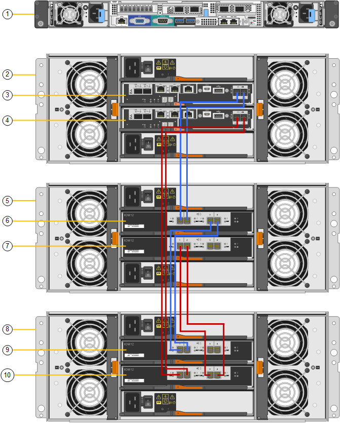

= Ajoutez un tiroir d'extension à SG6060 déployé
:allow-uri-read: 
:icons: font
:imagesdir: ../media/

[role="lead"]
Pour augmenter la capacité de stockage, vous pouvez ajouter un ou deux tiroirs d'extension à un SG6060 ou SG6060X qui est déjà déployé dans un système StorageGRID.

.Ce dont vous avez besoin
* Vous devez disposer de la phrase secrète pour le provisionnement.
* Vous devez exécuter StorageGRID 11.4 ou version ultérieure.
* Le tiroir d'extension et deux câbles SAS pour chaque tiroir d'extension sont disponibles.
* Vous avez trouvé l'appliance de stockage où vous ajoutez le tiroir d'extension dans le data Center.
+
xref:locating-controller-in-data-center.adoc[Localiser le contrôleur dans le data Center]

.Description de la tâche
Pour ajouter un tiroir d'extension, procédez comme suit :

* Installez le matériel dans l'armoire ou le rack.
* Mettez le SG6060 ou le SG6060X en mode maintenance.
* Connectez le tiroir d'extension au tiroir contrôleur E2860 ou à un autre tiroir d'extension.
* Démarrez l'extension à l'aide du programme d'installation de l'appliance StorageGRID
* Attendez que les nouveaux volumes soient configurés.

En procédant à une ou deux tiroirs d'extension, chaque nœud d'appliance doit prendre moins d'une heure. Pour réduire au minimum les temps d'arrêt, procédez comme suit afin d'installer les nouveaux tiroirs et disques d'extension avant de placer le SG6060 ou le SG60X en mode de maintenance. La durée restante de la procédure doit être d'environ 20 à 30 minutes par nœud d'appliance.

.Étapes
. Suivez les instructions d'installation des tiroirs de 60 disques dans une armoire ou un rack.
+
xref:sg6060-installing-60-drive-shelves-into-cabinet-or-rack.adoc[SG6060 et SG6060X : installez les tiroirs de 60 disques dans l'armoire ou le rack]

. Suivez les instructions d'installation des lecteurs.
+
xref:sg6060-installing-drives.adoc[SG6060 et SG6060X : installation des disques]

. Dans Grid Manager, xref:placing-appliance-into-maintenance-mode.adoc[Placez le contrôleur SG6000-CN en mode maintenance].
. Connectez chaque tiroir d'extension au tiroir contrôleur E2860, comme indiqué sur le schéma.
+
Cette mise en plan montre deux tiroirs d'extension. Si vous n'en avez qu'un, connectez l'E/S A au contrôleur A et connectez l'E/S B au contrôleur B.

+

NOTE: SG6060 est illustré. Le câblage d'extension du SG6060X est identique.

+

+
|===
| Légende | Description 

 a| 
1
 a| 
SG6000-CN

 a| 
2
 a| 
Tiroir contrôleur E2860

 a| 
3
 a| 
Contrôleur A

 a| 
4
 a| 
Contrôleur B

 a| 
5
 a| 
Tiroir d'extension 1

 a| 
6
 a| 
Module d'E/S A pour le tiroir d'extension 1

 a| 
7
 a| 
Module d'E/S B pour le tiroir d'extension 1

 a| 
8
 a| 
Tiroir d'extension 2

 a| 
9
 a| 
Module d'E/S A pour le tiroir d'extension 2

 a| 
10
 a| 
Module d'E/S B pour le tiroir d'extension 2

|===
. Branchez les câbles d'alimentation et mettez les tiroirs d'extension sous tension.
+
.. Connectez un cordon d'alimentation à chacune des deux unités d'alimentation de chaque shelf d'extension.
.. Connectez les deux cordons d'alimentation de chaque tiroir d'extension à deux PDU différentes dans l'armoire ou le rack.
.. Allumer les deux boutons d'alimentation pour chaque tiroir d'extension.
+
*** N'éteignez pas les interrupteurs d'alimentation pendant le processus de mise sous tension.
*** Les ventilateurs des tiroirs d'extension peuvent être très bruyants lors du premier démarrage. Le bruit est normal au démarrage.

. Surveillez la page d'accueil du programme d'installation de l'appliance StorageGRID.
+
En cinq minutes environ, les tiroirs d'extension sont mis sous tension et détectés par le système. La page d'accueil indique le nombre de nouveaux tiroirs d'extension détectés et le bouton Démarrer l'extension est activé.

+
La capture d'écran présente des exemples de messages qui peuvent apparaître sur la page d'accueil, selon le nombre de tiroirs d'extension existants ou nouveaux, comme suit :

+
** La bannière entourée en haut de la page indique le nombre total de étagères d'extension détectées.
+
*** La bannière indique le nombre total de tiroirs d'extension, que ceux-ci soient configurés et déployés ou nouveaux et non configurés.
*** Si aucun tiroir d'extension n'est détecté, la bannière n'apparaît pas.

** Le message encerclé en bas de la page indique qu'une extension est prête à être démarrée.
+
*** Ce message indique le nombre de nouveaux tiroirs d'extension détectés par StorageGRID. « Connecté » indique que la tablette est détectée. « Non configuré » indique que le tiroir est nouveau et qu'il n'est pas encore configuré à l'aide du programme d'installation de l'appliance StorageGRID.
+

NOTE: Les tiroirs d'extension déjà déployés ne sont pas inclus dans ce message. Ils sont inclus dans le compte dans la bannière en haut de la page.

*** Le message n'apparaît pas si de nouveaux tiroirs d'extension ne sont pas détectés.
+
image::../media/appl_installer_home_expansion_shelf_ready_to_install.png[Installation des tiroirs d'extension]

. Si nécessaire, résolvez les problèmes décrits dans les messages de la page d'accueil.
+
Utilisez SANtricity System Manager, par exemple, pour résoudre les problèmes matériels de stockage.

. Vérifiez que le nombre de tiroirs d'extension affichés sur la page d'accueil correspond au nombre de tiroirs d'extension que vous ajoutez.
+

NOTE: Si les nouveaux tiroirs d'extension n'ont pas été détectés, vérifiez qu'ils sont correctement câblés et mis sous tension.

. [[start_expansion]]cliquez sur *Start expansion* pour configurer les tiroirs d'extension et les rendre disponibles pour le stockage d'objets.
. Surveiller la progression de la configuration du tiroir d'extension.
+
Des barres de progression apparaissent sur la page Web, comme elles le font lors de l'installation initiale.

+
image::../media/monitor_expansion_for_new_appliance_shelf.png[Contrôle de la configuration des tiroirs d'extension]

+
Une fois la configuration terminée, l'appliance redémarre automatiquement pour quitter le mode de maintenance et rejoindre à nouveau la grille. Ce processus peut prendre jusqu'à 20 minutes.

+

NOTE: Pour relancer la configuration du tiroir d'extension en cas d'échec, accédez au programme d'installation de l'appliance StorageGRID, sélectionnez *Avancé* *redémarrer le contrôleur*, puis sélectionnez *redémarrer en mode de maintenance*. Une fois le nœud redémarré, réessayez dans <<start_expansion,configuration des tiroirs d'extension>>.

+
Une fois le redémarrage terminé, l'onglet *tâches* ressemble à la capture d'écran suivante :

+
image::../media/appliance_installer_reboot_complete.png[Redémarrage terminé]

. Vérifiez l'état du nœud de stockage de l'appliance et des nouveaux tiroirs d'extension.
+
.. Dans Grid Manager, sélectionnez *NODES* et vérifiez que le noeud de stockage de l'appliance possède une icône de coche verte.
+
L'icône de coche verte indique qu'aucune alerte n'est active et que le nœud est connecté à la grille. Pour obtenir une description des icônes de nœud, reportez-vous aux instructions de contrôle et de dépannage de StorageGRID.

.. Sélectionnez l'onglet *stockage* et vérifiez que 16 nouveaux magasins d'objets sont affichés dans la table stockage d'objets pour chaque étagère d'extension ajoutée.
.. Vérifier que chaque nouveau tiroir d'extension dispose d'un état de tiroir nominal et d'un état de configuration configuré.

.Informations associées
xref:unpacking-boxes-sg6000.adoc[Boîtes de déballage (SG6000 et SG6060X)]

xref:sg6060-installing-60-drive-shelves-into-cabinet-or-rack.adoc[SG6060 et SG6060X : installez les tiroirs de 60 disques dans l'armoire ou le rack]

xref:sg6060-installing-drives.adoc[SG6060 et SG6060X : installation des disques]

xref:../monitor/index.adoc[Surveiller et résoudre les problèmes]
