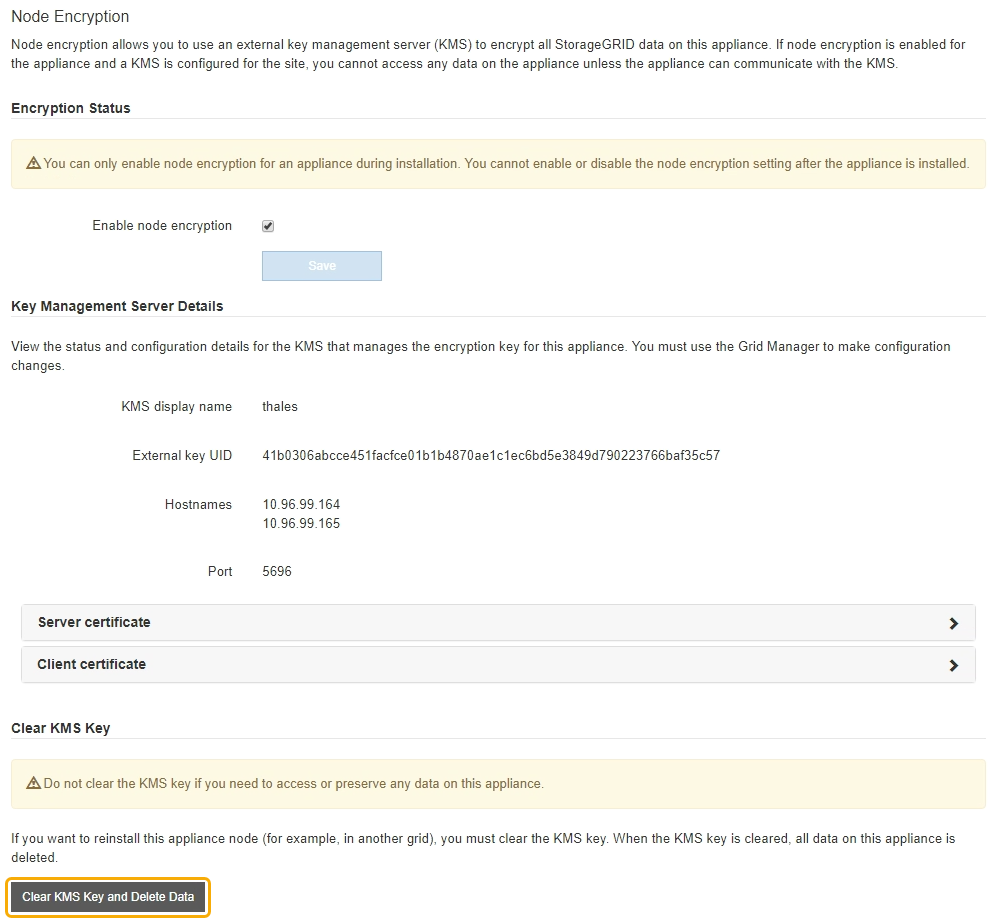

= Effacez la configuration du serveur de gestion des clés
:allow-uri-read: 
:icons: font
:imagesdir: ../media/

[role="lead"]
L'effacement de la configuration du serveur de gestion des clés (KMS) désactive le cryptage des nœuds sur votre appliance. Une fois la configuration KMS effacée, les données de votre appliance sont définitivement supprimées et ne sont plus accessibles. Ces données ne peuvent pas être récupérées.

.Ce dont vous avez besoin
Si vous devez conserver les données sur l'appliance, vous devez effectuer une procédure de déclassement d'un nœud ou cloner le nœud avant d'effacer la configuration du KMS.

IMPORTANT: Lorsque le KMS est effacé, les données de l'appliance seront définitivement supprimées et ne sont plus accessibles. Ces données ne peuvent pas être récupérées.

xref:../maintain/grid-node-decommissioning.adoc[Mise hors service du nœud] Pour déplacer toutes les données qu'il contient vers d'autres nœuds de StorageGRID.

.Description de la tâche
L'effacement de la configuration KMS de l'appliance désactive le cryptage des nœuds, supprimant ainsi l'association entre le nœud de l'appliance et la configuration KMS pour le site StorageGRID. Les données de l'appliance sont ensuite supprimées et l'appliance reste en état préinstallation. Ce processus ne peut pas être inversé.

Vous devez effacer la configuration KMS :

* Avant de pouvoir installer l'appliance dans un autre système StorageGRID, qui n'utilise pas de KMS ou qui utilise un KMS différent.
+

IMPORTANT: N'effacez pas la configuration KMS si vous prévoyez de réinstaller un nœud d'appliance dans un système StorageGRID qui utilise la même clé KMS.

* Avant de pouvoir récupérer et réinstaller un nœud où la configuration KMS était perdue et où la clé KMS n'est pas récupérable.
* Avant de retourner tout appareil déjà utilisé sur votre site.
* Après la désaffectation d'une appliance qui avait activé le chiffrement de nœud.

IMPORTANT: Désaffectez l'appliance avant d'effacer KMS pour déplacer ses données vers d'autres nœuds de votre système StorageGRID. L'effacement de KMS avant la mise hors service de l'appareil entraînera une perte de données et pourrait rendre l'appareil inutilisable.

.Étapes
. Ouvrez un navigateur et entrez l'une des adresses IP du contrôleur de calcul de l'appliance. +
`*https://_Controller_IP_:8443*`
+
`_Controller_IP_` Est l'adresse IP du contrôleur de calcul (pas le contrôleur de stockage) sur l'un des trois réseaux StorageGRID.

+
La page d'accueil du programme d'installation de l'appliance StorageGRID s'affiche.

. Sélectionnez *configurer le matériel* *cryptage de nœud*.
+

+

IMPORTANT: Si la configuration KMS est effacée, les données de l'appliance seront définitivement supprimées. Ces données ne peuvent pas être récupérées.

. En bas de la fenêtre, sélectionnez *Effacer la clé KMS et Supprimer les données*.
. Si vous êtes sûr de vouloir effacer la configuration KMS, tapez +
`*clear*` + et sélectionnez *Effacer clé KMS et Supprimer données*.
+
image::../media/fde_disable_confirmation.png[Confirmation d'effacement DES KM]

+
La clé de chiffrement KMS et toutes les données sont supprimées du nœud, et l'appliance redémarre. Cette opération peut prendre jusqu'à 20 minutes.

. Ouvrez un navigateur et entrez l'une des adresses IP du contrôleur de calcul de l'appliance. +
`*https://_Controller_IP_:8443*`
+
`_Controller_IP_` Est l'adresse IP du contrôleur de calcul (pas le contrôleur de stockage) sur l'un des trois réseaux StorageGRID.

+
La page d'accueil du programme d'installation de l'appliance StorageGRID s'affiche.

. Sélectionnez *configurer le matériel* *cryptage de nœud*.
. Vérifiez que le chiffrement de nœud est désactivé et que les informations de clé et de certificat dans *Key Management Server Details* et le contrôle *clear KMS Key et Delete Data* sont supprimées de la fenêtre.
+
Le chiffrement des nœuds ne peut pas être activé à nouveau sur l'appliance tant qu'il n'est pas réinstallé dans une grille.

.Une fois que vous avez terminé
Après le redémarrage de l'appliance et après avoir vérifié que KMS a été effacé et que l'appliance est dans un état de pré-installation, vous pouvez physiquement retirer l'appliance de votre système StorageGRID. Voir la xref:../maintain/preparing-appliance-for-reinstallation-platform-replacement-only.adoc[instructions de préparation de l'appareil pour la réinstallation].

.Informations associées
xref:../admin/index.adoc[Administrer StorageGRID]
