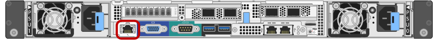

= Collecte des informations d'installation (SG6000)
:allow-uri-read: 
:icons: font
:imagesdir: ../media/

[role="lead"]
Lors de l'installation et de la configuration de l'appliance StorageGRID, vous devez prendre des décisions et collecter des informations sur les ports de commutation Ethernet, les adresses IP et les modes de liaison réseau et de port.

Vous pouvez utiliser les tableaux suivants pour enregistrer les informations requises pour chaque réseau que vous connectez à l'appliance. Ces valeurs sont nécessaires pour installer et configurer le matériel.

== Informations nécessaires pour la connexion à SANtricity System Manager sur les contrôleurs de stockage

Vous devez connecter les deux contrôleurs de stockage de l'appliance (contrôleurs E2800 Series ou EF570) au réseau de gestion que vous utiliserez pour SANtricity System Manager. Les contrôleurs sont situés sur chaque appliance comme suit :

* SG6060 et SG6060X : le contrôleur A se trouve en haut et le contrôleur B en bas.
* SGF6024 : le contrôleur A est sur la gauche et le contrôleur B sur la droite.

|===
| Informations nécessaires | Valeur pour le contrôleur A | Valeur pour le contrôleur B 

 a| 
Port de commutateur Ethernet vous vous connecerez au port de gestion 1 (nommé P1 sur le contrôleur E2800A et 0a sur le contrôleur E2800B).
 a| 
 a| 

 a| 
Adresse MAC pour le port de gestion 1 (imprimée sur une étiquette près du port P1 du contrôleur E2800A et 0a sur le contrôleur E2800B)
 a| 
 a| 

 a| 
Adresse IP attribuée par DHCP pour le port de gestion 1, si disponible après la mise sous tension

*Remarque :* si le réseau auquel vous vous connectez au contrôleur de stockage comporte un serveur DHCP, l'administrateur réseau peut utiliser l'adresse MAC pour déterminer l'adresse IP attribuée par le serveur DHCP.
 a| 
 a| 

 a| 
Adresse IP statique que vous prévoyez d'utiliser pour l'appliance sur le réseau de gestion
 a| 
Pour IPv4 :

* Adresse IPv4 :
* Masque de sous-réseau :
* Passerelle :

Pour IPv6 :

* Adresse IPv6 :
* Adresse IP routable :
* Adresse IP du routeur du contrôleur de stockage :

 a| 
Pour IPv4 :

* Adresse IPv4 :
* Masque de sous-réseau :
* Passerelle :

Pour IPv6 :

* Adresse IPv6 :
* Adresse IP routable :
* Adresse IP du routeur du contrôleur de stockage :

 a| 
Format d'adresse IP
 a| 
Choisir une option :

* IPv4
* IPv6

 a| 
Choisir une option :

* IPv4
* IPv6

 a| 
Vitesse et mode duplex

*Remarque :* vous devez vous assurer que le commutateur Ethernet du réseau de gestion SANtricity System Manager est défini sur négociation automatique.
 a| 
Doit être :

* Négociation automatique (par défaut)

 a| 
Doit être :

* Négociation automatique (par défaut)

|===

== Informations nécessaires pour connecter le contrôleur SG6000-CN au réseau Admin

Le réseau d'administration pour StorageGRID est un réseau facultatif, utilisé pour l'administration et la maintenance du système. Le dispositif se connecte au réseau d'administration à l'aide des ports de gestion 1 GbE suivants sur le contrôleur SG6000-CN.

image::../media/rj_45_ports_circled.png[Ports RJ-45]

|===
| Informations nécessaires | Votre valeur 

 a| 
Réseau admin activé
 a| 
Choisir une option :

* Non
* Oui (par défaut)

 a| 
Mode de liaison réseau
 a| 
Choisir une option :

* Indépendant (par défaut)
* Sauvegarde active-Backup

 a| 
Port de commutation pour le port gauche dans le cercle rouge du schéma (port actif par défaut pour le mode de liaison réseau indépendante)
 a| 

 a| 
Port de commutateur pour le port droit dans le cercle rouge du schéma (mode liaison réseau Active-Backup uniquement)
 a| 

 a| 
Adresse MAC du port réseau d'administration

*Remarque :* l'étiquette d'adresse MAC située à l'avant du contrôleur SG6000-CN répertorie l'adresse MAC du port de gestion BMC. Pour déterminer l'adresse MAC du port réseau Admin, vous devez ajouter *2* au numéro hexadécimal sur l'étiquette. Par exemple, si l'adresse MAC de l'étiquette se termine par *09*, l'adresse MAC du port d'administration se terminera par *0B*. Si l'adresse MAC de l'étiquette se termine dans *(_y_)FF*, l'adresse MAC du port d'administration se terminera dans *(_y_+1)01*. Vous pouvez facilement effectuer ce calcul en ouvrant Calculator sous Windows, en le définissant en mode programmateur, en sélectionnant Hex, en saisissant l'adresse MAC, puis en tapant *+ 2 =*.
 a| 

 a| 
Adresse IP attribuée par DHCP pour le port réseau d'administration, si disponible après la mise sous tension

*Remarque :* vous pouvez déterminer l'adresse IP attribuée par DHCP en utilisant l'adresse MAC pour rechercher l'adresse IP attribuée.
 a| 
* Adresse IPv4 (CIDR) :
* Passerelle :

 a| 
Adresse IP statique que vous envisagez d'utiliser pour le nœud de stockage de l'appliance sur le réseau d'administration

*Remarque :* si votre réseau n'a pas de passerelle, spécifiez la même adresse IPv4 statique pour la passerelle.
 a| 
* Adresse IPv4 (CIDR) :
* Passerelle :

 a| 
Sous-réseaux du réseau d'administration (CIDR)
 a| 

|===

== Informations nécessaires pour connecter et configurer les ports 10/25 GbE sur le contrôleur SG6000-CN

Les quatre ports 10/25 GbE du contrôleur SG6000-CN se connectent au réseau de réseau StorageGRID et au réseau client en option.

|===
| Informations nécessaires | Votre valeur 

 a| 
Vitesse de liaison
 a| 
Choisir une option :

* Auto (par défaut)
* 10 GbE
* 25 GbE

 a| 
Mode de liaison du port
 a| 
Choisir une option :

* Fixe (par défaut)
* Agrégat

 a| 
Port de commutation pour le port 1 (réseau client pour mode fixe)
 a| 

 a| 
Port de commutation pour le port 2 (réseau grille pour mode fixe)
 a| 

 a| 
Port de commutation pour le port 3 (réseau client pour mode fixe)
 a| 

 a| 
Port de commutation pour le port 4 (réseau Grid pour mode fixe)
 a| 

|===

== Informations nécessaires pour connecter le contrôleur SG6000-CN au réseau Grid

Le réseau Grid Network pour StorageGRID est un réseau requis, utilisé pour l'ensemble du trafic StorageGRID interne. L'appareil se connecte au réseau Grid à l'aide des ports 10/25 GbE du contrôleur SG6000-CN.

|===
| Informations nécessaires | Votre valeur 

 a| 
Mode de liaison réseau
 a| 
Choisir une option :

* Sauvegarde active/active (par défaut)
* LACP (802.3ad)

 a| 
Balisage VLAN activé
 a| 
Choisir une option :

* Non (par défaut)
* Oui.

 a| 
Balise VLAN (si le marquage VLAN est activé)
 a| 
Entrez une valeur comprise entre 0 et 4095 :

 a| 
Adresse IP attribuée par DHCP pour le réseau Grid, si disponible après la mise sous tension
 a| 
* Adresse IPv4 (CIDR) :
* Passerelle :

 a| 
Adresse IP statique que vous prévoyez d'utiliser pour le noeud de stockage de l'appliance sur le réseau Grid

*Remarque :* si votre réseau n'a pas de passerelle, spécifiez la même adresse IPv4 statique pour la passerelle.
 a| 
* Adresse IPv4 (CIDR) :
* Passerelle :

 a| 
Sous-réseaux du réseau de grille (CIDR)
 a| 

|===

== Informations nécessaires pour connecter le contrôleur SG6000-CN au réseau client

Le réseau client pour StorageGRID est un réseau facultatif, généralement utilisé pour fournir l'accès du protocole client à la grille. L'appliance se connecte au réseau client à l'aide des ports 10/25 GbE du contrôleur SG6000-CN.

|===
| Informations nécessaires | Votre valeur 

 a| 
Réseau client activé
 a| 
Choisir une option :

* Non (par défaut)
* Oui.

 a| 
Mode de liaison réseau
 a| 
Choisir une option :

* Sauvegarde active/active (par défaut)
* LACP (802.3ad)

 a| 
Balisage VLAN activé
 a| 
Choisir une option :

* Non (par défaut)
* Oui.

 a| 
Balise VLAN (si le marquage VLAN est activé)
 a| 
Entrez une valeur comprise entre 0 et 4095 :

 a| 
Adresse IP attribuée par DHCP pour le réseau client, si disponible après la mise sous tension
 a| 
* Adresse IPv4 (CIDR) :
* Passerelle :

 a| 
Adresse IP statique que vous prévoyez d'utiliser pour le noeud de stockage de l'appliance sur le réseau client

*Remarque :* si le réseau client est activé, la route par défaut du contrôleur utilisera la passerelle indiquée ici.
 a| 
* Adresse IPv4 (CIDR) :
* Passerelle :

|===

== Informations nécessaires pour connecter le contrôleur SG6000-CN au réseau de gestion BMC

Vous pouvez accéder à l'interface BMC sur le contrôleur SG6000-CN à l'aide du port de gestion 1 GbE suivant. Ce port prend en charge la gestion à distance du matériel du contrôleur via Ethernet en utilisant la norme IPMI (Intelligent Platform Management interface).

|===
| Informations nécessaires | Votre valeur 

 a| 
Port de commutateur Ethernet vous vous connectez au port de gestion du contrôleur BMC (encerclé dans le diagramme)
 a| 

 a| 
Adresse IP attribuée par DHCP pour le réseau de gestion BMC, si disponible après la mise sous tension
 a| 
* Adresse IPv4 (CIDR) :
* Passerelle :

 a| 
Adresse IP statique que vous prévoyez d'utiliser pour le port de gestion BMC
 a| 
* Adresse IPv4 (CIDR) :
* Passerelle :

|===
xref:controllers-in-sg6000-appliances.adoc[Contrôleurs des appareils SG6000]

xref:reviewing-appliance-network-connections-sg6000.adoc[Vérifier les connexions réseau de l'appareil (SG6000)]

xref:port-bond-modes-for-sg6000-cn-controller.adoc[Modes de liaison des ports pour le contrôleur SG6000-CN]

xref:cabling-appliance-sg6000.adoc[Cable appliance (SG6000)]

xref:configuring-storagegrid-ip-addresses-sg6000.adoc[Configurez les adresses IP StorageGRID]
