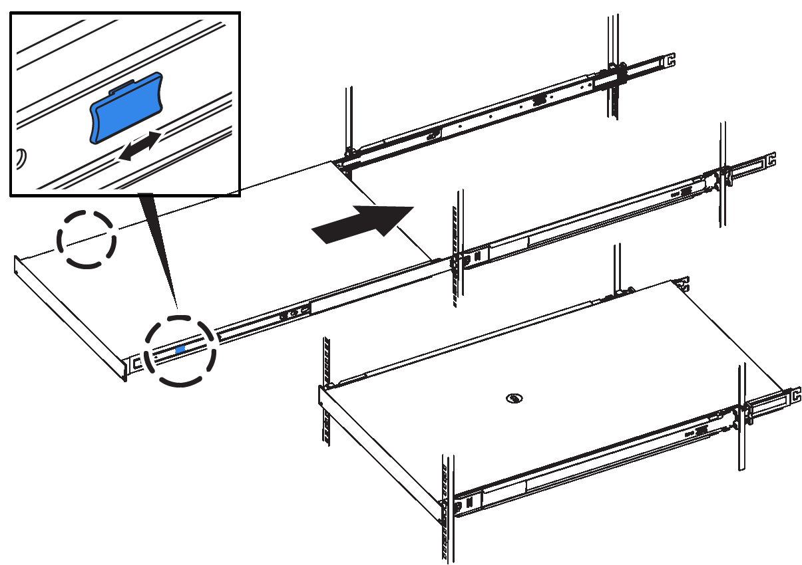

= Réinstallez le contrôleur SG6000-CN dans l'armoire ou le rack
:allow-uri-read: 
:icons: font
:imagesdir: ../media/

[role="lead"]
Une fois la maintenance matérielle terminée, réinstallez le contrôleur dans une armoire ou un rack.

Vous avez réinstallé le capot du contrôleur.

xref:reinstalling-sg6000-cn-controller-cover.adoc[Réinstallez le couvercle du contrôleur SG6000-CN]

.Étapes
. Appuyez sur le rail bleu pour libérer les deux rails de rack en même temps et faites glisser le contrôleur SG6000-CN dans le rack jusqu'à ce qu'il soit bien en place.
+
Lorsque vous ne pouvez pas déplacer le contrôleur, tirez les loquets bleus des deux côtés du châssis pour faire glisser le contrôleur complètement vers l'intérieur.

+

+

NOTE: Ne connectez pas le panneau avant tant que vous n'avez pas mis le contrôleur sous tension.

. Serrez les vis imperdables du panneau avant du contrôleur pour fixer le contrôleur dans le rack.
+
image::../media/sg6060_rack_retaining_screws.png[Vis de fixation du rack SG6060]

. Enroulez l'extrémité du bracelet antistatique autour de votre poignet et fixez l'extrémité du clip à une masse métallique afin d'éviter toute décharge statique.
. Reconnectez les câbles de données du contrôleur et les émetteurs-récepteurs SFP+ ou SFP28.
+

IMPORTANT: Pour éviter de dégrader les performances, ne pas tordre, plier, pincer ou marcher sur les câbles.

+
xref:cabling-appliance-sg6000.adoc[Cable appliance (SG6000)]

. Reconnectez les câbles d'alimentation du contrôleur.
+
xref:connecting-power-cords-and-applying-power-sg6000.adoc[Branchement des câbles d'alimentation et alimentation (SG6000)]

Le contrôleur peut être redémarré.

xref:powering-on-sg6000-cn-controller-and-verifying-operation.adoc[Mettez le contrôleur SG6000-CN sous tension et vérifiez son fonctionnement]
