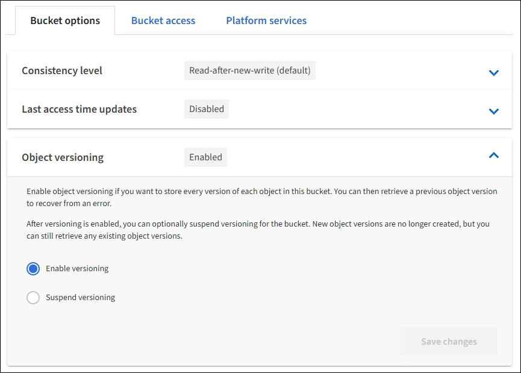

= Modifiez le contrôle de version d'objet pour un compartiment
:allow-uri-read: 
:icons: font
:imagesdir: ../media/

[role="lead"]
Si vous utilisez un locataire S3, vous pouvez utiliser le Gestionnaire des locataires ou l'API de gestion des locataires pour modifier l'état des versions des compartiments S3.

.Ce dont vous avez besoin
* Vous êtes connecté au Gestionnaire de locataires à l'aide d'un xref:../admin/web-browser-requirements.adoc[navigateur web pris en charge].
* Vous appartenez à un groupe d'utilisateurs possédant l'autorisation gérer toutes les rubriques ou accès racine. Ces autorisations remplacent les paramètres d'autorisations des stratégies de groupes ou de compartiments.
+
xref:tenant-management-permissions.adoc[Autorisations de gestion des locataires]

.Description de la tâche
Vous pouvez activer ou suspendre la gestion des versions d'objet pour un compartiment. Une fois que vous avez activé la gestion des versions d'un compartiment, celui-ci ne peut plus revenir à un état sans version. Toutefois, vous pouvez suspendre le contrôle de version du compartiment.

* Désactivé : le contrôle de version n'a jamais été activé
* Activé : la gestion des versions est activée
* Suspendu : la gestion des versions a déjà été activée et est suspendue

xref:../s3/object-versioning.adoc[Gestion des versions d'objets S3]

xref:../ilm/example-4-ilm-rules-and-policy-for-s3-versioned-objects.adoc[Règles et règles ILM pour les objets avec version S3 (exemple 4)]

.Étapes
. Sélectionnez *STOCKAGE (S3)* *seaux*.
. Sélectionnez le nom du compartiment dans la liste.
. Sélectionnez *Options de rubrique* *gestion des versions d'objet*.
+

. Sélectionnez un état de gestion des versions pour les objets de ce compartiment.
+

NOTE: Si le verrouillage d'objet S3 ou la conformité héritée est activée, les options *Object versionnage* sont désactivées.

+
[cols="1a,3a"]
|===
| Option | Description 

 a| 
Activez le contrôle des versions
 a| 
Activez la gestion des versions d'objet si vous souhaitez stocker chaque version de chaque objet dans ce compartiment. Vous pouvez ensuite récupérer les versions précédentes d'un objet si nécessaire.

Les objets qui se trouvent déjà dans le compartiment sont avec gestion de version lorsqu'ils sont modifiés par l'utilisateur.

 a| 
Suspendre la gestion des versions
 a| 
Suspendre la gestion des versions d'objet si vous ne souhaitez plus créer de nouvelles versions d'objet. Vous pouvez toujours récupérer toutes les versions d'objet existantes.

|===
. Sélectionnez *Enregistrer les modifications*.

