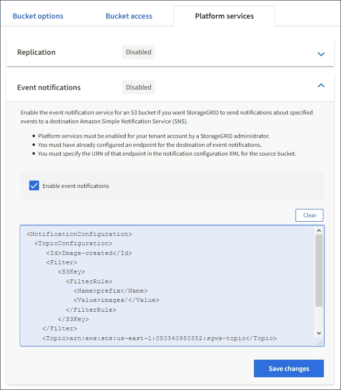

= Configurer les notifications d'événements
:allow-uri-read: 
:icons: font
:imagesdir: ../media/

[role="lead"]
Le service de notifications est l'un des trois services de plate-forme StorageGRID. Vous pouvez activer les notifications d'un compartiment pour envoyer des informations sur les événements spécifiés vers un service de destination qui prend en charge le service SNS (simple notification Service™) d'AWS.

.Ce dont vous avez besoin, 8217;ll
* Les services de plateforme doivent être activés pour votre compte de locataire par un administrateur StorageGRID.
* Vous devez avoir déjà créé un compartiment pour faire office de source de notifications.
* Le terminal que vous prévoyez d'utiliser comme destination pour les notifications d'événements doit déjà exister et vous devez disposer de son URN.
* Vous devez appartenir à un groupe d'utilisateurs disposant de l'autorisation gérer toutes les rubriques ou accès racine, ce qui vous permet de gérer les paramètres de tous les compartiments S3 de votre compte locataire. Ces autorisations remplacent les paramètres d'autorisation des stratégies de groupe ou de compartiment lors de la configuration du compartiment à l'aide du Gestionnaire de locataires.

Après avoir configuré les notifications d'événements, chaque fois qu'un événement spécifié se produit pour un objet dans le compartiment source, une notification est générée et envoyée à la rubrique SNS (simple notification Service) utilisée comme point final de destination. Pour activer les notifications pour un compartiment, vous devez créer et appliquer un XML de configuration de notification valide. Le XML de configuration de notification doit utiliser l'URN d'un terminal de notification d'événement pour chaque destination.

Pour obtenir des informations générales sur les notifications d'événements et leur configuration, consultez la documentation Amazon. Pour plus d'informations sur la façon dont StorageGRID implémente l'API de notification des compartiments S3, consultez les instructions pour l'implémentation des applications client S3.

Si vous activez les notifications d'événements pour un compartiment contenant des objets, les notifications sont envoyées uniquement pour les actions qui sont effectuées après l'enregistrement de la configuration de notification.

.Étapes
. Activer les notifications pour le compartiment source :
+
** Utilisez un éditeur de texte pour créer le XML de configuration de notification requis pour activer les notifications d'événement, comme spécifié dans l'API de notification S3.
** Lors de la configuration du XML, utilisez l'URN d'un terminal de notification d'événements comme sujet de destination.

+
[listing]
----
<NotificationConfiguration>
  <TopicConfiguration>
     <Id>Image-created</Id>
     <Filter>
        <S3Key>
          <FilterRule>
            <Name>prefix</Name>
            <Value>images/</Value>
          </FilterRule>
        </S3Key>
    </Filter>
    <Topic>arn:aws:sns:us-east-1:050340950352:sgws-topic</Topic>
    <Event>s3:ObjectCreated:*</Event>
   </TopicConfiguration>
 </NotificationConfiguration>
----
. Dans le Gestionnaire de locataires, sélectionnez *STORAGE (S3)* *seaux*.
. Sélectionnez le nom du compartiment source.
+
La page des détails du compartiment s'affiche.

. Sélectionnez *Platform Services* *Event Notifications*.
. Cochez la case *Activer les notifications d'événement*.
. Collez le XML de configuration de notification dans la zone de texte, puis sélectionnez *Enregistrer les modifications*.
+

+

NOTE: Les services de plateforme doivent être activés pour chaque compte de locataire par un administrateur StorageGRID à l'aide de Grid Manager ou de l'API de gestion du grid. Contactez votre administrateur StorageGRID si une erreur se produit lors de l'enregistrement du XML de configuration.

. Vérifiez que les notifications d'événements sont correctement configurées :
+
.. Exécutez une action sur un objet du compartiment source qui répond aux exigences de déclenchement d'une notification telles qu'elles sont configurées dans le fichier XML de configuration.
+
Dans l'exemple, une notification d'événement est envoyée chaque fois qu'un objet est créé avec le `images/` préfixe.

.. Confirmez qu'une notification a été envoyée à la rubrique SNS de destination.
+
Par exemple, si le sujet de votre destination est hébergé sur le service SNS (simple notification Service) d'AWS, vous pouvez configurer le service pour vous envoyer un e-mail une fois la notification envoyée.

+
[listing]
----
{
   "Records":[
      {
         "eventVersion":"2.0",
         "eventSource":"sgws:s3",
         "eventTime":"2017-08-08T23:52:38Z",
         "eventName":"ObjectCreated:Put",
         "userIdentity":{
            "principalId":"1111111111111111111"
         },
         "requestParameters":{
            "sourceIPAddress":"193.51.100.20"
         },
         "responseElements":{
            "x-amz-request-id":"122047343"
         },
         "s3":{
            "s3SchemaVersion":"1.0",
            "configurationId":"Image-created",
            "bucket":{
               "name":"test1",
               "ownerIdentity":{
                  "principalId":"1111111111111111111"
               },
               "arn":"arn:sgws:s3:::test1"
            },
            "object":{
               "key":"images/cat.jpg",
               "size":0,
               "eTag":"d41d8cd98f00b204e9800998ecf8427e",
               "sequencer":"14D90402421461C7"
            }
         }
      }
   ]
}
----

+
Si la notification est reçue dans la rubrique de destination, vous avez configuré votre compartiment source pour les notifications StorageGRID.

xref:understanding-notifications-for-buckets.adoc[Description des notifications pour les compartiments]

xref:../s3/index.adoc[Utilisation de S3]

xref:creating-platform-services-endpoint.adoc[Créer un terminal de services de plate-forme]
