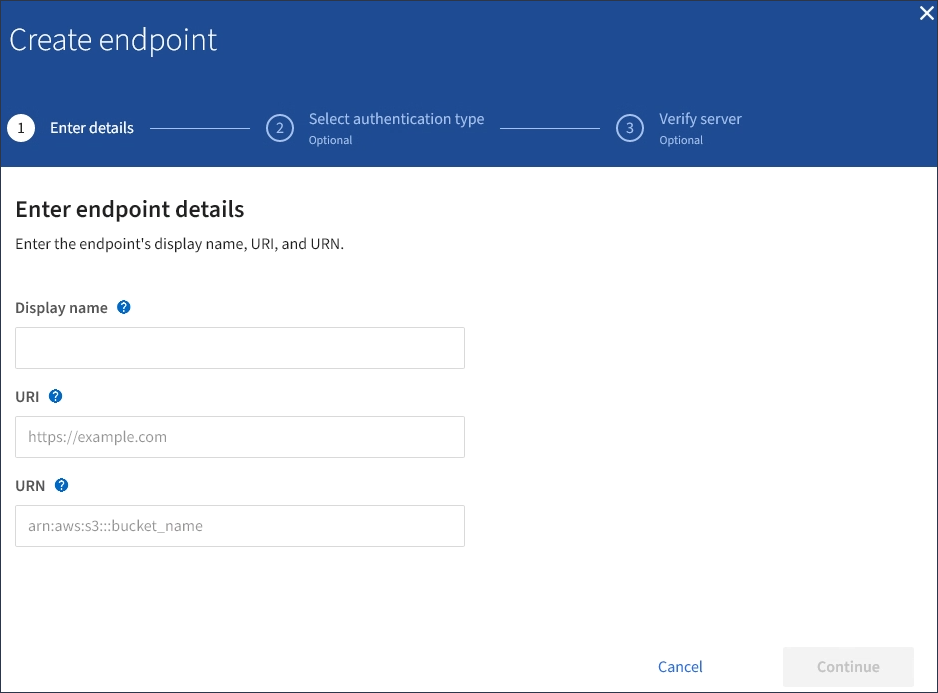

= Créer un terminal de services de plate-forme
:allow-uri-read: 
:icons: font
:imagesdir: ../media/

[role="lead"]
Vous devez créer au moins un noeud final du type correct avant d'activer un service de plate-forme.

.Ce dont vous avez besoin, 8217;ll
* Vous devez être connecté au Gestionnaire de locataires à l'aide d'un xref:../admin/web-browser-requirements.adoc[navigateur web pris en charge].
* Les services de plateforme doivent être activés pour votre compte de locataire par un administrateur StorageGRID.
* Vous devez appartenir à un groupe d'utilisateurs possédant l'autorisation gérer les noeuds finaux.
* La ressource référencée par le point final des services de plate-forme doit avoir été créée :
+
** Réplication CloudMirror : compartiment S3
** Notification d'événement : rubrique SNS
** Notification de recherche : index Elasticsearch, si le cluster de destination n'est pas configuré pour créer automatiquement des index.

* Vous devez disposer des informations relatives à la ressource de destination :
+
** Hôte et port pour l'URI (Uniform Resource identifier)
+

NOTE: Si vous prévoyez d'utiliser un compartiment hébergé sur un système StorageGRID comme point de terminaison pour la réplication CloudMirror, contactez l'administrateur de la grille pour déterminer les valeurs à saisir.

** Nom de ressource unique (URN)
+
xref:specifying-urn-for-platform-services-endpoint.adoc[Spécifiez l'URN du terminal des services de plateforme]

** Informations d'authentification (si nécessaire) :
+
*** Clé d'accès : ID de clé d'accès et clé d'accès secrète
*** HTTP de base : nom d'utilisateur et mot de passe
*** CAP (C2S Access Portal) : URL d'informations d'identification temporaires, certificats de serveur et de client, clés client et phrase de passe de clé privée de client facultative.

** Certificat de sécurité (en cas d'utilisation d'un certificat d'autorité de certification personnalisé)

.Étapes
. Sélectionnez *STORAGE (S3)* *Platform services Endpoints*.
+
La page noeuds finaux des services de plate-forme s'affiche.

+
image::../media/endpoints_page_blank.png[Page vierge de noeuds finaux Platform Services]

. Sélectionnez *Créer un noeud final*.
+

. Entrez un nom d'affichage pour décrire brièvement le point final et son objectif.
+
Le type de service de plate-forme pris en charge par le noeud final s'affiche en regard du nom du noeud final lorsqu'il est répertorié sur la page noeuds finaux. Vous n'avez donc pas besoin d'inclure ces informations dans le nom.

. Dans le champ *URI*, spécifiez l'identificateur de ressource unique (URI) du noeud final.
+
Utilisez l'un des formats suivants :

+
[listing]
----
https://host:port
http://host:port
----
+
Si vous ne spécifiez pas de port, le port 443 est utilisé pour les URI HTTPS et le port 80 est utilisé pour les URI HTTP.

+
Par exemple, l'URI d'un compartiment hébergé sur StorageGRID peut être :

+
[listing]
----
https://s3.example.com:10443
----
+
Dans cet exemple, `s3.example.com` Représente l'entrée DNS pour l'adresse IP virtuelle (VIP) du groupe haute disponibilité StorageGRID, et `10443` représente le port défini dans le noeud final de l'équilibreur de charge.

+

NOTE: Lorsque cela est possible, vous devez vous connecter à un groupe haute disponibilité de nœuds d'équilibrage de la charge afin d'éviter un point de défaillance unique.

+
De la même manière, l'URI d'un compartiment hébergé sur AWS peut être :

+
[listing]
----
https://s3-aws-region.amazonaws.com
----
+

NOTE: Si le noeud final est utilisé pour le service de réplication CloudMirror, n'incluez pas le nom de compartiment dans l'URI. Vous incluez le nom du compartiment dans le champ *URN*.

. Entrez le nom de ressource unique (URN) du noeud final.
+

NOTE: Vous ne pouvez pas modifier l'URN d'un terminal après sa création.

. Sélectionnez *Continuer*.
. Sélectionnez une valeur pour *Type d'authentification*, puis saisissez ou téléchargez les informations d'identification requises.
+
image::../media/endpoint_create_authentication_type.png[Créer un point final - Type d'authentification]

+
Les informations d'identification que vous fournissez doivent disposer d'autorisations d'écriture pour la ressource de destination.

+
[cols="1a,2a,2a"]
|===
| Type d'authentification | Description | Informations d'identification 

 a| 
Anonyme
 a| 
Fournit un accès anonyme à la destination. Fonctionne uniquement pour les terminaux dont la sécurité est désactivée.
 a| 
Pas d'authentification.

 a| 
Clé d'accès
 a| 
Utilise des identifiants de style AWS pour authentifier les connexions avec la destination.
 a| 
** ID de clé d'accès
** Clé d'accès secrète

 a| 
HTTP de base
 a| 
Utilise un nom d'utilisateur et un mot de passe pour authentifier les connexions à la destination.
 a| 
** Nom d'utilisateur
** Mot de passe

 a| 
CAP (portail d'accès C2S)
 a| 
Utilise des certificats et des clés pour authentifier les connexions à la destination.
 a| 
** URL des informations d'identification temporaires
** Certificat autorité de certification du serveur (téléchargement de fichiers PEM)
** Certificat client (téléchargement de fichier PEM)
** Clé privée client (téléchargement de fichiers PEM, format crypté OpenSSL ou format de clé privée non crypté)
** Phrase de passe de clé privée du client (facultatif)

|===
. Sélectionnez *Continuer*.
. Sélectionnez un bouton radio pour *Verify Server* pour choisir la manière dont la connexion TLS au noeud final est vérifiée.
+

+
[cols="1a,2a"]
|===
| Type de vérification du certificat | Description 

 a| 
Utiliser un certificat d'autorité de certification personnalisé
 a| 
Utilisez un certificat de sécurité personnalisé. Si vous sélectionnez ce paramètre, copiez et collez le certificat de sécurité personnalisé dans la zone de texte *certificat CA*.

 a| 
Utiliser le certificat CA du système d'exploitation
 a| 
Utilisez le certificat d'autorité de certification Grid par défaut installé sur le système d'exploitation pour sécuriser les connexions.

 a| 
Ne vérifiez pas le certificat
 a| 
Le certificat utilisé pour la connexion TLS n'est pas vérifié. Cette option n'est pas sécurisée.

|===
. Sélectionnez *Test et Créer un noeud final*.
+
** Un message de réussite s'affiche si le noeud final peut être atteint à l'aide des informations d'identification spécifiées. La connexion au noeud final est validée à partir d'un nœud sur chaque site.
** Un message d'erreur s'affiche si la validation du noeud final échoue. Si vous devez modifier le noeud final pour corriger l'erreur, sélectionnez *Retour aux détails du noeud final* et mettez à jour les informations. Sélectionnez ensuite *Test et Créer un noeud final*.
+

NOTE: La création de point final échoue si les services de plate-forme ne sont pas activés pour votre compte de locataire. Veuillez contacter votre administrateur StorageGRID.

Après avoir configuré un noeud final, vous pouvez utiliser son URN pour configurer un service de plate-forme.

xref:specifying-urn-for-platform-services-endpoint.adoc[Spécifiez l'URN du terminal des services de plateforme]

xref:configuring-cloudmirror-replication.adoc[Configurez la réplication CloudMirror]

xref:configuring-event-notifications.adoc[Configurer les notifications d'événements]

xref:configuring-search-integration-service.adoc[Configurez le service d'intégration de la recherche]
