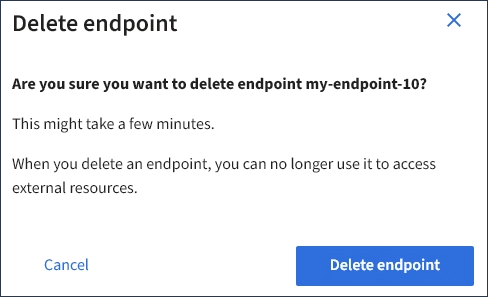

= Supprimer le noeud final des services de plate-forme
:allow-uri-read: 
:icons: font
:imagesdir: ../media/

[role="lead"]
Vous pouvez supprimer un noeud final si vous ne souhaitez plus utiliser le service de plate-forme associé.

.Ce dont vous avez besoin, 8217;ll
* Vous devez être connecté au Gestionnaire de locataires à l'aide d'un xref:../admin/web-browser-requirements.adoc[navigateur web pris en charge].
* Vous devez appartenir à un groupe d'utilisateurs qui dispose de l'autorisation *gérer les noeuds finaux* . Voir xref:tenant-management-permissions.adoc[Autorisations de gestion des locataires].

.Étapes
. Sélectionnez *STORAGE (S3)* *Platform services Endpoints*.
+
La page noeuds finaux des services de plate-forme s'affiche et affiche la liste des noeuds finaux des services de plate-forme déjà configurés.

+
image::../media/endpoints_list.png[Liste des noeuds finaux]

. Cochez la case correspondant à chaque noeud final que vous souhaitez supprimer.
+

IMPORTANT: Si vous supprimez un noeud final de services de plate-forme en cours d'utilisation, le service de plate-forme associé sera désactivé pour tous les compartiments qui utilisent le noeud final. Toutes les demandes qui n'ont pas encore été traitées seront supprimées. Toutes les nouvelles demandes seront toujours générées jusqu'à ce que vous modifiiez la configuration de compartiment pour ne plus référencer l'URN supprimé. StorageGRID signale ces demandes comme des erreurs irrécupérables.

. Sélectionnez *actions* *Supprimer le point final*.
+
Un message de confirmation s'affiche.

+

. Sélectionnez *Supprimer le point final*.

